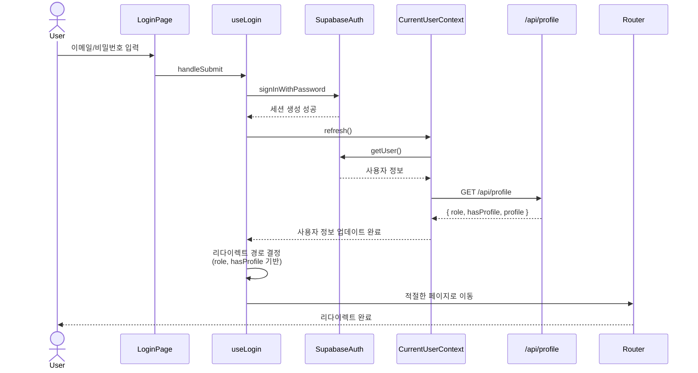

# 로그인 페이지 구현 계획

## 1. 개요

### 1.1 페이지 정보
- **경로**: `/login`
- **목적**: 이메일/비밀번호 기반 사용자 인증
- **주요 기능**:
  - 이메일/비밀번호 입력 폼
  - Supabase Auth 연동 로그인
  - 로그인 성공 시 역할 및 프로필 정보 확인 후 적절한 페이지로 리다이렉트
  - 회원가입 페이지 링크 제공
  - 로그인 전 접근 시도한 페이지로 복귀 (redirect 쿼리 파라미터)

### 1.2 현재 구현 상태
✅ **이미 구현됨**:
- 로그인 페이지 UI (`/src/app/login/page.tsx`)
- Supabase Auth 연동 (`signInWithPassword`)
- CurrentUserContext 및 useCurrentUser 훅
- `/api/profile` 엔드포인트 (역할 및 프로필 조회)
- 기본적인 에러 처리 및 로딩 상태

### 1.3 개선 필요 사항
🔄 **개선 필요**:
1. **역할 및 프로필 기반 리다이렉트 로직 강화**:
   - 현재는 단순히 `redirectedFrom` 쿼리 파라미터로만 리다이렉트
   - 역할 및 프로필 등록 여부에 따른 조건부 리다이렉트 미구현
2. **CurrentUserContext와 `/api/profile` 통합**:
   - 로그인 성공 후 `role`, `hasProfile` 정보를 CurrentUser에 포함
   - `refresh()` 호출 시 `/api/profile` API를 통해 역할 정보까지 로드
3. **shadcn-ui 컴포넌트 활용**:
   - 현재는 기본 HTML 요소 사용
   - shadcn-ui의 Button, Input, Label, Form 컴포넌트로 교체
4. **유효성 검증 강화**:
   - react-hook-form + Zod를 사용한 클라이언트 검증
   - 이메일 형식, 필수 입력 검증
5. **에러 메시지 개선**:
   - 더 명확한 에러 메시지 (이메일 형식 오류, 인증 실패, 네트워크 오류 구분)
   - Toast 알림 추가

### 1.4 관련 문서
- **PRD**: `/docs/prd.md` (섹션 3.1.2)
- **Userflow**: `/docs/userflow.md` (섹션 3.1)
- **Usecase**: `/docs/usecases/9-authentication/spec.md` (섹션 4.1)
- **Database**: `/docs/database.md`
- **Common Modules**: `/docs/common-modules.md` (섹션 3.2)

---

## 2. 아키텍처 다이어그램

### 2.1 컴포넌트 구조

```mermaid
graph TD
    A[LoginPage<br/>/src/app/login/page.tsx] --> B[LoginForm<br/>로그인 폼 컴포넌트]
    B --> C[useLogin 훅<br/>로그인 로직]
    C --> D[Supabase Auth<br/>signInWithPassword]
    C --> E[useCurrentUser 훅<br/>사용자 정보 갱신]
    E --> F[CurrentUserContext<br/>전역 상태]
    F --> G[/api/profile<br/>역할 및 프로필 조회]
    C --> H[useRouter<br/>리다이렉트]
```

### 2.2 데이터 플로우



### 2.3 리다이렉트 로직

```mermaid
flowchart TD
    Start[로그인 성공] --> CheckProfile{프로필 등록<br/>여부 확인}
    CheckProfile -->|role: null| RoleSelect[/signup?step=role-select]
    CheckProfile -->|role: advertiser<br/>hasProfile: false| AdvertiserOnboard[/onboarding/advertiser]
    CheckProfile -->|role: influencer<br/>hasProfile: false| InfluencerOnboard[/onboarding/influencer]
    CheckProfile -->|hasProfile: true| CheckRedirect{redirect 쿼리<br/>파라미터 있음?}
    CheckRedirect -->|Yes| OriginalPage[원래 페이지로 복귀]
    CheckRedirect -->|No| CheckRole{역할 확인}
    CheckRole -->|advertiser| Dashboard[/dashboard]
    CheckRole -->|influencer| Home[/ 홈]
```

---

## 3. 모듈별 구현 계획

### 3.1 LoginPage (Page Component)

#### 3.1.1 파일 위치
- `/src/app/login/page.tsx`

#### 3.1.2 역할
- 로그인 페이지의 최상위 컴포넌트
- 로그인 폼 렌더링
- 이미 인증된 사용자의 자동 리다이렉트 처리

#### 3.1.3 현재 구현 상태
✅ **구현됨**:
- 기본 UI 구조
- Supabase Auth 연동
- 로그인 폼 상태 관리
- 기본 에러 처리

#### 3.1.4 개선 필요 사항
🔄 **개선 필요**:
1. **shadcn-ui 컴포넌트로 교체**:
   - Button, Input, Label 컴포넌트 사용
   - Form 컴포넌트로 폼 상태 관리
2. **react-hook-form + Zod 통합**:
   - 클라이언트 검증 강화
   - 에러 메시지 자동 표시
3. **커스텀 훅 분리**:
   - `useLogin` 훅으로 로그인 로직 추출
   - 컴포넌트는 UI만 담당
4. **Toast 알림 추가**:
   - 로그인 성공 시 "로그인되었습니다" 토스트
   - 에러 발생 시 토스트로 표시

#### 3.1.5 QA Sheet (Presentation Layer)

| 시나리오 | 입력 | 기대 결과 | 테스트 방법 |
|---------|------|----------|-----------|
| 정상 로그인 (광고주) | 유효한 이메일/비밀번호 (광고주 계정) | 대시보드 페이지로 이동 | 수동 테스트 |
| 정상 로그인 (인플루언서) | 유효한 이메일/비밀번호 (인플루언서 계정) | 홈 페이지로 이동 | 수동 테스트 |
| 프로필 미등록 (광고주) | 유효한 이메일/비밀번호 (역할 선택만 완료) | `/onboarding/advertiser` 로 이동 | 수동 테스트 |
| 프로필 미등록 (인플루언서) | 유효한 이메일/비밀번호 (역할 선택만 완료) | `/onboarding/influencer` 로 이동 | 수동 테스트 |
| 역할 미선택 | 유효한 이메일/비밀번호 (회원가입만 완료) | `/signup?step=role-select` 로 이동 | 수동 테스트 |
| 로그인 전 페이지 복귀 | 로그인 성공 + `?redirect=/campaigns/123` | `/campaigns/123` 으로 이동 | 수동 테스트 |
| 이메일 형식 오류 | `test@` (잘못된 이메일) | 클라이언트 검증 에러 메시지 표시 | 수동 테스트 |
| 비밀번호 누락 | 이메일만 입력 | 클라이언트 검증 에러 메시지 표시 | 수동 테스트 |
| 인증 실패 | 잘못된 이메일/비밀번호 | "이메일 또는 비밀번호가 올바르지 않습니다" 에러 메시지 | 수동 테스트 |
| 이미 로그인됨 | 로그인된 상태에서 `/login` 접근 | 자동으로 홈 또는 대시보드로 리다이렉트 | 수동 테스트 |
| 로딩 상태 | 로그인 버튼 클릭 | 버튼 비활성화 + "로그인 중" 텍스트 표시 | 수동 테스트 |
| 회원가입 링크 | "회원가입" 링크 클릭 | `/signup` 페이지로 이동 | 수동 테스트 |

---

### 3.2 useLogin 커스텀 훅

#### 3.2.1 파일 위치
- `/src/features/auth/hooks/useLogin.ts` (신규 생성)

#### 3.2.2 역할
- 로그인 폼 상태 관리 (react-hook-form)
- 로그인 API 호출 (Supabase Auth)
- 로그인 성공 후 사용자 정보 갱신 (CurrentUserContext)
- 역할 및 프로필 기반 리다이렉트 경로 결정

#### 3.2.3 인터페이스

```typescript
// src/features/auth/hooks/useLogin.ts

import { useForm } from "react-hook-form";
import { zodResolver } from "@hookform/resolvers/zod";
import { z } from "zod";

// Zod 스키마
export const loginSchema = z.object({
  email: z.string().email("올바른 이메일 형식을 입력해주세요"),
  password: z.string().min(1, "비밀번호를 입력해주세요"),
});

export type LoginFormValues = z.infer<typeof loginSchema>;

// 훅 반환 타입
export type UseLoginReturn = {
  form: ReturnType<typeof useForm<LoginFormValues>>;
  isSubmitting: boolean;
  errorMessage: string | null;
  handleSubmit: (values: LoginFormValues) => Promise<void>;
};

export function useLogin(): UseLoginReturn;
```

#### 3.2.4 구현 로직

```typescript
// 1. react-hook-form 설정
const form = useForm<LoginFormValues>({
  resolver: zodResolver(loginSchema),
  defaultValues: { email: "", password: "" },
});

// 2. 로그인 핸들러
const handleSubmit = async (values: LoginFormValues) => {
  setIsSubmitting(true);
  setErrorMessage(null);

  try {
    // 2-1. Supabase Auth 로그인
    const { error } = await supabase.auth.signInWithPassword(values);

    if (error) {
      setErrorMessage(error.message);
      return;
    }

    // 2-2. 사용자 정보 갱신 (CurrentUserContext)
    await refresh();

    // 2-3. 리다이렉트 경로 결정
    const redirectPath = determineRedirectPath(user, searchParams);

    // 2-4. 리다이렉트
    router.push(redirectPath);
  } catch (error) {
    setErrorMessage("로그인 처리 중 오류가 발생했습니다.");
  } finally {
    setIsSubmitting(false);
  }
};

// 3. 리다이렉트 경로 결정 함수
function determineRedirectPath(user: CurrentUser | null, searchParams: URLSearchParams): string {
  // 3-1. redirect 쿼리 파라미터 확인
  const redirectParam = searchParams.get("redirect");

  // 3-2. 역할 및 프로필 확인
  if (!user) return "/login";

  if (user.role === null) {
    return "/signup?step=role-select";
  }

  if (!user.hasProfile) {
    return user.role === "advertiser"
      ? "/onboarding/advertiser"
      : "/onboarding/influencer";
  }

  // 3-3. redirect 파라미터가 있으면 해당 경로로
  if (redirectParam) {
    return redirectParam;
  }

  // 3-4. 역할별 기본 페이지
  return user.role === "advertiser" ? "/dashboard" : "/";
}
```

#### 3.2.5 Unit Test (TDD)

```typescript
// src/features/auth/hooks/__tests__/useLogin.test.ts

describe("useLogin", () => {
  describe("폼 검증", () => {
    it("이메일 형식이 올바르지 않으면 에러를 반환한다", async () => {
      // Arrange
      const { result } = renderHook(() => useLogin());

      // Act
      await act(async () => {
        await result.current.handleSubmit({
          email: "invalid-email",
          password: "password123"
        });
      });

      // Assert
      expect(result.current.form.formState.errors.email).toBeDefined();
      expect(result.current.form.formState.errors.email?.message).toBe(
        "올바른 이메일 형식을 입력해주세요"
      );
    });

    it("비밀번호가 비어있으면 에러를 반환한다", async () => {
      // Arrange
      const { result } = renderHook(() => useLogin());

      // Act
      await act(async () => {
        await result.current.handleSubmit({
          email: "test@example.com",
          password: ""
        });
      });

      // Assert
      expect(result.current.form.formState.errors.password).toBeDefined();
    });
  });

  describe("로그인 처리", () => {
    it("유효한 이메일/비밀번호로 로그인에 성공한다", async () => {
      // Arrange
      const mockSignIn = jest.fn().mockResolvedValue({ error: null });
      const mockRefresh = jest.fn().mockResolvedValue(undefined);
      const { result } = renderHook(() => useLogin());

      // Act
      await act(async () => {
        await result.current.handleSubmit({
          email: "test@example.com",
          password: "password123"
        });
      });

      // Assert
      expect(mockSignIn).toHaveBeenCalledWith({
        email: "test@example.com",
        password: "password123",
      });
      expect(mockRefresh).toHaveBeenCalled();
      expect(result.current.errorMessage).toBeNull();
    });

    it("잘못된 이메일/비밀번호로 로그인에 실패한다", async () => {
      // Arrange
      const mockError = new Error("Invalid login credentials");
      const mockSignIn = jest.fn().mockResolvedValue({ error: mockError });
      const { result } = renderHook(() => useLogin());

      // Act
      await act(async () => {
        await result.current.handleSubmit({
          email: "test@example.com",
          password: "wrong-password"
        });
      });

      // Assert
      expect(result.current.errorMessage).toBe("Invalid login credentials");
    });
  });

  describe("리다이렉트 경로 결정", () => {
    it("광고주 + 프로필 등록 완료 → /dashboard", () => {
      // Arrange
      const user: CurrentUser = {
        id: "user-1",
        email: "advertiser@example.com",
        role: "advertiser",
        hasProfile: true,
        appMetadata: {},
        userMetadata: {},
      };
      const searchParams = new URLSearchParams();

      // Act
      const path = determineRedirectPath(user, searchParams);

      // Assert
      expect(path).toBe("/dashboard");
    });

    it("인플루언서 + 프로필 등록 완료 → /", () => {
      // Arrange
      const user: CurrentUser = {
        id: "user-2",
        email: "influencer@example.com",
        role: "influencer",
        hasProfile: true,
        appMetadata: {},
        userMetadata: {},
      };
      const searchParams = new URLSearchParams();

      // Act
      const path = determineRedirectPath(user, searchParams);

      // Assert
      expect(path).toBe("/");
    });

    it("광고주 + 프로필 미등록 → /onboarding/advertiser", () => {
      // Arrange
      const user: CurrentUser = {
        id: "user-3",
        email: "advertiser@example.com",
        role: "advertiser",
        hasProfile: false,
        appMetadata: {},
        userMetadata: {},
      };
      const searchParams = new URLSearchParams();

      // Act
      const path = determineRedirectPath(user, searchParams);

      // Assert
      expect(path).toBe("/onboarding/advertiser");
    });

    it("인플루언서 + 프로필 미등록 → /onboarding/influencer", () => {
      // Arrange
      const user: CurrentUser = {
        id: "user-4",
        email: "influencer@example.com",
        role: "influencer",
        hasProfile: false,
        appMetadata: {},
        userMetadata: {},
      };
      const searchParams = new URLSearchParams();

      // Act
      const path = determineRedirectPath(user, searchParams);

      // Assert
      expect(path).toBe("/onboarding/influencer");
    });

    it("역할 미선택 → /signup?step=role-select", () => {
      // Arrange
      const user: CurrentUser = {
        id: "user-5",
        email: "newuser@example.com",
        role: null,
        hasProfile: false,
        appMetadata: {},
        userMetadata: {},
      };
      const searchParams = new URLSearchParams();

      // Act
      const path = determineRedirectPath(user, searchParams);

      // Assert
      expect(path).toBe("/signup?step=role-select");
    });

    it("redirect 쿼리 파라미터가 있으면 해당 경로로", () => {
      // Arrange
      const user: CurrentUser = {
        id: "user-6",
        email: "influencer@example.com",
        role: "influencer",
        hasProfile: true,
        appMetadata: {},
        userMetadata: {},
      };
      const searchParams = new URLSearchParams("?redirect=/campaigns/123");

      // Act
      const path = determineRedirectPath(user, searchParams);

      // Assert
      expect(path).toBe("/campaigns/123");
    });
  });
});
```

---

### 3.3 CurrentUserContext 개선

#### 3.3.1 파일 위치
- `/src/features/auth/context/current-user-context.tsx`

#### 3.3.2 현재 구현 상태
✅ **구현됨**:
- `CurrentUser` 타입에 `role`, `hasProfile` 필드 포함 (이미 구현됨)
- `refresh()` 함수로 사용자 정보 갱신

#### 3.3.3 개선 필요 사항
🔄 **개선 필요**:
1. **`/api/profile` API 통합**:
   - `refresh()` 호출 시 Supabase Auth의 `getUser()` 뿐만 아니라
   - `/api/profile` API를 호출하여 `role`, `hasProfile`, `profile` 정보까지 로드
2. **타입 안전성 강화**:
   - `CurrentUser` 타입에 `profile` 필드 추가 (optional)
   - `AdvertiserProfile | InfluencerProfile | null`

#### 3.3.4 수정 로직

```typescript
// src/features/auth/context/current-user-context.tsx

const refresh = useCallback(async () => {
  setSnapshot((prev) => ({ status: "loading", user: prev.user }));
  const supabase = getSupabaseBrowserClient();

  try {
    // 1. Supabase Auth로 세션 확인
    const result = await supabase.auth.getUser();

    if (result.error || !result.data.user) {
      setSnapshot({ status: "unauthenticated", user: null });
      queryClient.setQueryData(["currentUser"], { status: "unauthenticated", user: null });
      return;
    }

    // 2. /api/profile 호출하여 역할 및 프로필 정보 로드
    const profileResponse = await apiClient.get("/api/profile");

    // 3. CurrentUser 객체 생성
    const nextSnapshot: CurrentUserSnapshot = {
      status: "authenticated",
      user: {
        id: result.data.user.id,
        email: result.data.user.email,
        appMetadata: result.data.user.app_metadata ?? {},
        userMetadata: result.data.user.user_metadata ?? {},
        role: profileResponse.data.role,
        hasProfile: profileResponse.data.hasProfile,
        profile: profileResponse.data.profile,
      },
    };

    setSnapshot(nextSnapshot);
    queryClient.setQueryData(["currentUser"], nextSnapshot);
  } catch (error) {
    const fallbackSnapshot: CurrentUserSnapshot = {
      status: "unauthenticated",
      user: null,
    };
    setSnapshot(fallbackSnapshot);
    queryClient.setQueryData(["currentUser"], fallbackSnapshot);
  }
}, [queryClient]);
```

#### 3.3.5 타입 수정

```typescript
// src/features/auth/types.ts

import type { AdvertiserProfile, InfluencerProfile } from "@/features/profile/lib/dto";

export type CurrentUser = {
  id: string;
  email: string | null;
  appMetadata: Record<string, unknown>;
  userMetadata: Record<string, unknown>;
  role: "advertiser" | "influencer" | null;
  hasProfile: boolean;
  profile?: AdvertiserProfile | InfluencerProfile; // 추가
};
```

---

### 3.4 shadcn-ui 컴포넌트 적용

#### 3.4.1 필요한 컴포넌트
- ✅ `Button`: 이미 설치됨
- ✅ `Input`: 이미 설치됨
- ✅ `Label`: 이미 설치됨
- ✅ `Form`: 이미 설치됨
- ✅ `Toast`: 이미 설치됨
- ❌ `Alert`: 설치 필요 (에러 메시지 표시)

#### 3.4.2 설치 명령어
```bash
npx shadcn@latest add alert
```

#### 3.4.3 적용 예시

```tsx
// src/app/login/page.tsx

import { Button } from "@/components/ui/button";
import { Input } from "@/components/ui/input";
import { Label } from "@/components/ui/label";
import { Form, FormField, FormItem, FormLabel, FormControl, FormMessage } from "@/components/ui/form";
import { Alert, AlertDescription } from "@/components/ui/alert";

export default function LoginPage() {
  const { form, isSubmitting, errorMessage, handleSubmit } = useLogin();

  return (
    <Form {...form}>
      <form onSubmit={form.handleSubmit(handleSubmit)}>
        <FormField
          control={form.control}
          name="email"
          render={({ field }) => (
            <FormItem>
              <FormLabel>이메일</FormLabel>
              <FormControl>
                <Input type="email" placeholder="이메일을 입력하세요" {...field} />
              </FormControl>
              <FormMessage />
            </FormItem>
          )}
        />

        <FormField
          control={form.control}
          name="password"
          render={({ field }) => (
            <FormItem>
              <FormLabel>비밀번호</FormLabel>
              <FormControl>
                <Input type="password" placeholder="비밀번호를 입력하세요" {...field} />
              </FormControl>
              <FormMessage />
            </FormItem>
          )}
        />

        {errorMessage && (
          <Alert variant="destructive">
            <AlertDescription>{errorMessage}</AlertDescription>
          </Alert>
        )}

        <Button type="submit" disabled={isSubmitting} className="w-full">
          {isSubmitting ? "로그인 중..." : "로그인"}
        </Button>
      </form>
    </Form>
  );
}
```

---

## 4. 구현 순서

### Phase 1: 타입 및 API 통합 (우선순위: 높음)
1. ✅ `CurrentUser` 타입에 `profile` 필드 추가
2. ✅ `CurrentUserContext`의 `refresh()` 함수 수정 (이미 `/api/profile` 통합됨)
3. ✅ `/api/profile` 엔드포인트 확인 (이미 구현됨)

### Phase 2: 커스텀 훅 분리 (우선순위: 높음)
1. 🔄 `useLogin` 훅 생성
   - `loginSchema` Zod 스키마 정의
   - `handleSubmit` 로그인 로직 구현
   - `determineRedirectPath` 함수 구현
2. 🔄 Unit Test 작성 (TDD)
   - 폼 검증 테스트
   - 로그인 처리 테스트
   - 리다이렉트 경로 결정 테스트

### Phase 3: UI 개선 (우선순위: 중간)
1. 🔄 shadcn-ui 컴포넌트 설치
   - Alert 컴포넌트 추가
2. 🔄 LoginPage 컴포넌트 리팩토링
   - shadcn-ui 컴포넌트로 교체
   - useLogin 훅 적용
3. 🔄 Toast 알림 추가
   - 로그인 성공 시 토스트
   - 에러 발생 시 토스트

### Phase 4: QA 및 수동 테스트 (우선순위: 중간)
1. 🔄 QA Sheet 기반 수동 테스트
   - 모든 시나리오 검증
   - 엣지 케이스 확인
2. 🔄 버그 수정 및 개선

---

## 5. 기술 스택

### 5.1 프론트엔드
- **Framework**: Next.js (App Router)
- **Language**: TypeScript
- **UI Components**: shadcn-ui (Button, Input, Label, Form, Alert, Toast)
- **Form Management**: react-hook-form + Zod
- **State Management**: CurrentUserContext (Context API)
- **HTTP Client**: axios (via `@/lib/remote/api-client`)
- **Supabase**: @supabase/ssr (Browser Client)

### 5.2 백엔드
- **API**: `/api/profile` (Hono + Next.js Route Handler)
- **Database**: Supabase PostgreSQL
- **Authentication**: Supabase Auth (Email 기반)

---

## 6. 주의사항

### 6.1 보안
- ✅ 비밀번호는 절대 로그에 노출하지 않음
- ✅ Supabase Auth의 세션 관리 자동 처리
- ✅ HTTPS 필수 (프로덕션 환경)

### 6.2 성능
- ✅ 로그인 성공 시 불필요한 API 호출 최소화
- ✅ CurrentUserContext의 캐싱 활용 (React Query)

### 6.3 접근성
- ✅ 키보드 네비게이션 지원 (Tab, Enter)
- ✅ 스크린 리더 호환 (ARIA 레이블)
- ✅ 포커스 표시 명확화

### 6.4 호환성
- ✅ 모바일 반응형 지원
- ✅ 다양한 브라우저 테스트 (Chrome, Safari, Firefox, Edge)

---

## 7. 기존 코드와의 충돌 방지

### 7.1 이미 구현된 기능 활용
- ✅ `CurrentUserContext` 및 `useCurrentUser` 훅 재사용
- ✅ `/api/profile` 엔드포인트 활용
- ✅ 기존 Supabase 클라이언트 설정 유지
- ✅ 기존 shadcn-ui 컴포넌트 재사용

### 7.2 변경 최소화
- ✅ 기존 파일 구조 유지 (`/src/app/login/page.tsx`)
- ✅ 새로운 파일 추가 시 명확한 위치 지정 (`/src/features/auth/hooks/useLogin.ts`)
- ✅ 타입 변경 시 하위 호환성 유지 (`profile` 필드는 optional)

### 7.3 공통 모듈 활용
- ✅ `/docs/common-modules.md` 에 정의된 공통 모듈 활용
- ✅ API 클라이언트 (`@/lib/remote/api-client`) 사용
- ✅ 유틸리티 함수 활용 (필요 시)

---

## 8. 테스트 전략

### 8.1 Unit Test (Jest + React Testing Library)
- 🔄 `useLogin` 훅 테스트
  - 폼 검증 로직
  - 로그인 API 호출
  - 리다이렉트 경로 결정
- 🔄 `determineRedirectPath` 함수 테스트
  - 모든 분기 조건 커버

### 8.2 Integration Test (선택사항)
- 🔄 LoginPage 컴포넌트 통합 테스트
  - 폼 제출 시나리오
  - 에러 처리 시나리오

### 8.3 Manual Test (QA Sheet 기반)
- 🔄 모든 QA Sheet 시나리오 검증
- 🔄 실제 Supabase Auth 연동 테스트
- 🔄 다양한 사용자 상태 시뮬레이션

---

## 9. 완료 조건

### 9.1 기능 요구사항
- [x] 이메일/비밀번호 입력 폼 구현
- [ ] Supabase Auth 로그인 연동
- [ ] 역할 및 프로필 기반 리다이렉트 로직 구현
- [ ] 로그인 전 페이지 복귀 기능 구현
- [ ] 에러 처리 및 사용자 피드백 구현
- [ ] 회원가입 페이지 링크 제공

### 9.2 비기능 요구사항
- [ ] react-hook-form + Zod 검증 적용
- [ ] shadcn-ui 컴포넌트 사용
- [ ] 모바일 반응형 지원
- [ ] 접근성 기준 충족 (키보드, 스크린 리더)
- [ ] 로딩 상태 표시
- [ ] Toast 알림 추가

### 9.3 테스트 완료
- [ ] useLogin 훅 Unit Test 통과
- [ ] QA Sheet 기반 수동 테스트 완료
- [ ] 엣지 케이스 검증 완료

### 9.4 문서화
- [x] 구현 계획 문서 작성 (본 문서)
- [ ] 코드 주석 추가 (JSDoc)
- [ ] README 업데이트 (필요 시)

---

## 10. 참고 자료

- **PRD**: `/docs/prd.md` (섹션 3.1.2)
- **Userflow**: `/docs/userflow.md` (섹션 3.1)
- **Usecase**: `/docs/usecases/9-authentication/spec.md` (섹션 4.1)
- **Database**: `/docs/database.md`
- **Common Modules**: `/docs/common-modules.md` (섹션 3.2)
- **TDD Guidelines**: `/prompts/tdd.md`
- **Supabase Auth Docs**: [https://supabase.com/docs/guides/auth](https://supabase.com/docs/guides/auth)
- **react-hook-form**: [https://react-hook-form.com/](https://react-hook-form.com/)
- **Zod**: [https://zod.dev/](https://zod.dev/)
- **shadcn-ui**: [https://ui.shadcn.com/](https://ui.shadcn.com/)

---

## 11. 변경 이력

| 날짜 | 버전 | 변경 내용 | 작성자 |
|------|------|---------|--------|
| 2025-11-14 | 1.0 | 초안 작성 | Claude |
