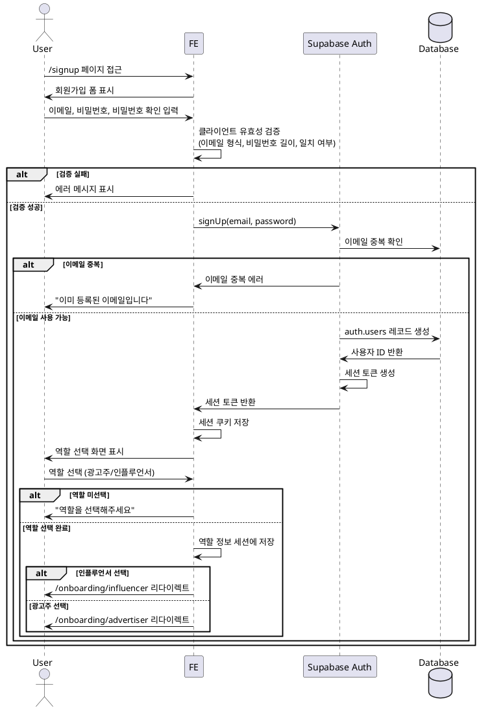

# 유스케이스: 회원가입 및 역할 선택

## UC-001: 회원가입 및 역할 선택

### Primary Actor
- 신규 사용자 (미인증 사용자)

---

## 1. 개요

### 1.1 목적
신규 사용자가 이메일 기반 회원가입을 통해 계정을 생성하고, 광고주 또는 인플루언서 역할을 선택하여 서비스 이용을 시작할 수 있도록 한다.

### 1.2 범위
- 이메일/비밀번호 기반 회원가입 (Supabase Auth)
- 역할 선택 (광고주 / 인플루언서)
- 역할별 온보딩 페이지로 리다이렉트

**제외 사항**:
- 소셜 로그인 (구글, 카카오 등)
- 이메일 인증 (1차 범위에서 자동 인증으로 가정)
- 비밀번호 찾기

### 1.3 액터
- **주요 액터**: 신규 사용자
- **시스템 액터**: Supabase Auth, Backend API

---

## 2. 선행 조건 (Preconditions)

- 사용자가 회원가입 페이지(`/signup`)에 접근 가능해야 한다.
- 사용자가 유효한 이메일 주소를 보유하고 있어야 한다.
- 인터넷 연결이 정상적으로 작동해야 한다.

---

## 3. 트리거 (Trigger)

사용자가 회원가입 페이지(`/signup`)에 접근하여 이메일과 비밀번호를 입력하고 "회원가입" 버튼을 클릭한다.

---

## 4. 기본 플로우 (Main Scenario)

### 단계 1: 회원가입 정보 입력

1. **사용자**: `/signup` 페이지에 접근한다.
2. **FE**: 회원가입 폼을 표시한다.
   - 이메일 입력 필드
   - 비밀번호 입력 필드 (최소 8자 이상)
   - 비밀번호 확인 입력 필드
   - "회원가입" 버튼
3. **사용자**: 이메일, 비밀번호, 비밀번호 확인을 입력하고 "회원가입" 버튼을 클릭한다.
4. **FE**: 클라이언트 사이드 유효성 검증을 수행한다.
   - 이메일 형식 확인
   - 비밀번호 최소 길이 확인 (8자 이상)
   - 비밀번호 일치 여부 확인

### 단계 2: Supabase Auth 회원가입

5. **FE**: `supabase.auth.signUp()` 를 호출하여 Supabase Auth에 회원가입 요청을 전송한다.
6. **Supabase Auth**: 이메일 중복 여부를 확인한다.
7. **Supabase Auth**: `auth.users` 테이블에 사용자를 생성하고 세션 토큰을 발급한다.
8. **FE**: 세션을 쿠키에 저장하고 로그인 상태로 전환한다.

### 단계 3: 역할 선택

9. **FE**: 역할 선택 화면을 자동으로 표시한다.
   - 라디오 버튼: "인플루언서" / "광고주"
   - "다음" 버튼
10. **사용자**: 원하는 역할을 선택하고 "다음" 버튼을 클릭한다.
11. **FE**: 선택한 역할을 세션 또는 임시 상태에 저장한다.

### 단계 4: 역할별 온보딩 리다이렉트

12. **FE**: 선택한 역할에 따라 적절한 온보딩 페이지로 리다이렉트한다.
    - 인플루언서 선택 시: `/onboarding/influencer`
    - 광고주 선택 시: `/onboarding/advertiser`

---

## 5. 대안 플로우 (Alternative Flows)

### 5.1 이미 로그인된 사용자가 회원가입 페이지 접근

**시작 조건**: 단계 1에서 사용자가 이미 로그인된 상태

**단계**:
1. **FE**: 세션 쿠키를 확인하여 로그인 상태를 감지한다.
2. **FE**: 사용자를 홈 페이지(`/`)로 리다이렉트한다.

**결과**: 회원가입 프로세스가 실행되지 않는다.

---

## 6. 예외 플로우 (Exception Flows)

### 6.1 이메일 중복

**발생 조건**: 단계 6에서 이미 등록된 이메일로 가입 시도

**처리 방법**:
1. **Supabase Auth**: 이메일 중복 에러를 반환한다.
2. **FE**: "이미 등록된 이메일입니다" 에러 메시지를 표시한다.
3. **사용자**: 다른 이메일을 입력하거나 로그인 페이지로 이동한다.

**에러 코드**: `SIGNUP_EMAIL_DUPLICATE` (400 Bad Request)

**사용자 메시지**: "이미 등록된 이메일입니다. 다른 이메일을 사용하거나 로그인해주세요."

### 6.2 이메일 형식 오류

**발생 조건**: 단계 4에서 유효하지 않은 이메일 형식 입력

**처리 방법**:
1. **FE**: 클라이언트 사이드 검증에서 이메일 형식 오류를 감지한다.
2. **FE**: 이메일 입력 필드 하단에 "올바른 이메일 형식을 입력해주세요" 에러 메시지를 표시한다.
3. **사용자**: 올바른 형식의 이메일을 입력한다.

**에러 코드**: `SIGNUP_EMAIL_INVALID` (클라이언트 검증)

**사용자 메시지**: "올바른 이메일 형식을 입력해주세요 (예: user@example.com)"

### 6.3 비밀번호 불일치

**발생 조건**: 단계 4에서 비밀번호와 비밀번호 확인이 일치하지 않음

**처리 방법**:
1. **FE**: 클라이언트 사이드 검증에서 비밀번호 불일치를 감지한다.
2. **FE**: 비밀번호 확인 필드 하단에 "비밀번호가 일치하지 않습니다" 에러 메시지를 표시한다.
3. **사용자**: 비밀번호 확인을 다시 입력한다.

**에러 코드**: `SIGNUP_PASSWORD_MISMATCH` (클라이언트 검증)

**사용자 메시지**: "비밀번호가 일치하지 않습니다"

### 6.4 비밀번호 강도 부족

**발생 조건**: 단계 4에서 비밀번호가 최소 길이(8자) 미만

**처리 방법**:
1. **FE**: 클라이언트 사이드 검증에서 비밀번호 강도 부족을 감지한다.
2. **FE**: 비밀번호 입력 필드 하단에 "비밀번호는 최소 8자 이상이어야 합니다" 에러 메시지를 표시한다.
3. **사용자**: 8자 이상의 비밀번호를 입력한다.

**에러 코드**: `SIGNUP_PASSWORD_TOO_SHORT` (클라이언트 검증)

**사용자 메시지**: "비밀번호는 최소 8자 이상이어야 합니다"

### 6.5 역할 미선택

**발생 조건**: 단계 10에서 역할을 선택하지 않고 "다음" 버튼 클릭

**처리 방법**:
1. **FE**: 역할 미선택 상태를 감지한다.
2. **FE**: 역할 선택 영역 상단에 "역할을 선택해주세요" 에러 메시지를 표시한다.
3. **사용자**: 역할을 선택한다.

**에러 코드**: `SIGNUP_ROLE_NOT_SELECTED` (클라이언트 검증)

**사용자 메시지**: "역할을 선택해주세요"

### 6.6 네트워크 오류

**발생 조건**: 단계 5에서 네트워크 연결 실패 또는 Supabase 서비스 장애

**처리 방법**:
1. **Supabase Auth**: 네트워크 오류 또는 서비스 장애로 인해 응답 실패
2. **FE**: "일시적인 오류가 발생했습니다. 다시 시도해주세요" 에러 메시지를 표시한다.
3. **FE**: "재시도" 버튼을 표시한다.
4. **사용자**: "재시도" 버튼을 클릭하거나 페이지를 새로고침한다.

**에러 코드**: `SIGNUP_NETWORK_ERROR` (500 Internal Server Error 또는 네트워크 타임아웃)

**사용자 메시지**: "일시적인 오류가 발생했습니다. 다시 시도해주세요"

---

## 7. 후행 조건 (Post-conditions)

### 7.1 성공 시

**데이터베이스 변경**:
- `auth.users` 테이블에 신규 사용자 레코드 생성
  - `id` (uuid, 자동 생성)
  - `email` (입력받은 이메일)
  - `encrypted_password` (해시된 비밀번호)
  - `created_at` (생성 시각)

**시스템 상태**:
- 사용자가 인증된 상태 (세션 쿠키 설정)
- 역할 선택 정보가 세션 또는 임시 상태에 저장됨
- 사용자가 역할별 온보딩 페이지로 리다이렉트됨

**외부 시스템**:
- Supabase Auth에서 세션 토큰 발급 완료

### 7.2 실패 시

**데이터 롤백**:
- 이메일 중복 시: 회원가입 시도 기록 없음
- 네트워크 오류 시: 부분 생성된 데이터 없음 (Supabase Auth가 트랜잭션 보장)

**시스템 상태**:
- 사용자가 비인증 상태 유지
- 회원가입 페이지에 머무름
- 에러 메시지가 사용자에게 표시됨

---

## 8. 엣지 케이스 (Edge Cases)

### 8.1 브라우저 뒤로가기로 회원가입 페이지 재진입

- **상황**: 역할 선택 단계에서 브라우저 뒤로가기 버튼 클릭
- **처리**: 이미 회원가입이 완료되었으므로 홈 페이지 또는 역할 선택 페이지로 리다이렉트

### 8.2 회원가입 중 페이지 새로고침

- **상황**: 회원가입 폼 작성 중 페이지 새로고침
- **처리**: 입력한 데이터가 사라지고 폼이 초기화됨 (별도 저장 로직 없음)

### 8.3 세션 쿠키가 손상된 경우

- **상황**: 회원가입 후 세션 쿠키가 손상되거나 삭제됨
- **처리**: 로그인 페이지로 리다이렉트하여 재로그인 유도

### 8.4 동시에 여러 탭에서 회원가입 시도

- **상황**: 같은 이메일로 여러 탭에서 동시에 회원가입 시도
- **처리**: 첫 번째 요청만 성공하고 나머지는 이메일 중복 에러 발생

---

## 9. 비즈니스 규칙 (Business Rules)

### BR-001: 이메일 유일성
- 하나의 이메일 주소는 하나의 계정만 생성 가능
- 중복 이메일 가입 시도는 거부됨

### BR-002: 비밀번호 보안 정책
- 비밀번호는 최소 8자 이상이어야 함
- Supabase Auth가 자동으로 해시하여 저장함

### BR-003: 역할 선택 필수
- 회원가입 후 반드시 역할(광고주 또는 인플루언서)을 선택해야 함
- 역할을 선택하지 않으면 온보딩 프로세스를 진행할 수 없음

### BR-004: 1인 1역할
- 한 사용자는 광고주 또는 인플루언서 중 하나의 역할만 가질 수 있음
- `advertisers` 테이블과 `influencers` 테이블은 `user_id`로 1:1 관계 유지

### BR-005: 자동 세션 생성
- 회원가입 성공 시 자동으로 로그인 상태로 전환됨
- 별도 로그인 과정 불필요

---

## 10. 참여 컴포넌트 (Components)

### Frontend (FE)
- **페이지**: `/signup` (회원가입 페이지)
- **역할**:
  - 회원가입 폼 렌더링
  - 클라이언트 사이드 유효성 검증
  - Supabase Auth 호출
  - 역할 선택 UI 제공
  - 온보딩 페이지 리다이렉트

### Backend (Supabase Auth)
- **역할**:
  - 이메일/비밀번호 기반 인증 처리
  - 이메일 중복 검증
  - 사용자 계정 생성 (`auth.users` 테이블)
  - 세션 토큰 발급

### Database (Supabase PostgreSQL)
- **테이블**: `auth.users` (Supabase 관리)
- **역할**: 사용자 인증 정보 저장

---

## 11. Sequence Diagram

---

## 12. UI/UX 요구사항

### 12.1 회원가입 페이지 (`/signup`)

**화면 구성**:
- 페이지 타이틀: "회원가입"
- 이메일 입력 필드
  - 레이블: "이메일"
  - 플레이스홀더: "user@example.com"
  - 타입: email
- 비밀번호 입력 필드
  - 레이블: "비밀번호"
  - 플레이스홀더: "최소 8자 이상"
  - 타입: password
- 비밀번호 확인 입력 필드
  - 레이블: "비밀번호 확인"
  - 플레이스홀더: "비밀번호를 다시 입력하세요"
  - 타입: password
- "회원가입" 버튼 (Primary CTA)
- "이미 계정이 있으신가요? 로그인" 링크

**UX 고려사항**:
- 각 필드 하단에 실시간 에러 메시지 표시
- 비밀번호 강도 인디케이터 (선택사항)
- "회원가입" 버튼 클릭 시 로딩 스피너 표시
- Enter 키로 폼 제출 가능

### 12.2 역할 선택 화면

**화면 구성**:
- 페이지 타이틀: "역할 선택"
- 설명 텍스트: "사용하실 서비스를 선택해주세요"
- 라디오 버튼 그룹:
  - "인플루언서" (아이콘 + 설명: "체험단에 지원하고 리뷰를 작성합니다")
  - "광고주" (아이콘 + 설명: "체험단을 등록하고 인플루언서를 선정합니다")
- "다음" 버튼 (Primary CTA)

**UX 고려사항**:
- 역할 카드를 클릭하면 자동으로 선택됨 (라디오 버튼 클릭 불필요)
- 선택된 역할 카드에 시각적 하이라이트 (테두리, 배경색 변경)
- "다음" 버튼은 역할 선택 후 활성화

---

## 13. 비기능 요구사항

### 13.1 성능
- 회원가입 API 응답 시간: 2초 이내
- 클라이언트 사이드 검증: 실시간 (입력과 동시)
- 페이지 로딩 시간: 1초 이내

### 13.2 보안
- 비밀번호는 평문으로 전송되지 않음 (HTTPS 필수)
- Supabase Auth가 자동으로 비밀번호 해시 처리
- 세션 토큰은 HttpOnly 쿠키로 저장
- CSRF 토큰 활용 (Supabase SSR 자동 처리)

### 13.3 접근성
- 폼 필드에 적절한 label 연결
- 에러 메시지는 aria-live로 스크린 리더에 전달
- 키보드만으로 모든 기능 사용 가능 (Tab, Enter 네비게이션)

### 13.4 브라우저 호환성
- Chrome, Safari, Firefox, Edge 최신 2개 버전 지원
- 모바일 브라우저 지원 (iOS Safari, Android Chrome)

---

## 14. 테스트 시나리오

### 14.1 성공 케이스

| 테스트 케이스 ID | 입력값 | 기대 결과 |
|----------------|--------|----------|
| TC-001-01      | 이메일: `test@example.com` 비밀번호: `password123` 비밀번호 확인: `password123` 역할: 인플루언서 | 회원가입 성공, `/onboarding/influencer`로 리다이렉트 |
| TC-001-02      | 이메일: `advertiser@example.com` 비밀번호: `securepass` 비밀번호 확인: `securepass` 역할: 광고주 | 회원가입 성공, `/onboarding/advertiser`로 리다이렉트 |

### 14.2 실패 케이스

| 테스트 케이스 ID | 입력값 | 기대 결과 |
|----------------|--------|----------|
| TC-001-03      | 이메일: `invalid-email` 비밀번호: `password123` 비밀번호 확인: `password123` | 에러 메시지: "올바른 이메일 형식을 입력해주세요" |
| TC-001-04      | 이메일: `test@example.com` 비밀번호: `1234567` 비밀번호 확인: `1234567` | 에러 메시지: "비밀번호는 최소 8자 이상이어야 합니다" |
| TC-001-05      | 이메일: `test@example.com` 비밀번호: `password123` 비밀번호 확인: `password456` | 에러 메시지: "비밀번호가 일치하지 않습니다" |
| TC-001-06      | 이메일: `existing@example.com` (이미 등록된 이메일) 비밀번호: `password123` 비밀번호 확인: `password123` | 에러 메시지: "이미 등록된 이메일입니다. 다른 이메일을 사용하거나 로그인해주세요." |
| TC-001-07      | 이메일: `test@example.com` 비밀번호: `password123` 비밀번호 확인: `password123` 역할: 미선택 | 에러 메시지: "역할을 선택해주세요" |

---

## 15. 관련 유스케이스

### 선행 유스케이스
- 없음 (회원가입은 첫 진입점)

### 후행 유스케이스
- **UC-002**: 인플루언서 정보 등록 (역할로 인플루언서 선택 시)
- **UC-003**: 광고주 정보 등록 (역할로 광고주 선택 시)

### 연관 유스케이스
- **UC-004**: 로그인 (회원가입 완료 후 재방문 시)

---

## 16. 참고 자료

- [Supabase Auth Documentation](https://supabase.com/docs/guides/auth)
- [Supabase JavaScript Client - signUp](https://supabase.com/docs/reference/javascript/auth-signup)
- `/docs/userflow.md` - 섹션 1.1.1, 1.1.2
- `/docs/prd.md` - 섹션 3.1.3 (회원가입 페이지)
- `/docs/database.md` - 섹션 4.1, 4.2 (advertisers, influencers 테이블)

---

## 17. 변경 이력

| 버전 | 날짜 | 작성자 | 변경 내용 |
|------|------|--------|-----------|
| 1.0  | 2025-11-14 | Claude | 초기 작성 |
