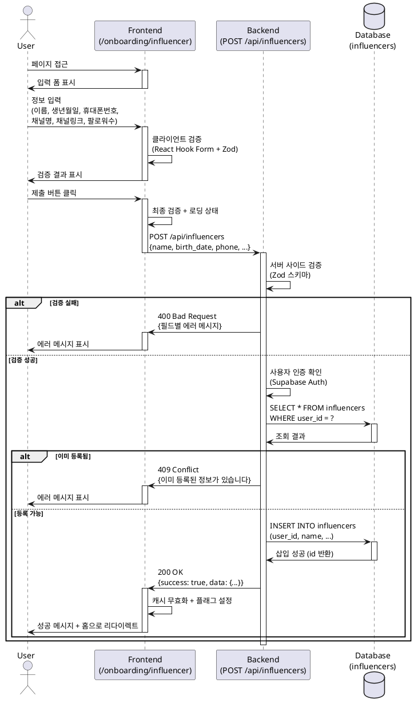

# 유스케이스: 인플루언서 정보 등록

## 유스케이스 ID: UC-002

### 제목
인플루언서 정보 등록 (Influencer Profile Registration)

---

## 1. 개요

### 1.1 목적
회원가입을 완료한 사용자가 인플루언서 역할을 선택한 후, 체험단 지원에 필요한 프로필 정보를 등록하는 기능입니다. 이 정보는 광고주가 인플루언서를 선정할 때 참고하는 핵심 데이터가 됩니다.

### 1.2 범위
- **포함**: 인플루언서 기본 정보 입력, SNS 채널 정보 입력, 유효성 검증, 데이터베이스 저장
- **제외**: 프로필 수정, 프로필 조회, 이미지 업로드 (1차 범위 제외)

### 1.3 액터
- **주요 액터**: 인플루언서 (회원가입 완료, 역할 선택 완료 상태의 사용자)
- **부 액터**: Supabase Database, Hono Backend API

---

## 2. 선행 조건

- 사용자가 이메일/비밀번호로 회원가입을 완료한 상태
- 사용자가 역할 선택에서 "인플루언서"를 선택한 상태
- 세션이 유효한 상태 (로그인됨)
- 이미 인플루언서 정보를 등록하지 않은 상태

---

## 3. 참여 컴포넌트

- **Frontend**: `/onboarding/influencer` 페이지 (Client Component)
  - React Hook Form으로 폼 상태 관리
  - Zod 스키마로 클라이언트 사이드 검증
  - shadcn-ui 컴포넌트 사용 (Input, Date Picker, Button)
- **Backend API**: `POST /api/influencers` (Hono 라우터)
  - 요청 데이터 서버 사이드 검증
  - Supabase 클라이언트로 데이터베이스 삽입
  - 성공/실패 응답 반환
- **Database**: `public.influencers` 테이블
  - 인플루언서 프로필 데이터 저장
- **External Service**: Supabase Auth
  - 현재 로그인한 사용자 ID 확인

---

## 4. 기본 플로우 (Basic Flow)

### 4.1 단계별 흐름

1. **사용자**: `/onboarding/influencer` 페이지 접근
   - 입력: 없음 (역할 선택 단계에서 자동 리다이렉트)
   - 처리: 페이지 렌더링, 빈 폼 표시
   - 출력: 인플루언서 정보 입력 폼

2. **사용자**: 공통 정보 입력
   - 입력:
     - 이름 (텍스트, 필수)
     - 생년월일 (Date Picker, 필수)
     - 휴대폰번호 (텍스트, 숫자만, 필수)
   - 처리: 실시간 클라이언트 검증 (React Hook Form + Zod)
   - 출력: 필드별 검증 결과 표시 (에러 메시지 또는 성공 상태)

3. **사용자**: 인플루언서 정보 입력
   - 입력:
     - SNS 채널명 (텍스트, 필수)
     - 채널 링크 (URL, 필수, 복수 입력 가능: Naver Blog, YouTube, Instagram, Threads)
     - 팔로워 수 (숫자, 필수, 양수)
   - 처리: 실시간 클라이언트 검증
   - 출력: 필드별 검증 결과 표시

4. **사용자**: 제출 버튼 클릭
   - 입력: 폼 데이터 전체
   - 처리:
     - 최종 클라이언트 사이드 검증
     - 제출 버튼 비활성화 (중복 제출 방지)
     - 로딩 스피너 표시
   - 출력: `POST /api/influencers` API 호출

5. **Backend API**: 요청 데이터 검증
   - 입력: Request Body (JSON)
   - 처리:
     - Zod 스키마로 서버 사이드 검증
     - 필수 필드 확인
     - 데이터 타입 및 형식 확인 (이름 2자 이상, 생년월일 만 14세 이상, 휴대폰번호 형식, URL 형식, 팔로워 수 양수)
   - 출력: 검증 성공 시 다음 단계 진행, 실패 시 400 Bad Request 응답

6. **Backend API**: 사용자 인증 및 중복 확인
   - 입력: 세션 쿠키 (Supabase Auth)
   - 처리:
     - `supabase.auth.getUser()` 호출하여 현재 사용자 ID 확인
     - `influencers` 테이블에서 `user_id`로 기존 데이터 조회 (중복 등록 방지)
   - 출력:
     - 중복 없음: 다음 단계 진행
     - 중복 있음: 409 Conflict 응답

7. **Backend API**: 데이터베이스 삽입
   - 입력: 검증된 폼 데이터 + 현재 사용자 ID
   - 처리:
     - `INSERT INTO public.influencers` 쿼리 실행
     - 필드: `user_id`, `name`, `birth_date`, `phone`, `channel_name`, `channel_link`, `followers_count`
     - `created_at`, `updated_at` 자동 생성
   - 출력: 삽입 성공 시 생성된 레코드 ID

8. **Backend API**: 성공 응답 반환
   - 입력: 생성된 인플루언서 레코드
   - 처리: 성공 응답 객체 생성
   - 출력:
     ```json
     {
       "success": true,
       "data": {
         "id": 1,
         "user_id": "uuid",
         "name": "홍길동",
         "channel_name": "길동TV"
       },
       "message": "인플루언서 정보가 등록되었습니다"
     }
     ```

9. **Frontend**: 성공 처리
   - 입력: API 응답 (200 OK)
   - 처리:
     - 토스트 메시지 표시: "인플루언서 정보가 등록되었습니다"
     - React Query 캐시 무효화 (사용자 프로필)
     - 프로필 등록 완료 플래그 설정 (전역 상태)
   - 출력: `/` (홈 페이지)로 리다이렉트

### 4.2 시퀀스 다이어그램



---

## 5. 대안 플로우 (Alternative Flows)

### 5.1 대안 플로우 1: 이미 인플루언서 정보가 등록된 사용자의 재접근

**시작 조건**: 페이지 로드 시

**단계**:
1. **Frontend**: 페이지 로드 시 `GET /api/profile` 호출하여 현재 사용자 프로필 조회
2. **Backend API**: `influencers` 테이블에서 `user_id`로 기존 데이터 확인
3. **Frontend**: 기존 데이터 존재 시 홈 페이지로 자동 리다이렉트

**결과**: 사용자는 홈 페이지로 이동하며, 폼을 볼 수 없음

---

## 6. 예외 플로우 (Exception Flows)

### 6.1 예외 상황 1: 유효성 검증 실패

**발생 조건**: 입력 데이터가 유효성 규칙을 만족하지 않는 경우

**처리 방법**:
1. 클라이언트 사이드에서 우선 검증 (React Hook Form)
2. 각 필드 하단에 빨간색 에러 메시지 표시
3. 제출 버튼 비활성화 (모든 필드가 유효할 때까지)
4. 서버 사이드 검증 실패 시 400 Bad Request 응답

**에러 코드**: `400 Bad Request`

**사용자 메시지 예시**:
- "이름은 2자 이상이어야 합니다"
- "만 14세 이상만 가입할 수 있습니다"
- "올바른 휴대폰번호 형식을 입력해주세요 (예: 010-1234-5678)"
- "올바른 URL 형식을 입력해주세요"
- "팔로워 수는 0 이상이어야 합니다"

### 6.2 예외 상황 2: 중복 등록 시도

**발생 조건**: 이미 인플루언서 정보가 등록된 사용자가 제출 시도

**처리 방법**:
1. Backend API에서 `influencers` 테이블 조회
2. `user_id`가 이미 존재하는 경우 409 Conflict 응답
3. Frontend에서 에러 메시지 표시 후 홈으로 리다이렉트

**에러 코드**: `409 Conflict`

**사용자 메시지**: "이미 등록된 정보가 있습니다"

### 6.3 예외 상황 3: 네트워크 오류

**발생 조건**: API 요청 실패 (서버 장애, 네트워크 끊김 등)

**처리 방법**:
1. React Query의 retry 로직 활용 (최대 3회 재시도)
2. 3회 실패 시 에러 메시지 표시
3. 제출 버튼 재활성화
4. 로딩 스피너 숨김

**에러 코드**: `500 Internal Server Error` 또는 Network Error

**사용자 메시지**: "일시적인 오류가 발생했습니다. 다시 시도해주세요"

### 6.4 예외 상황 4: 비로그인 상태 접근

**발생 조건**: 세션이 만료되었거나 비로그인 상태에서 페이지 접근

**처리 방법**:
1. Middleware에서 세션 확인
2. 세션 없음 시 `/login?redirect=/onboarding/influencer`로 리다이렉트
3. 로그인 후 원래 페이지로 복귀

**에러 코드**: `401 Unauthorized`

**사용자 메시지**: "로그인이 필요합니다"

### 6.5 예외 상황 5: 휴대폰번호 형식 오류

**발생 조건**: 숫자 외 문자 포함, 형식 불일치

**처리 방법**:
1. 클라이언트 사이드에서 실시간 검증
2. Input 컴포넌트에서 숫자만 입력 가능하도록 제한
3. 서버 사이드에서도 정규식으로 검증

**에러 코드**: `400 Bad Request`

**사용자 메시지**: "휴대폰번호는 숫자만 입력해주세요 (예: 01012345678)"

### 6.6 예외 상황 6: 팔로워 수에 음수 또는 문자 입력

**발생 조건**: 팔로워 수 필드에 잘못된 값 입력

**처리 방법**:
1. Input type="number"로 숫자만 입력 가능하도록 제한
2. 클라이언트 검증에서 양수 확인
3. 서버 사이드에서도 양수 확인

**에러 코드**: `400 Bad Request`

**사용자 메시지**: "팔로워 수는 0 이상의 숫자를 입력해주세요"

---

## 7. 후행 조건 (Post-conditions)

### 7.1 성공 시

- **데이터베이스 변경**:
  - `public.influencers` 테이블에 새 레코드 삽입
  - `user_id`와 1:1 관계 형성
- **시스템 상태**:
  - 사용자는 "인플루언서 정보 등록 완료" 상태
  - 체험단 지원 기능 활성화
  - 홈 페이지의 "지원하기" 버튼 활성화
- **외부 시스템**:
  - React Query 캐시 무효화
  - 전역 상태 업데이트 (Zustand)

### 7.2 실패 시

- **데이터 롤백**:
  - 데이터베이스에 아무 변경 없음
  - 트랜잭션 자동 롤백
- **시스템 상태**:
  - 사용자는 여전히 "인플루언서 정보 미등록" 상태
  - 폼 데이터는 유지되어 재시도 가능

---

## 8. 비기능 요구사항

### 8.1 성능
- 페이지 로딩 시간: 2초 이내 (First Contentful Paint)
- API 응답 시간: 300ms 이내 (데이터베이스 삽입 포함)
- 클라이언트 검증: 실시간 (debounce 300ms)

### 8.2 보안
- 서버 사이드 검증 필수 (클라이언트 검증 우회 방지)
- Supabase Auth 세션 기반 인증
- SQL Injection 방지 (Parameterized Query)
- XSS 방지 (React 자동 이스케이핑)

### 8.3 가용성
- API 재시도 로직 (React Query, 최대 3회)
- 네트워크 오류 시 사용자 친화적 에러 메시지
- 중복 제출 방지 (제출 버튼 비활성화)

### 8.4 접근성
- 키보드 네비게이션 지원 (Tab 키로 이동)
- 스크린 리더 호환 (ARIA 레이블)
- 에러 메시지는 해당 필드 하단에 명확히 표시

---

## 9. UI/UX 요구사항

### 9.1 화면 구성

**레이아웃**:
- 중앙 정렬, 최대 너비 600px
- 카드 형태의 폼 컨테이너 (shadcn-ui Card)
- 제목: "인플루언서 정보 등록"
- 부제목: "체험단 지원을 위해 프로필을 완성해주세요"

**입력 필드**:
1. 이름 (Input)
2. 생년월일 (Date Picker)
3. 휴대폰번호 (Input, placeholder: "01012345678")
4. SNS 채널명 (Input)
5. 채널 링크 (Input, placeholder: "https://blog.naver.com/...")
6. 팔로워 수 (Input type="number")

**버튼**:
- "등록 완료" (Primary Button, 우측 하단)
- 로딩 상태 시 스피너 + "처리 중..." 텍스트

**에러 표시**:
- 각 필드 하단에 빨간색 텍스트로 에러 메시지
- 포커스 시 필드 테두리 빨간색 강조

### 9.2 사용자 경험

**입력 편의성**:
- Date Picker로 생년월일 선택 편리
- 휴대폰번호 자동 포맷팅 (선택사항)
- 팔로워 수 천 단위 구분 (선택사항)

**피드백**:
- 실시간 검증 결과 표시 (타이핑 중)
- 성공 시 토스트 메시지 + 부드러운 페이지 전환
- 실패 시 명확한 에러 메시지

**반응형**:
- 모바일 우선 디자인
- 브레이크포인트: 320px, 768px, 1024px

---

## 10. 비즈니스 규칙

### 10.1 데이터 검증 규칙

| 필드 | 규칙 | 에러 메시지 |
|------|------|------------|
| 이름 | 필수, 2자 이상 | "이름은 2자 이상이어야 합니다" |
| 생년월일 | 필수, 만 14세 이상 | "만 14세 이상만 가입할 수 있습니다" |
| 휴대폰번호 | 필수, 010-XXXX-XXXX 형식 또는 01XXXXXXXXX | "올바른 휴대폰번호 형식을 입력해주세요" |
| SNS 채널명 | 필수, 1자 이상 | "SNS 채널명을 입력해주세요" |
| 채널 링크 | 필수, URL 형식 | "올바른 URL 형식을 입력해주세요" |
| 팔로워 수 | 필수, 0 이상 정수 | "팔로워 수는 0 이상이어야 합니다" |

### 10.2 중복 등록 방지
- `influencers` 테이블의 `user_id`는 UNIQUE 제약 조건
- 동일 사용자는 1개의 인플루언서 프로필만 생성 가능

### 10.3 권한 규칙
- 인플루언서 정보 등록 완료 후에만 체험단 지원 가능
- 광고주 역할로 가입한 사용자는 접근 불가

---

## 11. 테스트 시나리오

### 11.1 성공 케이스

| 테스트 케이스 ID | 입력값 | 기대 결과 |
|-----------------|--------|----------|
| TC-002-01 | 유효한 모든 필드 입력 | 200 OK, 데이터베이스 삽입 성공, 홈으로 리다이렉트 |
| TC-002-02 | 팔로워 수 0 입력 | 200 OK, 정상 처리 (0도 유효) |
| TC-002-03 | 생년월일 만 14세 정확히 입력 | 200 OK, 정상 처리 |

### 11.2 실패 케이스

| 테스트 케이스 ID | 입력값 | 기대 결과 |
|-----------------|--------|----------|
| TC-002-04 | 이름 1자 입력 | 클라이언트 검증 실패, 에러 메시지 표시 |
| TC-002-05 | 생년월일 만 13세 입력 | 클라이언트 검증 실패, "만 14세 이상만 가입할 수 있습니다" |
| TC-002-06 | 휴대폰번호 형식 오류 (예: "abc123") | 클라이언트 검증 실패, "올바른 휴대폰번호 형식을 입력해주세요" |
| TC-002-07 | 채널 링크 형식 오류 (예: "notaurl") | 클라이언트 검증 실패, "올바른 URL 형식을 입력해주세요" |
| TC-002-08 | 팔로워 수 음수 입력 | 클라이언트 검증 실패, "팔로워 수는 0 이상이어야 합니다" |
| TC-002-09 | 이미 등록된 사용자 재제출 | 409 Conflict, "이미 등록된 정보가 있습니다" |
| TC-002-10 | 비로그인 상태 접근 | 로그인 페이지로 리다이렉트 |

### 11.3 엣지 케이스

| 테스트 케이스 ID | 입력값 | 기대 결과 |
|-----------------|--------|----------|
| TC-002-11 | 네트워크 연결 끊김 상태에서 제출 | 재시도 로직 작동, 에러 메시지 표시 |
| TC-002-12 | 제출 버튼 연속 클릭 | 첫 클릭 후 버튼 비활성화, 중복 제출 방지 |
| TC-002-13 | 매우 긴 이름 입력 (100자 이상) | 서버 검증 통과 (길이 제한 없음) |
| TC-002-14 | 팔로워 수 매우 큰 수 (1억 이상) | 정상 처리 (INT 범위 내) |

---

## 12. 관련 유스케이스

- **선행 유스케이스**:
  - UC-001: 회원가입 및 역할 선택
- **후행 유스케이스**:
  - UC-003: 체험단 탐색 및 조회
  - UC-004: 체험단 지원
- **연관 유스케이스**:
  - UC-010: 광고주 정보 등록 (유사한 프로필 등록 플로우)

---

## 13. API 명세

### 13.1 Endpoint
```
POST /api/influencers
```

### 13.2 Request Headers
```
Content-Type: application/json
Cookie: supabase-auth-token={token}
```

### 13.3 Request Body (Zod Schema)
```typescript
{
  name: string,              // 필수, 2자 이상
  birth_date: string,        // 필수, YYYY-MM-DD 형식, 만 14세 이상
  phone: string,             // 필수, 010-XXXX-XXXX 또는 01XXXXXXXXX 형식
  channel_name: string,      // 필수, 1자 이상
  channel_link: string,      // 필수, URL 형식
  followers_count: number    // 필수, 0 이상 정수
}
```

### 13.4 Response Body (성공)
```json
{
  "success": true,
  "data": {
    "id": 1,
    "user_id": "123e4567-e89b-12d3-a456-426614174000",
    "name": "홍길동",
    "birth_date": "1995-05-15",
    "phone": "01012345678",
    "channel_name": "길동TV",
    "channel_link": "https://youtube.com/@gildongtv",
    "followers_count": 5000,
    "created_at": "2025-11-14T12:00:00Z",
    "updated_at": "2025-11-14T12:00:00Z"
  },
  "message": "인플루언서 정보가 등록되었습니다"
}
```

### 13.5 Response Body (실패 - 검증 오류)
```json
{
  "success": false,
  "error": {
    "code": "VALIDATION_ERROR",
    "message": "입력 데이터가 유효하지 않습니다",
    "details": [
      {
        "field": "name",
        "message": "이름은 2자 이상이어야 합니다"
      },
      {
        "field": "birth_date",
        "message": "만 14세 이상만 가입할 수 있습니다"
      }
    ]
  }
}
```

### 13.6 Response Body (실패 - 중복 등록)
```json
{
  "success": false,
  "error": {
    "code": "DUPLICATE_PROFILE",
    "message": "이미 등록된 정보가 있습니다"
  }
}
```

---

## 14. 데이터베이스 스키마

### 14.1 테이블: influencers

```sql
create table public.influencers (
  id bigint generated always as identity primary key,
  user_id uuid not null unique references auth.users(id) on delete cascade,
  name text not null,
  birth_date date not null,
  phone text not null,
  channel_name text not null,
  channel_link text not null,
  followers_count int not null default 0,
  created_at timestamptz not null default now(),
  updated_at timestamptz not null default now(),

  constraint influencers_followers_count_positive check (followers_count >= 0)
);
```

### 14.2 인덱스

```sql
create index idx_influencers_user_id on public.influencers(user_id);
create index idx_influencers_followers_count on public.influencers(followers_count desc);
```

---

## 15. 변경 이력

| 버전 | 날짜 | 작성자 | 변경 내용 |
|------|------|--------|-----------|
| 1.0  | 2025-11-14 | Claude | 초기 작성 |

---

## 부록

### A. 용어 정의

- **인플루언서**: SNS 채널을 운영하며 팔로워를 보유한 콘텐츠 크리에이터
- **체험단**: 광고주가 제공하는 제품/서비스를 체험하고 리뷰하는 마케팅 프로그램
- **프로필 등록**: 인플루언서가 체험단 지원을 위해 필요한 기본 정보를 입력하는 과정
- **선행 조건**: 유스케이스 실행 전에 반드시 만족해야 하는 조건
- **후행 조건**: 유스케이스 실행 후의 시스템 상태

### B. 참고 자료

- `/docs/userflow.md` - 섹션 1.1.3: 인플루언서 정보 등록
- `/docs/prd.md` - 섹션 3.2.1: 인플루언서 정보 등록 페이지
- `/docs/database.md` - 섹션 4.2: influencers 테이블 스키마
- `/docs/requirement.md` - 기본 요구사항
- `CLAUDE.md` - 프로젝트 개발 가이드라인
