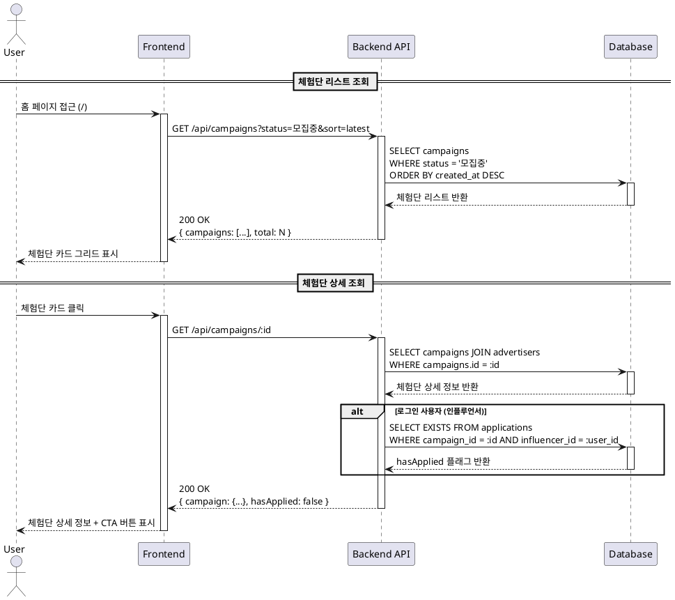

# 유스케이스: UC-003 체험단 탐색 및 리스트 조회

## 1. 개요

### 1.1 목적
인플루언서가 모집 중인 체험단을 탐색하고, 필터 및 정렬 기능을 통해 원하는 체험단을 쉽게 찾을 수 있도록 합니다. 또한 선택한 체험단의 상세 정보를 확인하여 지원 여부를 결정할 수 있도록 합니다.

### 1.2 범위
- 체험단 리스트 조회 (홈 페이지)
- 카테고리, 지역, 모집 상태별 필터링
- 최신순, 마감임박순 정렬
- 체험단 상세 정보 조회
- 지원 가능 여부 확인 및 CTA 버튼 표시

**제외 사항**:
- 체험단 지원 프로세스 (UC-004에서 다룸)
- 체험단 등록 및 관리 (UC-005, UC-006에서 다룸)

### 1.3 액터
- **주요 액터**: 인플루언서 (로그인/비로그인 모두 가능)
- **부 액터**: 광고주 (체험단 등록자로 간접 참여), 시스템 (자동 모집 상태 업데이트)

---

## 2. 선행 조건

### 2.1 체험단 리스트 조회
- 등록된 체험단이 1개 이상 존재
- 사용자는 로그인 여부와 관계없이 접근 가능

### 2.2 체험단 상세 조회
- 조회하려는 체험단이 존재
- 사용자는 로그인 여부와 관계없이 접근 가능

---

## 3. 참여 컴포넌트

### 3.1 Frontend
- **페이지**: `/` (홈), `/campaigns/:id` (체험단 상세)
- **컴포넌트**:
  - `CampaignCard`: 체험단 카드 UI
  - `CampaignFilter`: 필터 및 정렬 컴포넌트
  - `CampaignDetail`: 체험단 상세 정보 표시
- **훅**:
  - `useCampaigns`: 체험단 리스트 조회 (React Query)
  - `useCampaignDetail`: 체험단 상세 조회 (React Query)

### 3.2 Backend
- **API 엔드포인트**:
  - `GET /api/campaigns`: 체험단 리스트 조회
  - `GET /api/campaigns/:id`: 체험단 상세 조회
- **서비스**:
  - `CampaignService.getCampaigns()`: 필터링 및 페이지네이션 처리
  - `CampaignService.getCampaignById()`: 상세 정보 조회 및 권한 검증

### 3.3 Database
- **테이블**: `campaigns`, `advertisers`, `applications`
- **인덱스**:
  - `idx_campaigns_status`
  - `idx_campaigns_category`
  - `idx_campaigns_status_created_at`

---

## 4. 기본 플로우 (Basic Flow)

### 4.1 체험단 리스트 조회 (Userflow 1.2.1)

#### 단계별 흐름

1. **사용자**: 홈 페이지 (`/`) 접근
   - 입력: URL 직접 입력 또는 네비게이션 클릭
   - 처리: Next.js 라우팅
   - 출력: 홈 페이지 렌더링

2. **Frontend**: `useCampaigns` 훅 실행
   - 입력: 필터 조건 (선택사항)
     - `category`: 카테고리 (음식점, 카페, 뷰티, 패션, 생활, 기타)
     - `region`: 지역 (서울, 부산, 대구 등)
     - `status`: 모집 상태 (모집중, 모집종료, 선정완료)
     - `sort`: 정렬 기준 (latest, deadline, popular)
   - 처리: `GET /api/campaigns` API 호출
   - 출력: 로딩 상태 → 체험단 리스트 데이터

3. **Backend**: `GET /api/campaigns` 핸들러 실행
   - 입력: 쿼리 파라미터 (`category`, `region`, `status`, `sort`, `page`, `limit`)
   - 처리:
     - Zod 스키마로 쿼리 파라미터 검증
     - `CampaignService.getCampaigns()` 호출
   - 출력: JSON 응답 (체험단 리스트 + 페이지네이션 메타데이터)

4. **Database**: `campaigns` 테이블 조회
   - 쿼리:
     ```sql
     SELECT
       campaigns.id,
       campaigns.title,
       campaigns.recruitment_count,
       campaigns.recruitment_end_date,
       campaigns.status,
       campaigns.category,
       campaigns.created_at,
       advertisers.business_name
     FROM campaigns
     JOIN advertisers ON campaigns.advertiser_id = advertisers.id
     WHERE campaigns.status = '모집중'
       AND (category = :category OR :category IS NULL)
       AND (status = :status OR :status IS NULL)
     ORDER BY campaigns.created_at DESC
     LIMIT 20 OFFSET :offset
     ```
   - 출력: 체험단 레코드 배열

5. **Frontend**: 체험단 카드 그리드 렌더링
   - 입력: 체험단 리스트 데이터
   - 처리:
     - 각 체험단을 `CampaignCard` 컴포넌트로 렌더링
     - 썸네일 이미지 (placeholder)
     - 제목, 모집 인원, 마감일 표시
     - 모집 상태 뱃지 표시
   - 출력: 사용자에게 시각적 UI 제공

6. **사용자**: 체험단 카드 클릭
   - 입력: 마우스 클릭 또는 터치
   - 처리: `/campaigns/:id` 페이지로 이동
   - 출력: 페이지 전환

### 4.2 체험단 상세 조회 (Userflow 1.2.2)

#### 단계별 흐름

1. **사용자**: 체험단 상세 페이지 (`/campaigns/:id`) 접근
   - 입력: 체험단 카드 클릭 또는 URL 직접 입력
   - 처리: Next.js 라우팅
   - 출력: 체험단 상세 페이지 렌더링

2. **Frontend**: `useCampaignDetail` 훅 실행
   - 입력: 체험단 ID (URL 파라미터)
   - 처리: `GET /api/campaigns/:id` API 호출
   - 출력: 로딩 상태 → 체험단 상세 데이터

3. **Backend**: `GET /api/campaigns/:id` 핸들러 실행
   - 입력: 경로 파라미터 (체험단 ID)
   - 처리:
     - Zod 스키마로 ID 검증
     - 현재 사용자 세션 확인 (선택사항)
     - `CampaignService.getCampaignById()` 호출
   - 출력: JSON 응답 (체험단 상세 정보 + 광고주 정보)

4. **Database**: `campaigns` 및 `advertisers` 테이블 조인 조회
   - 쿼리:
     ```sql
     SELECT
       campaigns.*,
       advertisers.business_name,
       advertisers.address,
       advertisers.business_phone
     FROM campaigns
     JOIN advertisers ON campaigns.advertiser_id = advertisers.id
     WHERE campaigns.id = :campaign_id
     ```
   - 출력: 체험단 상세 레코드

5. **Backend**: 사용자 지원 여부 확인 (로그인 사용자만)
   - 입력: 체험단 ID, 현재 사용자 ID (인플루언서)
   - 처리:
     - `applications` 테이블 조회
     ```sql
     SELECT EXISTS(
       SELECT 1 FROM applications
       WHERE campaign_id = :campaign_id
         AND influencer_id = :influencer_id
     ) as already_applied
     ```
   - 출력: `hasApplied` 플래그

6. **Frontend**: 체험단 상세 정보 및 CTA 버튼 렌더링
   - 입력: 체험단 상세 데이터, 사용자 상태 (로그인 여부, 인플루언서 여부, 지원 여부)
   - 처리:
     - 체험단 정보 표시 (제목, 설명, 혜택, 모집 인원, 기간, 매장 정보, 미션)
     - CTA 버튼 상태 결정:
       - 비로그인: "로그인 후 지원하기" (클릭 시 `/login`으로 이동)
       - 인플루언서 정보 미등록: "프로필 등록 후 지원하기" (클릭 시 `/onboarding/influencer`로 이동)
       - 인플루언서 정보 등록 완료 + 모집중 + 미지원: "지원하기" 버튼 활성화 (클릭 시 `/campaigns/:id/apply`로 이동)
       - 이미 지원한 경우: "지원 완료" 비활성화 버튼
       - 모집 종료: "모집 종료" 비활성화 버튼
   - 출력: 사용자에게 시각적 UI 및 상호작용 제공

### 4.3 시퀀스 다이어그램 (PlantUML)



---

## 5. 대안 플로우 (Alternative Flows)

### 5.1 대안 플로우 1: 필터 적용

**시작 조건**: 사용자가 홈 페이지에서 필터 옵션 선택

**단계**:
1. 사용자가 카테고리 드롭다운에서 "카페" 선택
2. Frontend가 쿼리 파라미터 업데이트 (`?category=카페`)
3. `useCampaigns` 훅이 자동으로 재실행 (React Query)
4. Backend가 필터링된 체험단 리스트 반환
5. Frontend가 업데이트된 리스트 렌더링

**결과**: 선택한 카테고리의 체험단만 표시

### 5.2 대안 플로우 2: 정렬 변경

**시작 조건**: 사용자가 정렬 옵션 변경

**단계**:
1. 사용자가 "마감임박순" 선택
2. Frontend가 쿼리 파라미터 업데이트 (`?sort=deadline`)
3. Backend가 `recruitment_end_date ASC` 순으로 정렬
4. Frontend가 정렬된 리스트 렌더링

**결과**: 마감일이 가까운 체험단부터 표시

### 5.3 대안 플로우 3: 페이지네이션

**시작 조건**: 사용자가 페이지 하단으로 스크롤

**단계**:
1. 무한 스크롤 트리거 (또는 "더보기" 버튼 클릭)
2. Frontend가 `page` 파라미터 증가 (`?page=2`)
3. Backend가 다음 20개 체험단 반환
4. Frontend가 기존 리스트에 추가 렌더링

**결과**: 추가 체험단 로드

---

## 6. 예외 플로우 (Exception Flows)

### 6.1 예외 상황 1: 체험단 없음

**발생 조건**: 필터 조건에 맞는 체험단이 없거나, 전체 체험단이 없음

**처리 방법**:
1. Backend가 빈 배열 반환 (`{ campaigns: [], total: 0 }`)
2. Frontend가 빈 상태 메시지 표시
   - "모집 중인 체험단이 없습니다"
   - "체험단 등록하기" 버튼 (광고주용) 또는 필터 초기화 버튼 표시

**에러 코드**: 없음 (정상 응답)

**사용자 메시지**: "모집 중인 체험단이 없습니다"

### 6.2 예외 상황 2: 체험단 상세 조회 실패 (존재하지 않는 ID)

**발생 조건**: 존재하지 않거나 삭제된 체험단 ID로 접근

**처리 방법**:
1. Backend가 404 Not Found 응답
2. Frontend가 404 에러 페이지 표시
   - "존재하지 않는 체험단입니다"
   - "홈으로 돌아가기" 버튼

**에러 코드**: `CAMPAIGN_NOT_FOUND` (HTTP 404)

**사용자 메시지**: "존재하지 않는 체험단입니다"

### 6.3 예외 상황 3: 네트워크 오류

**발생 조건**: API 요청 실패 (서버 장애, 네트워크 연결 끊김)

**처리 방법**:
1. React Query가 자동 재시도 (최대 3회)
2. 3회 실패 시 Frontend가 에러 메시지 표시
   - "체험단 목록을 불러오는데 실패했습니다"
   - "재시도" 버튼

**에러 코드**: `NETWORK_ERROR` (HTTP 500 또는 네트워크 에러)

**사용자 메시지**: "일시적인 오류가 발생했습니다. 다시 시도해주세요"

### 6.4 예외 상황 4: 유효하지 않은 필터 파라미터

**발생 조건**: 잘못된 카테고리, 정렬 기준 등을 쿼리 파라미터로 전달

**처리 방법**:
1. Backend가 Zod 스키마 검증 실패
2. 400 Bad Request 응답
3. Frontend가 기본값으로 폴백 (예: 모든 카테고리, 최신순)

**에러 코드**: `INVALID_QUERY_PARAMS` (HTTP 400)

**사용자 메시지**: "잘못된 요청입니다" (사용자에게 직접 표시하지 않고 기본값으로 폴백)

---

## 7. 후행 조건 (Post-conditions)

### 7.1 성공 시

#### 체험단 리스트 조회
- **데이터베이스 변경**: 없음 (읽기 전용)
- **시스템 상태**:
  - React Query 캐시에 체험단 리스트 저장 (5분간 유지)
  - 사용자는 체험단 리스트를 확인하고 상세 페이지로 이동 가능
- **외부 시스템**: 없음

#### 체험단 상세 조회
- **데이터베이스 변경**: 없음 (읽기 전용)
- **시스템 상태**:
  - React Query 캐시에 체험단 상세 정보 저장 (5분간 유지)
  - 사용자는 지원 가능 여부를 확인하고 지원 페이지로 이동 가능
- **외부 시스템**: 없음

### 7.2 실패 시

- **데이터 롤백**: 해당 없음 (읽기 전용)
- **시스템 상태**:
  - 에러 메시지 표시
  - 사용자는 재시도 또는 홈으로 복귀 가능
  - React Query 캐시는 업데이트되지 않음

---

## 8. 비기능 요구사항

### 8.1 성능
- **API 응답 시간**: 500ms 이내 (평균)
- **페이지 로딩 시간**: 3초 이내 (First Contentful Paint)
- **페이지네이션**: 20개씩 로드 (초기 로딩 속도 최적화)
- **이미지 최적화**: Next.js Image 컴포넌트 사용, Lazy loading 적용
- **데이터베이스 쿼리**: 복합 인덱스 활용 (`idx_campaigns_status_created_at`)

### 8.2 보안
- **SQL Injection 방지**: Supabase Parameterized Query 사용
- **XSS 방지**: React의 자동 이스케이핑
- **권한 검증**:
  - 체험단 리스트는 누구나 조회 가능
  - 체험단 상세도 누구나 조회 가능
  - 지원 여부 확인은 로그인한 인플루언서만 가능

### 8.3 가용성
- **캐싱 전략**: React Query로 5분간 캐시 유지
- **에러 복구**: 자동 재시도 3회
- **폴백 UI**: 로딩 중 스켈레톤 UI 표시

---

## 9. UI/UX 요구사항

### 9.1 화면 구성

#### 홈 페이지 (`/`)
- **헤더**: 로고, 네비게이션, 로그인 버튼
- **필터 영역**:
  - 카테고리 드롭다운
  - 지역 드롭다운
  - 모집 상태 드롭다운
  - 정렬 드롭다운 (최신순, 마감임박순)
- **체험단 카드 그리드**:
  - 각 카드: 썸네일, 제목, 모집 인원, 마감일, 상태 뱃지
  - 그리드 레이아웃 (모바일: 1열, 태블릿: 2열, 데스크톱: 3-4열)
- **페이지네이션**: 무한 스크롤 또는 "더보기" 버튼

#### 체험단 상세 페이지 (`/campaigns/:id`)
- **헤더**: 동일
- **체험단 정보 섹션**:
  - 제목
  - 모집 상태 뱃지
  - 모집 인원 및 기간
  - 설명
  - 제공 혜택
  - 미션 및 요구사항
  - 매장 정보 (업체명, 주소, 연락처)
- **CTA 영역**:
  - 지원하기 버튼 (상태에 따라 변경)
  - 버튼 하단에 지원 조건 안내 (예: "인플루언서 정보 등록 후 지원 가능")

### 9.2 사용자 경험
- **로딩 상태**: 스켈레톤 UI로 로딩 중임을 명확히 표시
- **빈 상태**: 체험단이 없을 때 안내 메시지 및 액션 버튼 제공
- **반응형 디자인**: 모바일 우선, 모든 디바이스에서 최적화
- **접근성**:
  - 키보드 네비게이션 지원
  - 스크린 리더 호환 (ARIA 레이블)
  - 색상 대비 4.5:1 이상
- **피드백**:
  - 필터 적용 시 즉각적인 UI 업데이트
  - 에러 발생 시 명확한 메시지 및 복구 방법 제시

---

## 10. 테스트 시나리오

### 10.1 성공 케이스

| 테스트 케이스 ID | 입력값 | 기대 결과 |
|----------------|--------|----------|
| TC-003-01 | 홈 페이지 접근, 필터 없음 | 모집중인 체험단 리스트 최신순으로 20개 표시 |
| TC-003-02 | 카테고리 필터: "카페" | 카테고리가 "카페"인 체험단만 표시 |
| TC-003-03 | 정렬: "마감임박순" | 모집 종료일이 가까운 순으로 정렬 |
| TC-003-04 | 체험단 카드 클릭 | 체험단 상세 페이지로 이동 |
| TC-003-05 | 체험단 상세 페이지 접근 (비로그인) | 체험단 정보 표시 + "로그인 후 지원하기" 버튼 |
| TC-003-06 | 체험단 상세 페이지 접근 (인플루언서, 미지원) | 체험단 정보 표시 + "지원하기" 버튼 활성화 |
| TC-003-07 | 체험단 상세 페이지 접근 (인플루언서, 지원 완료) | 체험단 정보 표시 + "지원 완료" 버튼 비활성화 |

### 10.2 실패 케이스

| 테스트 케이스 ID | 입력값 | 기대 결과 |
|----------------|--------|----------|
| TC-003-08 | 필터: 존재하지 않는 카테고리 | 기본값으로 폴백 (모든 카테고리) |
| TC-003-09 | 체험단 상세 페이지: 존재하지 않는 ID | 404 에러 페이지 표시 |
| TC-003-10 | 네트워크 오류 발생 | "일시적인 오류가 발생했습니다" 메시지 + 재시도 버튼 |
| TC-003-11 | 모든 필터 적용 후 결과 없음 | "모집 중인 체험단이 없습니다" 빈 상태 메시지 |

---

## 11. 관련 유스케이스

- **선행 유스케이스**:
  - UC-001: 회원가입 (선택사항)
  - UC-002: 인플루언서 정보 등록 (지원하기 버튼 활성화에 필요)
- **후행 유스케이스**:
  - UC-004: 체험단 지원
- **연관 유스케이스**:
  - UC-005: 체험단 등록 (광고주)
  - UC-006: 체험단 관리 (광고주)

---

## 12. 비즈니스 규칙

### 12.1 체험단 리스트 조회
- 기본 정렬: 최신순 (`created_at DESC`)
- 기본 필터: 모집중인 체험단만 표시 (`status = '모집중'`)
- 페이지네이션: 20개씩 로드
- 모집 종료일이 지난 체험단은 자동으로 `모집종료` 상태로 변경되지 않음 (광고주가 수동으로 종료)

### 12.2 체험단 상세 조회
- 누구나 조회 가능 (비로그인 포함)
- 광고주가 자신이 등록한 체험단을 조회할 때는 "지원하기" 버튼 숨김
- 모집 종료된 체험단도 조회 가능 (단, 지원 불가)

### 12.3 CTA 버튼 상태 결정 로직
```
if (!로그인) {
  버튼 텍스트 = "로그인 후 지원하기"
  클릭 시 = /login으로 이동
} else if (광고주) {
  버튼 숨김
} else if (!인플루언서정보등록) {
  버튼 텍스트 = "프로필 등록 후 지원하기"
  클릭 시 = /onboarding/influencer로 이동
} else if (이미지원) {
  버튼 텍스트 = "지원 완료"
  버튼 비활성화
} else if (모집종료 || 선정완료) {
  버튼 텍스트 = "모집 종료"
  버튼 비활성화
} else {
  버튼 텍스트 = "지원하기"
  버튼 활성화
  클릭 시 = /campaigns/:id/apply로 이동
}
```

---

## 13. 변경 이력

| 버전 | 날짜 | 작성자 | 변경 내용 |
|------|------|--------|-----------|
| 1.0  | 2025-11-14 | Claude | 초기 작성 |

---

## 부록

### A. 용어 정의
- **체험단**: 광고주가 등록한 체험 캠페인
- **모집 상태**: 체험단의 현재 진행 상태 (모집중, 모집종료, 선정완료)
- **CTA (Call to Action)**: 사용자에게 특정 액션을 유도하는 버튼
- **스켈레톤 UI**: 로딩 중 표시되는 임시 UI (회색 애니메이션 블록)

### B. 참고 자료
- `/docs/userflow.md`: 사용자 플로우 상세 정의 (섹션 1.2.1, 1.2.2)
- `/docs/prd.md`: 제품 요구사항 정의 (섹션 3.1.1, 3.1.4)
- `/docs/database.md`: 데이터베이스 스키마 (섹션 4.3, 10.1, 10.2)
- `GET /api/campaigns` API 명세 (추후 작성 예정)
- `GET /api/campaigns/:id` API 명세 (추후 작성 예정)
