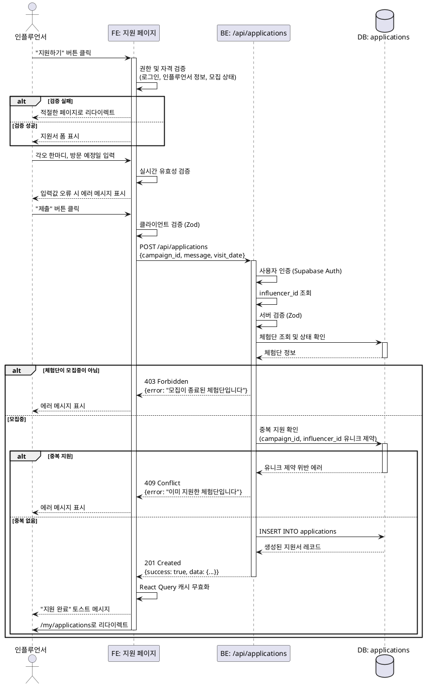

# 유스케이스: UC-004 체험단 지원

## 제목
인플루언서의 체험단 지원 프로세스

---

## 1. 개요

### 1.1 목적
인플루언서가 관심 있는 체험단을 찾아 지원서를 제출하고, 선정 결과를 확인할 수 있도록 한다.

### 1.2 범위
- 체험단 지원 페이지 접근 및 지원서 작성
- 지원서 제출 및 검증
- 중복 지원 방지
- 지원 내역 조회

**제외 사항**:
- 지원서 수정/삭제 (P2)
- 선정 알림 기능 (P1)

### 1.3 액터
- **주요 액터**: 인플루언서 (Influencer)
- **부 액터**: 시스템 (Backend API, Database)

---

## 2. 선행 조건

- 사용자가 인플루언서로 회원가입을 완료했다
- 인플루언서 정보 등록을 완료했다 (`influencers` 테이블에 레코드 존재)
- 로그인 상태이다 (Supabase Auth 세션 유효)
- 체험단이 '모집중' 상태이다
- 해당 체험단에 아직 지원하지 않았다

---

## 3. 참여 컴포넌트

- **Frontend (Client Component)**:
  - `/campaigns/:id/apply` 페이지 컴포넌트
  - React Hook Form (폼 상태 관리)
  - React Query (서버 상태 관리)
  - Zod (클라이언트 유효성 검증)

- **Backend (Hono Router)**:
  - `POST /api/applications` - 체험단 지원 API
  - Zod Schema (서버 유효성 검증)
  - Supabase Service-role Client

- **Database (Supabase PostgreSQL)**:
  - `applications` 테이블 - 지원서 저장
  - `campaigns` 테이블 - 체험단 정보 조회
  - `influencers` 테이블 - 인플루언서 정보 조회

---

## 4. 기본 플로우 (Basic Flow)

### 4.1 트리거
인플루언서가 체험단 상세 페이지에서 "지원하기" 버튼을 클릭한다.

### 4.2 단계별 흐름

1. **인플루언서**: 체험단 상세 페이지에서 "지원하기" 버튼 클릭
   - 입력: 체험단 ID (`campaign_id`)
   - 처리: `/campaigns/:id/apply` 페이지로 라우팅
   - 출력: 지원서 작성 폼 화면 렌더링

2. **Frontend**: 페이지 로드 시 권한 및 자격 검증
   - 처리:
     - 로그인 여부 확인 (Supabase Auth 세션)
     - 인플루언서 정보 등록 여부 확인
     - 체험단 모집 상태 확인 (`GET /api/campaigns/:id`)
     - 중복 지원 여부 확인 (캐시된 지원 목록 또는 API 조회)
   - 출력:
     - 성공: 지원서 폼 표시
     - 실패: 적절한 페이지로 리다이렉트 (로그인, 온보딩, 체험단 상세)

3. **인플루언서**: 지원서 폼 작성
   - 입력:
     - 각오 한마디 (Textarea, 10자 이상 500자 이하)
     - 방문 예정일 (Date Picker, 오늘 이후 날짜)
   - 처리: React Hook Form으로 실시간 유효성 검증
   - 출력: 입력값 오류 시 필드별 에러 메시지 표시

4. **인플루언서**: "제출" 버튼 클릭
   - 입력: 작성된 지원서 데이터
   - 처리: 제출 버튼 비활성화, 로딩 스피너 표시

5. **Frontend**: 서버로 지원서 데이터 전송
   - 처리:
     - Zod 스키마로 클라이언트 검증
     - `POST /api/applications` API 호출
     - 요청 바디:
       ```json
       {
         "campaign_id": 123,
         "message": "각오 한마디...",
         "visit_date": "2025-11-20"
       }
       ```

6. **Backend**: 지원서 데이터 검증 및 권한 확인
   - 처리:
     - Supabase Auth 세션으로 사용자 인증
     - 사용자의 `influencer_id` 조회
     - Zod 스키마로 요청 데이터 검증
     - 비즈니스 규칙 검증:
       - 체험단 존재 여부 (`campaigns` 테이블 조회)
       - 체험단 모집 상태 (`status = '모집중'`)
       - 중복 지원 여부 (`applications` 테이블 유니크 제약 확인)
   - 출력: 검증 실패 시 400/403 에러 응답

7. **Backend**: `applications` 테이블에 지원서 저장
   - 처리:
     ```sql
     INSERT INTO applications (
       campaign_id,
       influencer_id,
       message,
       visit_date,
       status,
       applied_at
     ) VALUES (
       :campaign_id,
       :influencer_id,
       :message,
       :visit_date,
       '신청완료',
       NOW()
     ) RETURNING *;
     ```
   - 출력: 생성된 지원서 레코드

8. **Backend**: 성공 응답 반환
   - 출력:
     ```json
     {
       "success": true,
       "data": {
         "id": 456,
         "campaign_id": 123,
         "influencer_id": 789,
         "message": "각오 한마디...",
         "visit_date": "2025-11-20",
         "status": "신청완료",
         "applied_at": "2025-11-14T10:30:00Z"
       }
     }
     ```

9. **Frontend**: 성공 처리
   - 처리:
     - React Query 캐시 무효화 (`applications`, `campaigns/:id`)
     - 토스트 메시지 표시: "체험단 지원이 완료되었습니다"
     - `/my/applications` (내 지원 목록) 페이지로 리다이렉트
   - 출력: 지원 목록 페이지에서 새로 제출한 지원서 확인 가능

### 4.3 시퀀스 다이어그램



---

## 5. 대안 플로우 (Alternative Flows)

### 5.1 대안 플로우 1: 비로그인 상태에서 접근

**시작 조건**: 사용자가 비로그인 상태에서 "지원하기" 버튼을 클릭한 경우

**단계**:
1. Frontend에서 Supabase Auth 세션이 없음을 감지
2. 현재 URL을 `redirect` 쿼리 파라미터로 저장
3. `/login?redirect=/campaigns/:id/apply`로 리다이렉트
4. 로그인 성공 후 원래 페이지로 복귀

**결과**: 로그인 후 지원서 작성 가능

---

### 5.2 대안 플로우 2: 인플루언서 정보 미등록 상태

**시작 조건**: 로그인했으나 인플루언서 정보를 등록하지 않은 경우

**단계**:
1. Frontend에서 `influencers` 테이블 조회 시 레코드가 없음을 확인
2. `/onboarding/influencer`로 리다이렉트
3. "프로필 등록 후 지원하기" 안내 메시지 표시
4. 인플루언서 정보 등록 완료 후 원래 체험단 페이지로 복귀

**결과**: 인플루언서 정보 등록 후 지원 가능

---

### 5.3 대안 플로우 3: 광고주 계정으로 접근

**시작 조건**: 광고주 계정으로 체험단 지원 페이지에 접근한 경우

**단계**:
1. Frontend에서 사용자 역할 확인 (`advertisers` 테이블 존재 여부)
2. "인플루언서만 지원할 수 있습니다" 에러 메시지 표시
3. 홈 페이지로 리다이렉트

**결과**: 지원 불가

---

## 6. 예외 플로우 (Exception Flows)

### 6.1 예외 상황 1: 이미 지원한 체험단에 재지원 시도

**발생 조건**:
- 동일한 `campaign_id`와 `influencer_id` 조합으로 지원서가 이미 존재하는 경우

**처리 방법**:
1. Backend에서 INSERT 시 유니크 제약 위반 에러 발생
2. 409 Conflict 응답 반환
3. Frontend에서 에러 메시지 표시
4. 체험단 상세 페이지로 리다이렉트

**에러 코드**: `409 Conflict`

**사용자 메시지**: "이미 지원한 체험단입니다"

---

### 6.2 예외 상황 2: 모집이 종료된 체험단에 지원 시도

**발생 조건**:
- 사용자가 지원서 작성 중 체험단 모집이 종료된 경우
- `campaigns.status` ≠ '모집중'

**처리 방법**:
1. Backend에서 체험단 상태 확인
2. 403 Forbidden 응답 반환
3. Frontend에서 에러 메시지 표시
4. 체험단 상세 페이지로 리다이렉트

**에러 코드**: `403 Forbidden`

**사용자 메시지**: "모집이 종료된 체험단입니다"

---

### 6.3 예외 상황 3: 유효성 검증 실패

**발생 조건**:
- 각오 한마디가 10자 미만 또는 500자 초과
- 방문 예정일이 과거 날짜
- 필수 필드 누락

**처리 방법**:
1. Backend에서 Zod 스키마 검증 실패
2. 400 Bad Request 응답 반환
3. Frontend에서 필드별 에러 메시지 표시
4. 사용자가 입력값 수정 후 재제출 가능

**에러 코드**: `400 Bad Request`

**사용자 메시지**:
- "각오 한마디는 10자 이상 500자 이하로 입력해주세요"
- "방문 예정일은 오늘 이후 날짜를 선택해주세요"

---

### 6.4 예외 상황 4: 네트워크 오류

**발생 조건**:
- API 요청 실패 (타임아웃, 연결 끊김 등)

**처리 방법**:
1. React Query의 retry 로직 활용 (최대 3회)
2. 3회 실패 시 에러 메시지 표시
3. "재시도" 버튼 제공

**에러 코드**: `500 Internal Server Error` (네트워크 오류)

**사용자 메시지**: "일시적인 오류가 발생했습니다. 다시 시도해주세요"

---

### 6.5 예외 상황 5: 존재하지 않는 체험단

**발생 조건**:
- 잘못된 `campaign_id`로 접근
- 삭제된 체험단에 접근

**처리 방법**:
1. Backend에서 체험단 조회 시 결과 없음
2. 404 Not Found 응답 반환
3. Frontend에서 404 에러 페이지 표시

**에러 코드**: `404 Not Found`

**사용자 메시지**: "존재하지 않는 체험단입니다"

---

## 7. 후행 조건 (Post-conditions)

### 7.1 성공 시

**데이터베이스 변경**:
- `applications` 테이블에 새로운 레코드 생성
  - `status`: '신청완료'
  - `applied_at`: 현재 시각
  - `created_at`, `updated_at`: 자동 생성

**시스템 상태**:
- 인플루언서의 지원 목록에 새로운 지원서 추가됨
- 광고주의 신청자 리스트에 해당 인플루언서 추가됨
- React Query 캐시 무효화:
  - `GET /api/applications` (내 지원 목록)
  - `GET /api/campaigns/:id` (체험단 상세)

**외부 시스템**:
- (추후 구현) 광고주에게 새로운 신청자 알림 발송

### 7.2 실패 시

**데이터 롤백**:
- 트랜잭션 롤백 (DB 변경 없음)
- 사용자 입력값은 폼에 유지됨 (재제출 가능)

**시스템 상태**:
- 에러 메시지 표시
- 제출 버튼 재활성화
- React Query 캐시 유지

---

## 8. 비즈니스 규칙

### BR-001: 중복 지원 방지
- 동일한 인플루언서는 동일한 체험단에 한 번만 지원할 수 있다
- 데이터베이스 레벨 유니크 제약으로 강제: `(campaign_id, influencer_id)`

### BR-002: 모집 상태 확인
- 체험단 상태가 '모집중'일 때만 지원 가능하다
- 모집종료 또는 선정완료 상태에서는 지원 불가

### BR-003: 인플루언서 자격 검증
- 인플루언서 정보 등록을 완료한 사용자만 지원 가능하다
- 광고주는 체험단에 지원할 수 없다

### BR-004: 방문 예정일 제약
- 방문 예정일은 반드시 오늘 이후 날짜여야 한다
- 과거 날짜 선택 불가

### BR-005: 각오 한마디 길이 제약
- 최소 10자 이상 작성해야 한다
- 최대 500자까지 작성 가능하다

---

## 9. 비기능 요구사항

### 9.1 성능
- API 응답 시간: 500ms 이내
- 폼 제출 후 리다이렉트까지: 2초 이내
- 클라이언트 유효성 검증: 실시간 (debounce 300ms)

### 9.2 보안
- Supabase Auth 세션 기반 인증 필수
- SQL Injection 방지: Supabase Parameterized Query 사용
- XSS 방지: React 자동 이스케이핑
- CSRF 방지: Supabase CSRF 토큰 자동 처리

### 9.3 가용성
- React Query의 retry 로직으로 네트워크 장애 대응
- 낙관적 업데이트 (Optimistic Update) 미적용 (데이터 무결성 우선)

### 9.4 사용성
- 로딩 상태 표시: 제출 버튼 비활성화 + 스피너
- 에러 메시지: 필드별 명확한 메시지 표시
- 접근성: 키보드 네비게이션, 스크린 리더 호환

---

## 10. UI/UX 요구사항

### 10.1 화면 구성

**지원서 작성 페이지 (`/campaigns/:id/apply`)**:
1. 상단: 체험단 요약 정보 (제목, 모집 인원, 마감일)
2. 폼 섹션:
   - 각오 한마디 (Textarea)
     - Placeholder: "체험단에 지원하는 각오를 작성해주세요 (10자 이상)"
     - 글자 수 카운터 표시 (예: "150 / 500자")
   - 방문 예정일 (Date Picker)
     - 오늘 이후 날짜만 선택 가능
     - Placeholder: "방문 예정일을 선택해주세요"
3. 하단: 제출 버튼
   - 텍스트: "지원하기"
   - 유효성 검증 실패 시 비활성화

### 10.2 사용자 경험

- **폼 자동 저장**: 미구현 (1차 범위 제외)
- **진행률 표시**: 필드 2개뿐이므로 불필요
- **성공 피드백**:
  - 토스트 메시지: "체험단 지원이 완료되었습니다" (3초 후 자동 사라짐)
  - 자동 리다이렉트: `/my/applications` (내 지원 목록)
- **에러 피드백**:
  - 필드별 에러 메시지: 빨간색, 필드 하단 표시
  - 전역 에러: 토스트 또는 모달로 표시

---

## 11. 테스트 시나리오

### 11.1 성공 케이스

| 테스트 케이스 ID | 입력값 | 기대 결과 |
|----------------|--------|----------|
| TC-004-01 | 각오 한마디: "열심히 리뷰하겠습니다..." (50자)<br>방문 예정일: 2025-11-20 | 201 Created, 지원서 생성 성공 |
| TC-004-02 | 각오 한마디: "최소 글자수" (10자)<br>방문 예정일: 내일 | 201 Created, 지원서 생성 성공 |
| TC-004-03 | 각오 한마디: 500자 (최대 길이)<br>방문 예정일: 1개월 후 | 201 Created, 지원서 생성 성공 |

### 11.2 실패 케이스

| 테스트 케이스 ID | 입력값 | 기대 결과 |
|----------------|--------|----------|
| TC-004-04 | 각오 한마디: "짧음" (5자)<br>방문 예정일: 내일 | 400 Bad Request, "각오 한마디는 10자 이상이어야 합니다" |
| TC-004-05 | 각오 한마디: 600자<br>방문 예정일: 내일 | 400 Bad Request, "각오 한마디는 500자 이하여야 합니다" |
| TC-004-06 | 각오 한마디: "정상" (50자)<br>방문 예정일: 어제 | 400 Bad Request, "방문 예정일은 오늘 이후여야 합니다" |
| TC-004-07 | 이미 지원한 체험단 재지원 | 409 Conflict, "이미 지원한 체험단입니다" |
| TC-004-08 | 모집종료된 체험단 지원 | 403 Forbidden, "모집이 종료된 체험단입니다" |
| TC-004-09 | 광고주 계정으로 지원 시도 | 403 Forbidden, "인플루언서만 지원할 수 있습니다" |
| TC-004-10 | 비로그인 상태에서 접근 | 리다이렉트 `/login?redirect=/campaigns/:id/apply` |
| TC-004-11 | 인플루언서 정보 미등록 상태 | 리다이렉트 `/onboarding/influencer` |

---

## 12. 관련 유스케이스

### 선행 유스케이스
- **UC-001**: 회원가입 및 로그인
- **UC-002**: 인플루언서 정보 등록
- **UC-003**: 체험단 상세 조회

### 후행 유스케이스
- **UC-005**: 내 지원 목록 조회
- **UC-006**: 인플루언서 선정 (광고주 관점)

### 연관 유스케이스
- **UC-003**: 체험단 상세 조회 (지원 버튼 활성화 여부 판단)

---

## 13. 데이터 스키마

### 13.1 API 요청 스키마

**POST /api/applications**

```typescript
// Request Body Schema (Zod)
{
  campaign_id: number,      // 체험단 ID (required)
  message: string,          // 각오 한마디 (required, min: 10, max: 500)
  visit_date: string        // 방문 예정일 (required, format: YYYY-MM-DD, 오늘 이후)
}
```

### 13.2 API 응답 스키마

**성공 응답 (201 Created)**
```typescript
{
  success: true,
  data: {
    id: number,
    campaign_id: number,
    influencer_id: number,
    message: string,
    visit_date: string,
    status: "신청완료",
    applied_at: string,       // ISO 8601 timestamp
    created_at: string,
    updated_at: string
  }
}
```

**에러 응답 (4xx/5xx)**
```typescript
{
  success: false,
  error: string,               // 에러 메시지
  details?: {                  // (optional) 필드별 에러
    message?: string[],
    visit_date?: string[]
  }
}
```

---

## 14. 변경 이력

| 버전 | 날짜 | 작성자 | 변경 내용 |
|------|------|--------|-----------|
| 1.0  | 2025-11-14 | Claude | 초기 작성 |

---

## 부록

### A. 용어 정의

- **체험단**: 광고주가 등록한 제품/서비스 체험 캠페인
- **인플루언서**: SNS 채널을 보유하고 체험단에 지원하는 사용자
- **지원서**: 인플루언서가 체험단에 제출하는 신청서
- **각오 한마디**: 지원 동기 또는 각오를 표현하는 짧은 글
- **방문 예정일**: 인플루언서가 매장을 방문할 예정인 날짜

### B. 참고 자료

- `/docs/userflow.md` - 섹션 1.2.3 (체험단 지원)
- `/docs/prd.md` - 섹션 3.2.2 (체험단 지원 페이지)
- `/docs/database.md` - 섹션 4.4 (applications 테이블)
- Supabase Auth Documentation: https://supabase.com/docs/guides/auth
- React Hook Form: https://react-hook-form.com/
- Zod Validation: https://zod.dev/
