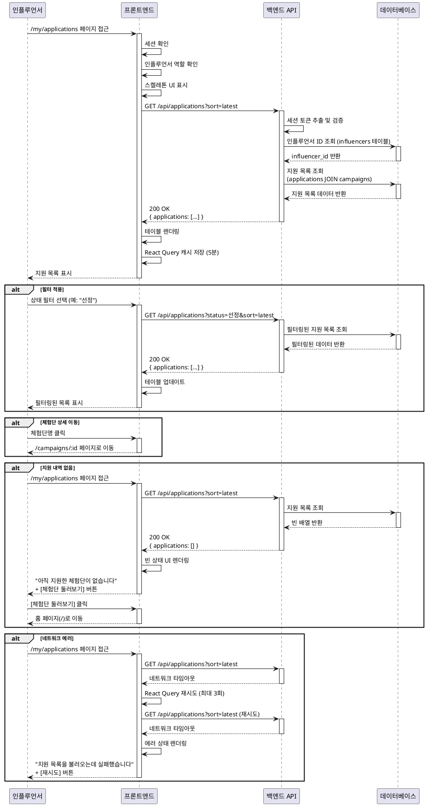

# 유스케이스: 내 지원 목록 조회

## UC-005: 인플루언서가 지원한 체험단 목록 및 상태 확인

---

## Primary Actor
- **인플루언서** (Influencer)

---

## Precondition
- 사용자가 로그인되어 있어야 합니다.
- 사용자가 인플루언서 역할이어야 합니다.
- 인플루언서 정보가 등록되어 있어야 합니다.

---

## Trigger
- 인플루언서가 `/my/applications` 페이지에 접근합니다.
- 또는 내비게이션 메뉴에서 "내 지원 목록" 메뉴를 클릭합니다.

---

## Main Scenario

### 1. 페이지 접근 및 초기 로딩

1. **인플루언서**: `/my/applications` 페이지에 접근합니다.
2. **프론트엔드**:
   - 사용자 인증 상태를 확인합니다.
   - 인플루언서 역할 여부를 확인합니다.
   - 스켈레톤 UI를 표시합니다.
3. **프론트엔드**: `GET /api/applications?sort=latest` API를 호출합니다.
4. **백엔드**:
   - 요청 헤더에서 세션 토큰을 추출합니다.
   - Supabase Auth를 통해 사용자 인증을 확인합니다.
   - 현재 사용자의 인플루언서 ID를 조회합니다.
5. **데이터베이스**:
   - `applications` 테이블에서 `influencer_id = current_user_influencer_id`인 레코드를 조회합니다.
   - `campaigns` 테이블과 조인하여 체험단 정보를 포함합니다.
   - `applied_at` 기준 최신순으로 정렬합니다.
6. **백엔드**: 조회 결과를 JSON 형식으로 응답합니다.
7. **프론트엔드**:
   - 응답 데이터를 테이블 형태로 렌더링합니다.
   - 각 행에 다음 정보를 표시합니다:
     - 체험단명
     - 지원일 (YYYY-MM-DD 형식)
     - 상태 (뱃지: 신청완료/선정/반려)
     - 방문 예정일 (YYYY-MM-DD 형식)

### 2. 필터 적용 (선택적)

1. **인플루언서**: 상태 필터 드롭다운에서 특정 상태를 선택합니다 (전체/신청완료/선정/반려).
2. **프론트엔드**: `GET /api/applications?status={selected_status}&sort=latest` API를 호출합니다.
3. **백엔드**: `status` 파라미터에 따라 필터링된 결과를 반환합니다.
4. **프론트엔드**: 필터링된 데이터를 테이블에 표시합니다.

### 3. 정렬 변경 (선택적)

1. **인플루언서**: 정렬 드롭다운에서 "지원일 오래된순"을 선택합니다.
2. **프론트엔드**: `GET /api/applications?sort=oldest` API를 호출합니다.
3. **백엔드**: `applied_at` 기준 오래된순으로 정렬하여 결과를 반환합니다.
4. **프론트엔드**: 정렬된 데이터를 테이블에 표시합니다.

### 4. 체험단 상세 이동 (선택적)

1. **인플루언서**: 테이블의 특정 행(체험단명)을 클릭합니다.
2. **프론트엔드**: 해당 체험단의 상세 페이지(`/campaigns/:id`)로 이동합니다.

---

## Alternative Flows

### Alt-1: 지원 내역이 없는 경우

**분기점**: Main Scenario Step 6에서 데이터가 없을 때

1. **백엔드**: 빈 배열(`[]`)을 응답합니다.
2. **프론트엔드**:
   - "아직 지원한 체험단이 없습니다" 빈 상태 메시지를 표시합니다.
   - "체험단 둘러보기" 버튼을 표시합니다.
3. **인플루언서**: "체험단 둘러보기" 버튼을 클릭합니다.
4. **프론트엔드**: 홈 페이지(`/`)로 이동합니다.

### Alt-2: 상태 변경 알림

**분기점**: Main Scenario Step 7에서 선정/반려 상태가 새로 업데이트된 경우

1. **프론트엔드**:
   - 해당 행에 "NEW" 뱃지를 추가로 표시합니다.
   - 선정 상태는 초록색, 반려 상태는 회색으로 강조합니다.

---

## Exception Flows

### Exc-1: 비로그인 사용자 접근

**발생 조건**: 세션이 없는 상태에서 페이지 접근

**처리 방법**:
1. **프론트엔드**: Middleware에서 세션을 확인합니다.
2. **프론트엔드**: `/login?redirect=/my/applications`로 리다이렉트합니다.

**사용자 메시지**: (리다이렉트 후 로그인 페이지에 표시) "로그인이 필요한 페이지입니다."

### Exc-2: 광고주 계정으로 접근

**발생 조건**: 광고주 역할로 페이지 접근 시도

**처리 방법**:
1. **프론트엔드**: 사용자 역할을 확인합니다.
2. **프론트엔드**: 홈 페이지(`/`)로 리다이렉트합니다.
3. **프론트엔드**: Toast 메시지를 표시합니다.

**사용자 메시지**: "인플루언서 전용 페이지입니다."

### Exc-3: 네트워크 오류

**발생 조건**: API 요청이 3회 실패한 경우

**에러 코드**: `500` (Internal Server Error) 또는 네트워크 타임아웃

**처리 방법**:
1. **프론트엔드**: React Query의 retry 로직이 3회 재시도를 수행합니다.
2. **프론트엔드**: 3회 실패 후 에러 상태를 렌더링합니다.
3. **프론트엔드**: "재시도" 버튼을 표시합니다.

**사용자 메시지**: "지원 목록을 불러오는데 실패했습니다. 다시 시도해주세요."

### Exc-4: 서버 에러

**발생 조건**: 백엔드에서 예상치 못한 에러 발생

**에러 코드**: `500` (Internal Server Error)

**처리 방법**:
1. **백엔드**: Hono의 `errorBoundary()` 미들웨어에서 에러를 로깅합니다.
2. **백엔드**: 일반적인 에러 응답을 반환합니다.
3. **프론트엔드**: 에러 메시지를 표시합니다.

**사용자 메시지**: "일시적인 오류가 발생했습니다. 잠시 후 다시 시도해주세요."

### Exc-5: 인플루언서 정보 미등록

**발생 조건**: 로그인은 되어 있으나 인플루언서 정보가 등록되지 않은 경우

**에러 코드**: `403` (Forbidden)

**처리 방법**:
1. **백엔드**: 인플루언서 정보 조회 실패 시 403 에러를 반환합니다.
2. **프론트엔드**: `/onboarding/influencer`로 리다이렉트합니다.

**사용자 메시지**: "인플루언서 정보를 먼저 등록해주세요."

---

## Edge Cases

### Edge-1: 페이지네이션 처리
- 지원 내역이 20개를 초과하는 경우:
  - 20개씩 페이지네이션 처리
  - "더 보기" 버튼 또는 무한 스크롤 적용 (향후 구현)

### Edge-2: 실시간 상태 업데이트
- 페이지를 열어둔 상태에서 광고주가 선정/반려 처리를 한 경우:
  - React Query의 stale time (5분) 이후 자동 갱신
  - 또는 사용자가 페이지를 새로고침하면 최신 상태 반영

### Edge-3: 삭제된 체험단
- 광고주가 체험단을 삭제한 경우:
  - 해당 지원 내역은 계속 표시되지만 체험단명을 클릭 시 404 에러
  - 체험단명에 "(삭제됨)" 텍스트 추가 (향후 구현 고려)

### Edge-4: 동일한 체험단에 중복 지원 시도 후 조회
- 중복 지원은 데이터베이스의 유니크 제약조건으로 차단됨
- 지원 목록에는 한 번만 표시됨

---

## Post-conditions

### 성공 시
- **데이터베이스 변경**: 없음 (조회만 수행)
- **시스템 상태**: React Query 캐시에 지원 목록 데이터가 5분간 저장됩니다.
- **사용자 상태**: 인플루언서는 자신의 지원 현황을 확인할 수 있습니다.

### 실패 시
- **데이터 롤백**: 해당 없음 (조회 작업)
- **시스템 상태**: 에러 상태 표시 및 재시도 가능한 UI 제공

---

## Business Rules

### BR-1: 권한 검증
- 인플루언서만 자신의 지원 목록을 조회할 수 있습니다.
- 다른 인플루언서의 지원 목록은 조회할 수 없습니다.

### BR-2: 상태 분류
- 지원 상태는 3가지로 구분됩니다:
  - **신청완료**: 지원 직후 초기 상태
  - **선정**: 광고주가 체험단 선정 시 설정
  - **반려**: 광고주가 선정하지 않은 경우 설정

### BR-3: 정렬 및 필터
- 기본 정렬: 지원일 최신순
- 상태 필터: 전체, 신청완료, 선정, 반려
- 정렬 옵션: 최신순, 오래된순

### BR-4: 캐싱 정책
- React Query를 통해 5분간 캐시 유지
- 5분 경과 후 자동으로 stale 상태로 전환
- 페이지 재방문 시 백그라운드에서 자동 갱신

---

## Non-functional Requirements

### Performance
- API 응답 시간: 500ms 이내
- 초기 페이지 로딩: 3초 이내 (First Contentful Paint)
- 페이지네이션 시 추가 로딩: 1초 이내

### Security
- 세션 기반 인증: Supabase Auth 토큰 검증
- 인플루언서 ID 검증: 백엔드에서 현재 사용자와 일치 여부 확인
- SQL Injection 방지: Supabase의 Parameterized Query 사용

### Usability
- 모바일 반응형 디자인 지원
- 상태별 색상 구분 (신청완료: 파란색, 선정: 초록색, 반려: 회색)
- 스켈레톤 UI로 로딩 상태 표시

---

## UI/UX Requirements

### 화면 구성

```
┌─────────────────────────────────────────────────┐
│  Header (Navigation)                             │
├─────────────────────────────────────────────────┤
│  [내 지원 목록]                                   │
│                                                   │
│  필터: [전체 ▼]  정렬: [최신순 ▼]                 │
│                                                   │
│  ┌─────────────────────────────────────────────┐ │
│  │ 체험단명    │ 지원일     │ 상태     │ 방문예정일 │ │
│  ├─────────────────────────────────────────────┤ │
│  │ OO 카페    │ 2025-11-10 │ [신청완료] │ 2025-11-20 │ │
│  │ XX 레스토랑 │ 2025-11-08 │ [선정]    │ 2025-11-18 │ │
│  │ △△ 뷰티샵  │ 2025-11-05 │ [반려]    │ 2025-11-15 │ │
│  └─────────────────────────────────────────────┘ │
│                                                   │
│  [ 더 보기 ]                                      │
└─────────────────────────────────────────────────┘
```

### 빈 상태 화면

```
┌─────────────────────────────────────────────────┐
│  Header (Navigation)                             │
├─────────────────────────────────────────────────┤
│  [내 지원 목록]                                   │
│                                                   │
│          📋                                       │
│                                                   │
│    아직 지원한 체험단이 없습니다                     │
│                                                   │
│    [체험단 둘러보기]                               │
│                                                   │
└─────────────────────────────────────────────────┘
```

### 상태 뱃지 스타일
- **신청완료**: 파란색 배경, 흰색 텍스트
- **선정**: 초록색 배경, 흰색 텍스트
- **반려**: 회색 배경, 흰색 텍스트

---

## Sequence Diagram



---

## Related Use Cases

### 선행 유스케이스
- **UC-001**: 회원가입 및 로그인
- **UC-002**: 인플루언서 정보 등록
- **UC-004**: 체험단 지원

### 후행 유스케이스
- **UC-003**: 체험단 상세 조회 (지원한 체험단 클릭 시)

### 연관 유스케이스
- **UC-008**: 광고주용 신청자 리스트 조회 (광고주 관점의 대응 기능)

---

## Test Scenarios

### 성공 케이스

| 테스트 케이스 ID | 전제 조건 | 입력값 | 기대 결과 |
|----------------|----------|--------|----------|
| TC-005-01 | 인플루언서 로그인, 지원 내역 3건 존재 | 페이지 접근 | 3건의 지원 내역이 테이블에 표시됨 |
| TC-005-02 | TC-005-01 상태 | 상태 필터: "선정" | "선정" 상태인 지원 내역만 표시됨 |
| TC-005-03 | TC-005-01 상태 | 정렬: "오래된순" | 지원일 오래된순으로 정렬되어 표시됨 |
| TC-005-04 | TC-005-01 상태 | 체험단명 클릭 | 해당 체험단 상세 페이지로 이동 |

### 실패 케이스

| 테스트 케이스 ID | 전제 조건 | 입력값 | 기대 결과 |
|----------------|----------|--------|----------|
| TC-005-05 | 비로그인 상태 | 페이지 접근 | `/login?redirect=/my/applications`로 리다이렉트 |
| TC-005-06 | 광고주로 로그인 | 페이지 접근 | 홈 페이지로 리다이렉트 + "인플루언서 전용 페이지입니다" 메시지 |
| TC-005-07 | 인플루언서 정보 미등록 | 페이지 접근 | `/onboarding/influencer`로 리다이렉트 |
| TC-005-08 | 인플루언서 로그인, 지원 내역 없음 | 페이지 접근 | 빈 상태 메시지 + "체험단 둘러보기" 버튼 표시 |
| TC-005-09 | 인플루언서 로그인 | API 요청 실패 (3회) | "지원 목록을 불러오는데 실패했습니다" + [재시도] 버튼 |

---

## 변경 이력

| 버전 | 날짜 | 작성자 | 변경 내용 |
|------|------|--------|-----------|
| 1.0  | 2025-11-14 | Claude | 초기 작성 |

---

## 부록

### A. 용어 정의
- **신청완료**: 인플루언서가 체험단에 지원한 직후의 초기 상태
- **선정**: 광고주가 체험단 선정 프로세스에서 해당 인플루언서를 선택한 상태
- **반려**: 광고주가 체험단 선정 프로세스에서 해당 인플루언서를 선택하지 않은 상태
- **스켈레톤 UI**: 실제 컨텐츠가 로딩되는 동안 표시되는 회색 애니메이션 블록

### B. 참고 자료
- `/docs/userflow.md` - 섹션 1.2.4 (내 지원 목록 조회)
- `/docs/prd.md` - 섹션 3.2.3 (내 지원 목록)
- `/docs/database.md` - `applications` 테이블 스키마
- API 엔드포인트: `GET /api/applications`
