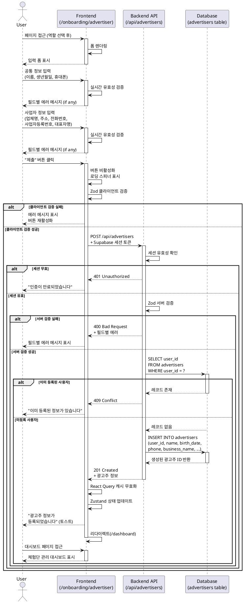

# 유스케이스: UC-006 광고주 정보 등록

## 1. 개요

### 1.1 목적
회원가입 후 광고주 역할을 선택한 사용자가 사업자 정보를 등록하여 체험단 관리 기능을 활성화한다.

### 1.2 범위
- 광고주 역할 선택 후 필수 정보 입력 폼 제공
- 공통 정보(이름, 생년월일, 휴대폰번호) 및 사업자 정보(업체명, 주소, 전화번호, 사업자등록번호, 대표자명) 입력
- 입력 데이터 유효성 검증 (클라이언트/서버 양측)
- `advertisers` 테이블에 정보 저장
- 체험단 관리 대시보드 접근 권한 활성화

**제외 사항**:
- 이미지 업로드 (1차 범위 제외)
- 사업자등록번호 실제 검증 API 연동 (향후 고려)
- 도로명 주소 API 연동 (1차 범위에서는 수동 입력 허용)

### 1.3 액터
- **주요 액터**: 광고주 (회원가입 후 광고주 역할을 선택한 사용자)
- **부 액터**: Supabase (인증 및 데이터베이스), 백엔드 API

---

## 2. 선행 조건

- 사용자가 이메일/비밀번호로 회원가입을 완료했다 (Supabase Auth)
- 역할 선택 단계에서 "광고주"를 선택했다
- 사용자가 로그인 상태이다
- 해당 사용자가 아직 광고주 정보를 등록하지 않았다 (중복 등록 방지)

---

## 3. 참여 컴포넌트

- **Frontend**: `/onboarding/advertiser` 페이지, React Hook Form, Zod 클라이언트 검증
- **Backend API**: `POST /api/advertisers` 엔드포인트 (Hono)
- **Database**: `advertisers` 테이블 (Supabase PostgreSQL)
- **Authentication**: Supabase Auth (세션 검증)
- **State Management**: React Query (mutation), Zustand (전역 상태)

---

## 4. 기본 플로우 (Basic Flow)

### 4.1 단계별 흐름

1. **사용자**: `/onboarding/advertiser` 페이지 접근
   - 입력: 없음 (역할 선택 후 자동 리다이렉트)
   - 처리: 페이지 로드, 입력 폼 표시
   - 출력: 광고주 정보 입력 폼 렌더링

2. **사용자**: 공통 정보 입력
   - 입력:
     - 이름 (텍스트, 필수, 2자 이상)
     - 생년월일 (Date Picker, 필수, 만 19세 이상)
     - 휴대폰번호 (텍스트, 필수, 010-XXXX-XXXX 형식)
   - 처리: React Hook Form이 실시간 유효성 검증
   - 출력: 각 필드별 에러 메시지 표시 (검증 실패 시)

3. **사용자**: 사업자 정보 입력
   - 입력:
     - 업체명 (텍스트, 필수)
     - 주소 (텍스트, 필수)
     - 업장 전화번호 (텍스트, 필수)
     - 사업자등록번호 (텍스트, 필수, XXX-XX-XXXXX 형식)
     - 대표자명 (텍스트, 필수)
   - 처리: React Hook Form이 실시간 유효성 검증
   - 출력: 각 필드별 에러 메시지 표시 (검증 실패 시)

4. **사용자**: "제출" 버튼 클릭
   - 입력: 모든 필드 입력 완료
   - 처리:
     - 제출 버튼 즉시 비활성화 (중복 제출 방지)
     - 로딩 스피너 표시
   - 출력: 버튼 상태 변경 ("제출" → "처리 중...")

5. **Frontend**: 클라이언트 사이드 최종 검증
   - 입력: 폼 데이터
   - 처리: Zod 스키마로 모든 필드 검증
   - 출력:
     - 성공: API 요청 전송
     - 실패: 에러 메시지 표시, 버튼 재활성화

6. **Backend API**: `POST /api/advertisers` 요청 수신
   - 입력:
     - 요청 본문: `{ name, birth_date, phone, business_name, address, business_phone, business_registration_number, representative_name }`
     - 헤더: Authorization (Supabase 세션 토큰)
   - 처리:
     - 세션 유효성 확인 (`c.get('supabase').auth.getUser()`)
     - 요청 데이터 Zod 스키마 검증
     - 중복 등록 여부 확인 (`advertisers` 테이블에서 `user_id` 조회)
   - 출력:
     - 성공: 다음 단계 진행
     - 실패: 400/401/409 에러 응답

7. **Backend API**: 광고주 정보 저장
   - 입력: 검증된 폼 데이터 + 현재 사용자 ID
   - 처리:
     - `advertisers` 테이블에 INSERT 쿼리 실행
     - `user_id`, `name`, `birth_date`, `phone`, `business_name`, `address`, `business_phone`, `business_registration_number`, `representative_name` 저장
     - `created_at`, `updated_at` 자동 생성
   - 출력:
     - 성공: 201 Created + 생성된 광고주 정보 반환
     - 실패: 500 Internal Server Error

8. **Frontend**: API 응답 처리
   - 입력: API 응답 (201 또는 에러)
   - 처리:
     - 성공 시:
       - React Query 캐시 무효화 (프로필 정보)
       - Zustand 전역 상태 업데이트 (광고주 등록 완료 플래그)
       - 성공 토스트 메시지 표시 ("광고주 정보가 등록되었습니다")
       - `/dashboard` 페이지로 리다이렉트
     - 실패 시:
       - 에러 메시지 표시
       - 버튼 재활성화
   - 출력: 사용자 피드백 (토스트 메시지 또는 에러 메시지)

9. **사용자**: 체험단 관리 대시보드 접근
   - 입력: 없음 (자동 리다이렉트)
   - 처리: `/dashboard` 페이지 로드
   - 출력: 체험단 관리 대시보드 표시

### 4.2 시퀀스 다이어그램



---

## 5. 대안 플로우 (Alternative Flows)

### 5.1 대안 플로우 1: 이미 등록된 사용자의 재접근

**시작 조건**: 광고주 정보가 이미 등록된 사용자가 `/onboarding/advertiser` 페이지에 직접 URL로 접근 시도

**단계**:
1. Frontend가 페이지 로드 시 현재 사용자의 광고주 정보 존재 여부 확인
2. 광고주 정보가 이미 존재하는 경우
3. "이미 광고주 정보가 등록되어 있습니다" 메시지 표시
4. 자동으로 `/dashboard` 페이지로 리다이렉트 (3초 후)

**결과**: 사용자는 대시보드로 이동하며, 중복 등록이 방지됨

### 5.2 대안 플로우 2: 네트워크 연결 끊김

**시작 조건**: 사용자가 "제출" 버튼 클릭 시 네트워크 연결이 끊어진 상태

**단계**:
1. Frontend가 API 요청 전송 시도
2. 네트워크 에러 발생 (timeout 또는 connection failed)
3. React Query의 retry 로직 실행 (최대 3회)
4. 3회 모두 실패 시 에러 핸들러 호출
5. "일시적인 오류가 발생했습니다. 네트워크 연결을 확인하고 다시 시도해주세요" 메시지 표시
6. "재시도" 버튼 표시

**결과**: 사용자는 네트워크 복구 후 재시도 가능하며, 입력한 데이터는 폼에 유지됨

---

## 6. 예외 플로우 (Exception Flows)

### 6.1 예외 상황 1: 비로그인 사용자 접근

**발생 조건**: 로그인하지 않은 사용자가 `/onboarding/advertiser` 페이지에 직접 접근 시도

**처리 방법**:
1. Middleware에서 세션 검증 실패
2. 자동으로 `/login?redirect=/onboarding/advertiser` 페이지로 리다이렉트
3. 로그인 페이지에 "로그인이 필요한 페이지입니다" 메시지 표시
4. 로그인 성공 후 원래 페이지로 복귀

**에러 코드**: `401 Unauthorized`

**사용자 메시지**: "로그인이 필요한 페이지입니다"

### 6.2 예외 상황 2: 필수 필드 미입력

**발생 조건**: 사용자가 필수 필드를 입력하지 않고 "제출" 버튼 클릭

**처리 방법**:
1. React Hook Form이 클라이언트 검증 실패
2. 제출 버튼 비활성화 상태 유지
3. 미입력 필드에 빨간색 테두리 표시
4. 각 필드 하단에 에러 메시지 표시
   - "이름은 필수 입력 항목입니다"
   - "생년월일을 선택해주세요"
   - "휴대폰번호를 입력해주세요"
   - "업체명을 입력해주세요"
   - 등

**에러 코드**: `N/A` (클라이언트 검증)

**사용자 메시지**: 각 필드별 에러 메시지 표시

### 6.3 예외 상황 3: 휴대폰번호/사업자등록번호 형식 오류

**발생 조건**: 사용자가 잘못된 형식으로 입력 (예: 휴대폰번호에 문자 포함, 사업자등록번호 자릿수 오류)

**처리 방법**:
1. React Hook Form이 Zod 스키마 검증 실패
2. 해당 필드에 빨간색 테두리 표시
3. 필드 하단에 에러 메시지 표시
   - "휴대폰번호는 010-XXXX-XXXX 형식으로 입력해주세요"
   - "사업자등록번호는 XXX-XX-XXXXX 형식으로 입력해주세요"
4. 제출 버튼 비활성화 상태 유지

**에러 코드**: `N/A` (클라이언트 검증)

**사용자 메시지**: "올바른 형식으로 입력해주세요"

### 6.4 예외 상황 4: 만 19세 미만 가입 시도

**발생 조건**: 생년월일 선택 시 현재 날짜 기준 만 19세 미만인 경우

**처리 방법**:
1. React Hook Form이 나이 검증 실패
2. 생년월일 필드에 빨간색 테두리 표시
3. 필드 하단에 에러 메시지 표시: "광고주는 만 19세 이상만 가입할 수 있습니다"
4. 제출 버튼 비활성화

**에러 코드**: `400 Bad Request` (서버 검증 시)

**사용자 메시지**: "광고주는 만 19세 이상만 가입할 수 있습니다"

### 6.5 예외 상황 5: 서버 에러 (500)

**발생 조건**: 데이터베이스 연결 실패, Supabase 장애 등 서버 내부 에러

**처리 방법**:
1. Backend에서 500 Internal Server Error 반환
2. Frontend가 에러 캐치
3. "서버에서 오류가 발생했습니다. 잠시 후 다시 시도해주세요" 메시지 표시
4. 에러 로그 기록 (Hono `errorBoundary()` 미들웨어)
5. "재시도" 버튼 표시

**에러 코드**: `500 Internal Server Error`

**사용자 메시지**: "서버에서 오류가 발생했습니다. 잠시 후 다시 시도해주세요"

---

## 7. 후행 조건 (Post-conditions)

### 7.1 성공 시

**데이터베이스 변경**:
- `advertisers` 테이블에 새로운 레코드 추가
  - `user_id`: 현재 로그인한 사용자의 Supabase Auth ID
  - `name`, `birth_date`, `phone`: 공통 정보
  - `business_name`, `address`, `business_phone`, `business_registration_number`, `representative_name`: 사업자 정보
  - `created_at`, `updated_at`: 현재 시각

**시스템 상태**:
- 사용자의 광고주 등록 상태: `미등록` → `등록 완료`
- 체험단 관리 기능 활성화
- `/dashboard` 페이지 접근 가능

**클라이언트 상태**:
- React Query 캐시에 광고주 정보 저장
- Zustand 전역 상태에 광고주 프로필 저장
- 로컬 스토리지에 온보딩 완료 플래그 설정

**외부 시스템**:
- 없음 (1차 범위에서는 외부 알림 없음)

### 7.2 실패 시

**데이터 롤백**:
- 데이터베이스 변경 없음 (트랜잭션 롤백)
- 클라이언트 캐시 변경 없음

**시스템 상태**:
- 사용자의 광고주 등록 상태: `미등록` 유지
- 체험단 관리 기능 비활성화 유지
- 사용자는 `/onboarding/advertiser` 페이지에 머물러 있음

**사용자 피드백**:
- 에러 메시지 표시 (에러 유형에 따라 다름)
- 입력한 데이터는 폼에 유지됨 (재입력 불필요)

---

## 8. 비기능 요구사항

### 8.1 성능
- API 응답 시간: 500ms 이내 (평균)
- 페이지 로딩 시간: 2초 이내 (First Contentful Paint)
- 입력 필드 실시간 검증: 100ms 이내 (debounce 적용)

### 8.2 보안
- Supabase Auth 기반 세션 검증 (모든 API 요청)
- HTTPS 통신 강제
- XSS 방어: React의 자동 이스케이핑 활용
- CSRF 방어: Supabase의 CSRF 토큰 자동 처리
- SQL Injection 방어: Supabase의 Parameterized Query 사용
- 클라이언트/서버 양측 입력 검증 (Zod 스키마)
- 사업자등록번호는 평문 저장 (암호화 불필요, 향후 마스킹 처리 고려)

### 8.3 가용성
- 네트워크 에러 시 자동 재시도 (최대 3회)
- 에러 발생 시 사용자 친화적 메시지 표시
- 입력 데이터 손실 방지 (폼 상태 유지)

### 8.4 접근성
- WCAG 2.1 Level AA 준수
- 키보드 네비게이션 지원 (Tab, Enter, Esc)
- 스크린 리더 호환 (ARIA 레이블 적용)
- 색상 대비 4.5:1 이상
- 에러 메시지는 스크린 리더가 읽을 수 있도록 aria-live 속성 사용

---

## 9. UI/UX 요구사항

### 9.1 화면 구성

**페이지 레이아웃**:
- 헤더: "광고주 정보 등록" 제목
- 진행 단계 표시: "1. 회원가입 → 2. 역할 선택 → **3. 정보 입력** → 4. 완료"
- 섹션 1: 공통 정보
  - 이름 (텍스트 입력)
  - 생년월일 (Date Picker)
  - 휴대폰번호 (텍스트 입력, placeholder: "010-1234-5678")
- 섹션 2: 사업자 정보
  - 업체명 (텍스트 입력)
  - 주소 (텍스트 입력 + 도로명 주소 검색 버튼 - 1차 범위에서는 수동 입력)
  - 업장 전화번호 (텍스트 입력, placeholder: "02-1234-5678")
  - 사업자등록번호 (텍스트 입력, placeholder: "123-45-67890")
  - 대표자명 (텍스트 입력)
- 제출 버튼 (하단 중앙)
- 에러 메시지 영역 (각 필드 하단)

**UI 컴포넌트**:
- shadcn-ui `Input` 컴포넌트
- shadcn-ui `DatePicker` 컴포넌트
- shadcn-ui `Button` 컴포넌트
- shadcn-ui `Label` 컴포넌트
- shadcn-ui `Alert` 컴포넌트 (전역 에러 메시지)
- shadcn-ui `Toast` 컴포넌트 (성공 메시지)

**반응형 디자인**:
- 모바일 (320px~767px): 1열 레이아웃
- 태블릿 (768px~1023px): 1열 레이아웃, 필드 너비 증가
- 데스크톱 (1024px 이상): 2열 레이아웃 (일부 필드)

### 9.2 사용자 경험

**입력 가이드**:
- 각 필드에 placeholder 텍스트 표시
- 필수 필드 옆에 빨간색 별표(*) 표시
- 휴대폰번호/사업자등록번호는 자동 하이픈(-) 삽입 (사용자 편의)

**실시간 피드백**:
- 필드 입력 중 실시간 유효성 검증 (debounce 300ms)
- 검증 실패 시 즉시 에러 메시지 표시
- 검증 성공 시 초록색 체크 아이콘 표시 (optional)

**로딩 상태**:
- 제출 버튼 클릭 시 버튼 텍스트 "제출" → "처리 중..." 변경
- 버튼에 스피너 아이콘 표시
- 전체 폼 비활성화 (중복 수정 방지)

**에러 처리**:
- 필드별 에러 메시지는 필드 하단에 빨간색 텍스트로 표시
- 전역 에러(서버 에러 등)는 페이지 상단에 Alert 컴포넌트로 표시
- 에러 발생 시 해당 필드로 자동 스크롤

**성공 처리**:
- 성공 토스트 메시지 표시 (3초간)
- 부드러운 페이지 전환 (fade-in 애니메이션)

---

## 10. 테스트 시나리오

### 10.1 성공 케이스

| 테스트 케이스 ID | 입력값 | 기대 결과 |
|----------------|--------|----------|
| TC-006-01 | 모든 필드에 유효한 값 입력 | 광고주 정보 등록 성공, `/dashboard` 페이지로 리다이렉트, 성공 토스트 표시 |
| TC-006-02 | 최소 길이 값 입력 (이름 2자) | 등록 성공 |
| TC-006-03 | 만 19세 정확히 되는 생년월일 입력 | 등록 성공 |

### 10.2 실패 케이스

| 테스트 케이스 ID | 입력값 | 기대 결과 |
|----------------|--------|----------|
| TC-006-04 | 이름 미입력 | "이름은 필수 입력 항목입니다" 에러 메시지, 제출 버튼 비활성화 |
| TC-006-05 | 이름 1자 입력 | "이름은 2자 이상이어야 합니다" 에러 메시지 |
| TC-006-06 | 생년월일 미선택 | "생년월일을 선택해주세요" 에러 메시지 |
| TC-006-07 | 만 19세 미만 생년월일 입력 | "광고주는 만 19세 이상만 가입할 수 있습니다" 에러 메시지 |
| TC-006-08 | 휴대폰번호 형식 오류 (예: "010-12-3456") | "휴대폰번호는 010-XXXX-XXXX 형식으로 입력해주세요" 에러 메시지 |
| TC-006-09 | 사업자등록번호 형식 오류 (예: "123-4-56789") | "사업자등록번호는 XXX-XX-XXXXX 형식으로 입력해주세요" 에러 메시지 |
| TC-006-10 | 이미 등록된 사용자로 재접근 | "이미 등록된 정보가 있습니다" 메시지, `/dashboard` 페이지로 리다이렉트 |
| TC-006-11 | 비로그인 상태에서 접근 | `/login` 페이지로 리다이렉트, "로그인이 필요한 페이지입니다" 메시지 |
| TC-006-12 | 네트워크 연결 끊김 상태에서 제출 | "일시적인 오류가 발생했습니다. 네트워크 연결을 확인하고 다시 시도해주세요" 메시지, "재시도" 버튼 표시 |

---

## 11. 관련 유스케이스

- **선행 유스케이스**:
  - UC-001: 회원가입 (Supabase Auth)
  - UC-002: 역할 선택
- **후행 유스케이스**:
  - UC-007: 체험단 관리 대시보드 조회
  - UC-008: 신규 체험단 등록
- **연관 유스케이스**:
  - UC-005: 인플루언서 정보 등록 (유사한 플로우)

---

## 12. 변경 이력

| 버전 | 날짜 | 작성자 | 변경 내용 |
|------|------|--------|-----------|
| 1.0  | 2025-11-14 | Claude | 초기 작성 |

---

## 부록

### A. 용어 정의

- **광고주**: 체험단을 등록하고 관리하는 사업자
- **온보딩**: 회원가입 후 필수 정보를 입력하여 서비스를 사용할 수 있도록 준비하는 과정
- **Supabase Auth**: Supabase가 제공하는 인증 서비스 (이메일/비밀번호 기반)
- **React Hook Form**: React 기반 폼 상태 관리 및 유효성 검증 라이브러리
- **Zod**: TypeScript 우선 스키마 검증 라이브러리
- **React Query**: 서버 상태 관리 라이브러리 (데이터 페칭, 캐싱, 동기화)
- **Zustand**: 경량 전역 상태 관리 라이브러리

### B. 참고 자료

- `/docs/requirement.md` - 기본 요구사항
- `/docs/prd.md` - PRD 문서 (섹션 3.3.1 광고주 정보 등록)
- `/docs/userflow.md` - 유저플로우 (섹션 2.1.3 광고주 정보 등록)
- `/docs/database.md` - 데이터베이스 설계 (섹션 4.1 advertisers 테이블)
- `/docs/external/supabase-auth.md` - Supabase Auth 가이드
- [React Hook Form 공식 문서](https://react-hook-form.com/)
- [Zod 공식 문서](https://zod.dev/)
- [shadcn-ui 공식 문서](https://ui.shadcn.com/)

### C. API 명세 (간략)

**엔드포인트**: `POST /api/advertisers`

**요청 헤더**:
```
Authorization: Bearer {supabase_access_token}
Content-Type: application/json
```

**요청 본문**:
```json
{
  "name": "홍길동",
  "birth_date": "1985-03-15",
  "phone": "010-1234-5678",
  "business_name": "홍길동네 식당",
  "address": "서울시 강남구 테헤란로 123",
  "business_phone": "02-1234-5678",
  "business_registration_number": "123-45-67890",
  "representative_name": "홍길동"
}
```

**응답 (성공)**:
```json
{
  "success": true,
  "data": {
    "id": 1,
    "user_id": "uuid-here",
    "name": "홍길동",
    "birth_date": "1985-03-15",
    "phone": "010-1234-5678",
    "business_name": "홍길동네 식당",
    "address": "서울시 강남구 테헤란로 123",
    "business_phone": "02-1234-5678",
    "business_registration_number": "123-45-67890",
    "representative_name": "홍길동",
    "created_at": "2025-11-14T10:00:00Z",
    "updated_at": "2025-11-14T10:00:00Z"
  }
}
```

**응답 (실패 - 중복 등록)**:
```json
{
  "success": false,
  "error": {
    "code": "ADVERTISER_ALREADY_EXISTS",
    "message": "이미 등록된 정보가 있습니다"
  }
}
```

### D. Zod 스키마 예시

```typescript
import { z } from 'zod';

export const advertiserRegistrationSchema = z.object({
  name: z.string().min(2, '이름은 2자 이상이어야 합니다'),
  birth_date: z.string().refine(
    (date) => {
      const birthDate = new Date(date);
      const today = new Date();
      const age = today.getFullYear() - birthDate.getFullYear();
      return age >= 19;
    },
    { message: '광고주는 만 19세 이상만 가입할 수 있습니다' }
  ),
  phone: z.string().regex(/^010-\d{4}-\d{4}$/, '휴대폰번호는 010-XXXX-XXXX 형식으로 입력해주세요'),
  business_name: z.string().min(1, '업체명을 입력해주세요'),
  address: z.string().min(1, '주소를 입력해주세요'),
  business_phone: z.string().min(1, '업장 전화번호를 입력해주세요'),
  business_registration_number: z.string().regex(/^\d{3}-\d{2}-\d{5}$/, '사업자등록번호는 XXX-XX-XXXXX 형식으로 입력해주세요'),
  representative_name: z.string().min(1, '대표자명을 입력해주세요'),
});

export type AdvertiserRegistrationInput = z.infer<typeof advertiserRegistrationSchema>;
```

### E. 비즈니스 규칙

1. **중복 등록 방지**: 하나의 Supabase Auth 계정은 하나의 광고주 정보만 등록 가능 (1:1 관계)
2. **연령 제한**: 광고주는 만 19세 이상만 가입 가능 (사업자 책임 능력 고려)
3. **필수 필드**: 모든 필드는 필수 입력 (선택 필드 없음)
4. **데이터 불변성**: 등록 후 일부 필드(사업자등록번호 등)는 수정 제한 (향후 정책에 따라 결정)
5. **역할 고유성**: 한 사용자는 광고주 또는 인플루언서 중 하나의 역할만 가질 수 있음 (추후 다중 역할 지원 시 변경 가능)
