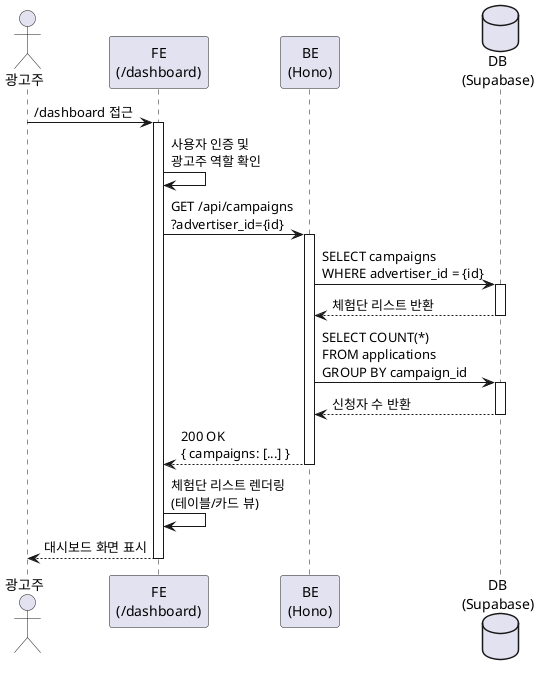
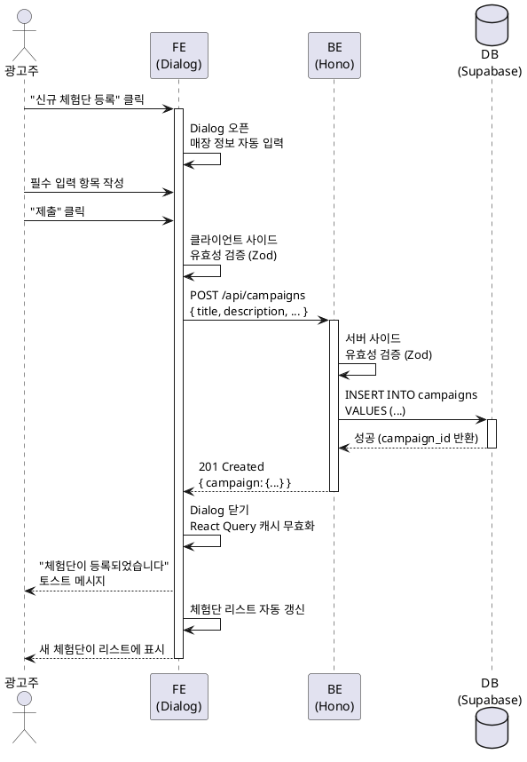
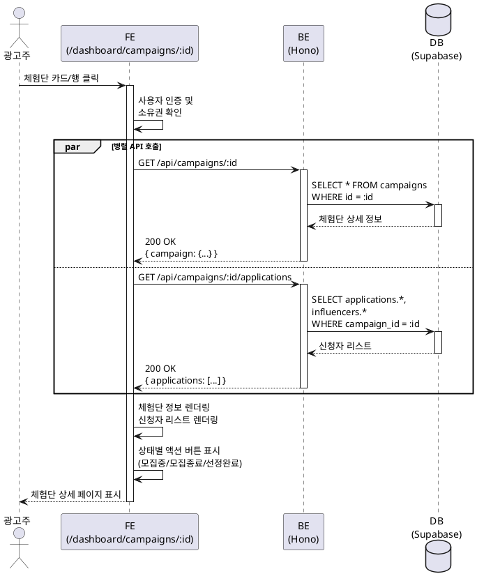
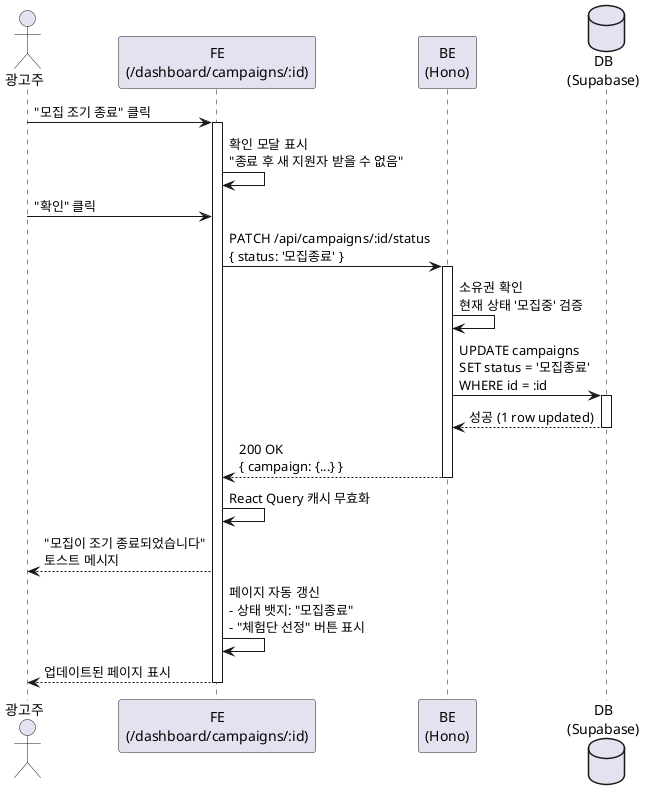
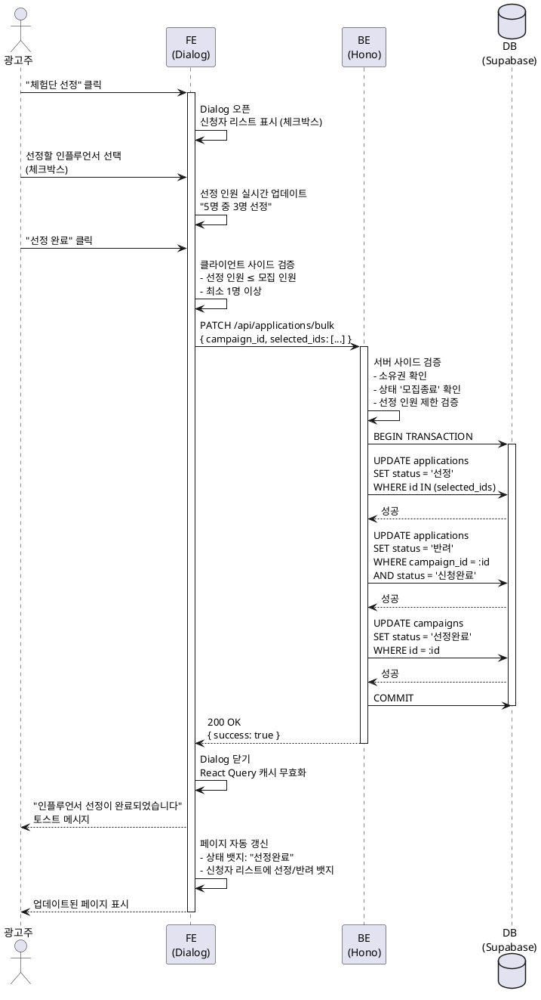

# 유스케이스: 체험단 관리 대시보드

## 유스케이스 ID: UC-007

### 제목
광고주의 체험단 등록, 조회, 관리 및 인플루언서 선정

---

## 1. 개요

### 1.1 목적
광고주가 자신이 등록한 체험단을 효율적으로 관리하고, 신규 체험단을 등록하며, 지원한 인플루언서를 확인하여 선정하는 통합 관리 기능을 제공합니다.

### 1.2 범위
- 체험단 리스트 조회 및 필터링
- 신규 체험단 등록 (Dialog 폼)
- 체험단 상세 조회 및 신청자 관리
- 모집 조기 종료
- 인플루언서 선정 프로세스

**제외 사항**:
- 체험단 수정/삭제 (P1)
- 이미지 업로드 (P2)
- 선정 결과 알림 (P1)

### 1.3 액터
- **주요 액터**: 광고주 (Advertiser)
- **부 액터**: 인플루언서 (지원자), 시스템

---

## 2. 선행 조건

- 사용자가 로그인된 상태여야 함
- 광고주 정보가 등록된 상태여야 함 (`advertisers` 테이블에 데이터 존재)
- `/dashboard` 또는 `/dashboard/campaigns/:id` 페이지에 접근 권한이 있어야 함

---

## 3. 참여 컴포넌트

### 3.1 프론트엔드
- **대시보드 페이지** (`/dashboard`): 체험단 리스트 및 신규 등록 Dialog
- **광고주용 상세 페이지** (`/dashboard/campaigns/:id`): 신청자 리스트 및 선정 프로세스
- **React Query**: 서버 상태 관리 및 캐싱
- **Zustand**: 전역 상태 관리 (사용자 세션)
- **Shadcn-ui**: Dialog, Table, Badge, Button 등 UI 컴포넌트

### 3.2 백엔드
- **Hono 라우터**: `/api/campaigns` 엔드포인트
- **Service Layer**: `src/features/campaign/backend/service.ts`
- **Zod Schema**: `src/features/campaign/backend/schema.ts`
- **Supabase Client**: 서버 사이드 DB 접근

### 3.3 데이터베이스
- **테이블**: `campaigns`, `advertisers`, `applications`, `influencers`

---

## 4. 기본 플로우 (Basic Flow)

### 4.1 체험단 관리 대시보드 조회 (UC-007-01)

#### Primary Actor
광고주

#### Precondition
- 광고주가 로그인되어 있음
- 광고주 정보가 등록되어 있음

#### Trigger
광고주가 `/dashboard` 페이지에 접근

#### Main Scenario
1. **광고주**: `/dashboard` 페이지 접근
2. **FE**: 사용자 인증 및 광고주 역할 확인
3. **FE**: `GET /api/campaigns?advertiser_id={current_user_id}` API 호출
4. **BE**: 현재 광고주가 등록한 체험단 리스트 조회
5. **BE**: 각 체험단의 신청자 수 계산 (`applications` 테이블 카운트)
6. **DB**: 데이터 반환 (`campaigns` JOIN `applications`)
7. **BE**: 응답 데이터 포맷 후 반환
8. **FE**: 체험단 리스트 테이블/카드 뷰 렌더링
   - 컬럼: 체험단명, 모집 상태, 신청자 수, 모집 인원, 생성일
   - 상태별 뱃지 표시 (모집중/모집종료/선정완료)
9. **FE**: "신규 체험단 등록" 버튼 노출

#### Edge Cases
- **데이터 없음**: "등록된 체험단이 없습니다" 빈 상태 메시지 + "첫 체험단 등록하기" 버튼 표시
- **권한 없음 (비로그인)**: `/login`으로 리다이렉트
- **권한 없음 (광고주 정보 미등록)**: `/onboarding/advertiser`로 리다이렉트
- **권한 없음 (인플루언서 계정)**: "광고주 전용 페이지입니다" 에러 메시지 + 홈으로 리다이렉트
- **네트워크 오류**: "체험단 목록을 불러오는데 실패했습니다" 에러 메시지 + 재시도 버튼

#### Business Rules
- 광고주는 자신이 등록한 체험단만 조회 가능
- 체험단 리스트는 생성일 최신순으로 정렬 (기본값)
- 상태별 필터 적용 가능 (전체/모집중/모집종료/선정완료)
- React Query 캐싱 (5분 stale time)

---

### 4.2 신규 체험단 등록 (UC-007-02)

#### Primary Actor
광고주

#### Precondition
- 광고주가 대시보드 페이지에 접근한 상태
- 광고주 정보가 등록되어 있음

#### Trigger
광고주가 "신규 체험단 등록" 버튼 클릭

#### Main Scenario
1. **광고주**: "신규 체험단 등록" 버튼 클릭
2. **FE**: Dialog 폼 오픈
3. **FE**: 광고주 정보에서 매장 정보 자동 입력 (업체명, 주소, 전화번호)
4. **광고주**: 필수 입력 항목 작성
   - 체험단명, 설명, 모집 시작일/종료일, 모집 인원, 제공 혜택, 미션, 매장 정보 (수정 가능), 카테고리
5. **광고주**: "제출" 버튼 클릭
6. **FE**: 클라이언트 사이드 유효성 검증 (Zod + React Hook Form)
7. **FE**: `POST /api/campaigns` API 호출
8. **BE**: 요청 데이터 검증 (Zod Schema)
   - 체험단명: 5자 이상 100자 이하
   - 설명: 20자 이상 2000자 이하
   - 모집 시작일: 오늘 이후 날짜
   - 모집 종료일: 모집 시작일 이후 날짜
   - 모집 인원: 1 이상
   - 기타 필수 필드: 비어있지 않음
9. **BE**: `campaigns` 테이블에 데이터 삽입
   - `advertiser_id`: 현재 로그인한 광고주 ID
   - `status`: '모집중'
   - `created_at`, `updated_at`: 자동 생성
10. **DB**: 데이터 저장 및 ID 반환
11. **BE**: 성공 응답 반환
12. **FE**: Dialog 닫기
13. **FE**: "체험단이 등록되었습니다" 토스트 메시지 표시
14. **FE**: React Query 캐시 무효화 (체험단 리스트 자동 갱신)
15. **FE**: 새로 등록된 체험단이 리스트 상단에 표시

#### Edge Cases
- **유효성 검증 실패**: 각 필드별 에러 메시지 표시 (Dialog 내 인라인 에러)
- **모집 종료일 < 시작일**: "모집 종료일은 시작일 이후여야 합니다" 에러 메시지
- **모집 인원 0 또는 음수**: "모집 인원은 1명 이상이어야 합니다" 에러 메시지
- **네트워크 오류**: "일시적인 오류가 발생했습니다. 다시 시도해주세요" 에러 메시지
- **Dialog 닫기 시 데이터 손실**: "작성 중인 내용이 있습니다. 정말 닫으시겠습니까?" 확인 모달 표시

#### Business Rules
- 모집 시작일은 오늘 이후여야 함
- 모집 종료일은 모집 시작일 이후여야 함
- 모집 인원은 1명 이상이어야 함
- 매장 정보는 광고주 정보에서 자동 입력되지만 수정 가능
- 등록 시 상태는 자동으로 '모집중'으로 설정
- 체험단 등록 완료 시 홈 페이지의 체험단 리스트에도 노출

---

### 4.3 광고주용 체험단 상세 조회 (UC-007-03)

#### Primary Actor
광고주

#### Precondition
- 광고주가 로그인되어 있음
- 대시보드에서 체험단 카드/행을 클릭했거나 직접 URL 접근

#### Trigger
광고주가 `/dashboard/campaigns/:id` 페이지에 접근

#### Main Scenario
1. **광고주**: 대시보드에서 체험단 카드/행 클릭 또는 직접 URL 접근
2. **FE**: 사용자 인증 및 광고주 역할 확인
3. **FE**: 체험단 소유권 확인 (`campaigns.advertiser_id = current_user_id`)
4. **FE**: 병렬 API 호출
   - `GET /api/campaigns/:id`: 체험단 상세 정보
   - `GET /api/campaigns/:id/applications`: 신청자 리스트
5. **BE**: 체험단 상세 정보 조회 (`campaigns` JOIN `advertisers`)
6. **BE**: 신청자 리스트 조회 (`applications` JOIN `influencers`)
7. **DB**: 데이터 반환
8. **BE**: 응답 데이터 포맷 후 반환
9. **FE**: 체험단 정보 표시 (읽기 전용)
   - 제목, 설명, 제공 혜택, 모집 인원, 모집 기간, 매장 정보, 미션
10. **FE**: 신청자 리스트 테이블 렌더링
    - 컬럼: 이름, SNS 채널명, 팔로워 수, 각오 한마디, 방문 예정일, 지원일
    - 정렬: 지원일 최신순 (기본값)
    - 각 행에 체크박스 포함 (선정 시 사용)
11. **FE**: 상태별 액션 버튼 표시
    - **모집중**: "모집 조기 종료" 버튼
    - **모집종료**: "체험단 선정" 버튼
    - **선정완료**: 버튼 숨김, "선정 완료" 뱃지 표시

#### Edge Cases
- **권한 없음 (다른 광고주의 체험단)**: "접근 권한이 없습니다" 에러 메시지 + 대시보드로 리다이렉트
- **존재하지 않는 체험단**: "존재하지 않는 체험단입니다" 404 에러 페이지
- **비로그인 상태**: `/login`으로 리다이렉트
- **인플루언서 계정 접근**: "광고주 전용 페이지입니다" 에러 메시지 + 홈으로 리다이렉트
- **신청자 없음**: "아직 지원한 인플루언서가 없습니다" 빈 상태 메시지
- **네트워크 오류**: "체험단 정보를 불러오는데 실패했습니다" 에러 메시지 + 재시도 버튼

#### Business Rules
- 광고주는 자신이 등록한 체험단만 접근 가능
- 신청자 리스트는 지원일 최신순 정렬 (기본값)
- 체험단 상태에 따라 노출되는 액션 버튼이 다름
- React Query 캐싱 (5분 stale time)

---

### 4.4 모집 조기 종료 (UC-007-04)

#### Primary Actor
광고주

#### Precondition
- 광고주용 체험단 상세 페이지에 접근한 상태
- 체험단 상태가 '모집중'

#### Trigger
광고주가 "모집 조기 종료" 버튼 클릭

#### Main Scenario
1. **광고주**: "모집 조기 종료" 버튼 클릭
2. **FE**: 확인 모달 표시
   - 메시지: "모집을 조기 종료하시겠습니까? 종료 후에는 새로운 지원자를 받을 수 없습니다."
   - 버튼: "확인" / "취소"
3. **광고주**: "확인" 버튼 클릭
4. **FE**: `PATCH /api/campaigns/:id/status` API 호출
   - Body: `{ status: '모집종료' }`
5. **BE**: 요청 데이터 검증
6. **BE**: 체험단 소유권 확인
7. **BE**: 현재 상태가 '모집중'인지 확인
8. **BE**: `campaigns` 테이블의 `status` 필드를 '모집종료'로 업데이트
9. **DB**: 데이터 업데이트 (`updated_at` 자동 갱신)
10. **BE**: 성공 응답 반환
11. **FE**: "모집이 조기 종료되었습니다" 토스트 메시지 표시
12. **FE**: React Query 캐시 무효화 (체험단 상세, 체험단 리스트)
13. **FE**: 페이지 자동 갱신
    - 상태 뱃지: "모집종료"로 변경
    - "모집 조기 종료" 버튼 숨김
    - "체험단 선정" 버튼 표시

#### Edge Cases
- **사용자 취소**: "취소" 버튼 클릭 시 아무 동작 없이 모달 닫기
- **이미 종료된 체험단**: "이미 종료된 체험단입니다" 에러 메시지
- **권한 없음**: "접근 권한이 없습니다" 에러 메시지
- **네트워크 오류**: "일시적인 오류가 발생했습니다. 다시 시도해주세요" 에러 메시지 + 재시도 버튼

#### Business Rules
- '모집중' 상태인 체험단만 조기 종료 가능
- 조기 종료 후 상태는 '모집종료'로 변경
- 모집 종료 후 새로운 지원자는 받을 수 없음
- 홈 페이지의 "모집중" 필터에서 제외됨

---

### 4.5 체험단 선정 프로세스 (UC-007-05)

#### Primary Actor
광고주

#### Precondition
- 광고주용 체험단 상세 페이지에 접근한 상태
- 체험단 상태가 '모집종료'
- 신청자가 1명 이상 존재

#### Trigger
광고주가 "체험단 선정" 버튼 클릭

#### Main Scenario
1. **광고주**: "체험단 선정" 버튼 클릭
2. **FE**: Dialog 오픈
3. **FE**: 신청자 리스트 표시 (체크박스 포함)
   - 컬럼: 이름, SNS 채널명, 팔로워 수, 각오 한마디, 방문 예정일
4. **FE**: 선정 인원 표시 (예: "5명 중 0명 선정")
5. **광고주**: 선정할 인플루언서 체크박스 선택 (복수 선택 가능)
6. **FE**: 선정 인원 실시간 업데이트 (예: "5명 중 3명 선정")
7. **광고주**: "선정 완료" 버튼 클릭
8. **FE**: 클라이언트 사이드 검증
   - 선택한 인원이 모집 인원을 초과하는지 확인
   - 0명 선택 시 에러 표시
9. **FE**: `PATCH /api/applications/bulk` API 호출
   - Body: `{ campaign_id, selected_application_ids: [...] }`
10. **BE**: 요청 데이터 검증 (Zod Schema)
11. **BE**: 체험단 소유권 확인
12. **BE**: 현재 상태가 '모집종료'인지 확인
13. **BE**: 선정 인원 제한 검증 (선택 인원 ≤ 모집 인원)
14. **BE**: 트랜잭션 시작
15. **BE**: 선정된 신청자의 `applications.status`를 '선정'으로 업데이트
16. **BE**: 미선정 신청자의 `applications.status`를 '반려'로 업데이트
17. **BE**: `campaigns` 테이블의 `status` 필드를 '선정완료'로 업데이트
18. **BE**: 트랜잭션 커밋
19. **DB**: 데이터 업데이트 (일괄)
20. **BE**: 성공 응답 반환
21. **FE**: Dialog 닫기
22. **FE**: "인플루언서 선정이 완료되었습니다" 토스트 메시지 표시
23. **FE**: React Query 캐시 무효화 (체험단 상세, 신청자 리스트, 체험단 리스트)
24. **FE**: 페이지 자동 갱신
    - 상태 뱃지: "선정완료"로 변경
    - "체험단 선정" 버튼 숨김
    - 신청자 리스트에 선정/반려 상태 뱃지 표시

#### Edge Cases
- **선정 인원 초과**: "최대 N명까지 선정할 수 있습니다" 에러 메시지 (제출 버튼 비활성화)
- **0명 선택**: "최소 1명 이상 선정해주세요" 에러 메시지 (제출 버튼 비활성화)
- **권한 없음**: "접근 권한이 없습니다" 에러 메시지
- **이미 선정완료**: "이미 선정이 완료된 체험단입니다" 에러 메시지
- **신청자 없음**: "지원자가 없어 선정할 수 없습니다" 에러 메시지 (버튼 비활성화)
- **네트워크 오류**: "일시적인 오류가 발생했습니다. 다시 시도해주세요" 에러 메시지
- **트랜잭션 실패**: 자동 롤백 후 에러 메시지

#### Business Rules
- '모집종료' 상태인 체험단만 선정 가능
- 선정 인원은 모집 인원 이하여야 함 (초과 불가)
- 모집 인원보다 적게 선정 가능 (정상 동작)
- 최소 1명 이상 선정해야 함
- 선정/반려는 동시에 처리됨 (트랜잭션)
- 선정 완료 후 상태는 '선정완료'로 변경
- 인플루언서의 "내 지원 목록"에서 상태 업데이트 (선정/반려)

---

## 5. 시퀀스 다이어그램

### 5.1 체험단 관리 대시보드 조회



---

### 5.2 신규 체험단 등록



---

### 5.3 광고주용 체험단 상세 조회



---

### 5.4 모집 조기 종료



---

### 5.5 체험단 선정 프로세스



---

## 6. 비기능 요구사항

### 6.1 성능
- 대시보드 페이지 로딩: 3초 이내 (First Contentful Paint)
- API 응답 시간: 500ms 이내
- 신청자 리스트 조회 (100명 기준): 1초 이내
- React Query 캐싱으로 불필요한 API 요청 최소화 (5분 stale time)

### 6.2 보안
- Supabase Auth 기반 인증 (세션 쿠키)
- 백엔드에서 소유권 검증 (다른 광고주의 체험단 접근 차단)
- Zod 스키마로 서버 사이드 유효성 검증
- RLS 비활성화 (프로젝트 가이드라인)

### 6.3 가용성
- 네트워크 오류 시 React Query의 자동 재시도 (최대 3회)
- 에러 발생 시 명확한 에러 메시지 표시
- 재시도 버튼 제공

---

## 7. UI/UX 요구사항

### 7.1 대시보드 페이지
- **레이아웃**: 테이블 또는 카드 뷰
- **필터**: 모집 상태별 필터 (전체/모집중/모집종료/선정완료)
- **정렬**: 생성일 최신순 (기본값)
- **빈 상태**: "등록된 체험단이 없습니다" + "첫 체험단 등록하기" 버튼

### 7.2 신규 체험단 등록 Dialog
- **크기**: 중형 Dialog (최소 600px)
- **필드 레이아웃**: 2단 그리드 (모바일은 1단)
- **자동 입력**: 매장 정보는 광고주 정보에서 자동 입력 (수정 가능)
- **에러 표시**: 인라인 에러 메시지 (필드 하단)
- **제출 버튼**: 유효성 검증 실패 시 비활성화

### 7.3 광고주용 상세 페이지
- **체험단 정보**: 읽기 전용 카드
- **신청자 리스트**: 테이블 뷰
- **액션 버튼**: 우측 상단 고정
- **빈 상태**: "아직 지원한 인플루언서가 없습니다"

### 7.4 체험단 선정 Dialog
- **신청자 리스트**: 체크박스 포함 테이블
- **선정 인원 표시**: Dialog 하단에 "5명 중 3명 선정" 형태로 표시
- **체크박스 제한**: 모집 인원 초과 시 추가 선택 비활성화 (선택사항)
- **제출 버튼**: 0명 또는 초과 시 비활성화

---

## 8. API 엔드포인트

### 8.1 GET /api/campaigns
**설명**: 광고주의 체험단 리스트 조회

**쿼리 파라미터**:
- `advertiser_id` (required): 광고주 ID
- `status` (optional): 모집 상태 필터
- `sort` (optional): 정렬 방식 (latest, oldest)

**응답 예시**:
```json
{
  "campaigns": [
    {
      "id": 1,
      "title": "강남 맛집 체험단",
      "status": "모집중",
      "recruitment_count": 5,
      "applicants_count": 12,
      "created_at": "2025-11-14T00:00:00Z"
    }
  ]
}
```

---

### 8.2 POST /api/campaigns
**설명**: 신규 체험단 등록

**요청 본문**:
```json
{
  "title": "강남 맛집 체험단",
  "description": "...",
  "recruitment_start_date": "2025-11-20",
  "recruitment_end_date": "2025-11-30",
  "recruitment_count": 5,
  "benefits": "무료 식사 제공",
  "mission": "방문 후 블로그 리뷰 작성",
  "store_name": "맛있는 식당",
  "store_address": "서울시 강남구...",
  "store_phone": "02-1234-5678",
  "category": "음식점"
}
```

**응답 예시**:
```json
{
  "campaign": {
    "id": 1,
    "title": "강남 맛집 체험단",
    "status": "모집중",
    "created_at": "2025-11-14T00:00:00Z"
  }
}
```

---

### 8.3 GET /api/campaigns/:id
**설명**: 체험단 상세 조회

**응답 예시**:
```json
{
  "campaign": {
    "id": 1,
    "title": "강남 맛집 체험단",
    "description": "...",
    "status": "모집중",
    "recruitment_count": 5,
    "benefits": "무료 식사 제공",
    "mission": "방문 후 블로그 리뷰 작성",
    "store_name": "맛있는 식당",
    "store_address": "서울시 강남구...",
    "store_phone": "02-1234-5678",
    "category": "음식점",
    "recruitment_start_date": "2025-11-20",
    "recruitment_end_date": "2025-11-30",
    "created_at": "2025-11-14T00:00:00Z"
  }
}
```

---

### 8.4 GET /api/campaigns/:id/applications
**설명**: 체험단 신청자 리스트 조회

**응답 예시**:
```json
{
  "applications": [
    {
      "id": 1,
      "message": "꼭 참여하고 싶습니다!",
      "visit_date": "2025-11-25",
      "status": "신청완료",
      "applied_at": "2025-11-14T10:00:00Z",
      "influencer": {
        "id": 1,
        "name": "홍길동",
        "channel_name": "길동이의 맛집 탐방",
        "channel_link": "https://blog.naver.com/...",
        "followers_count": 5000
      }
    }
  ]
}
```

---

### 8.5 PATCH /api/campaigns/:id/status
**설명**: 체험단 모집 상태 변경 (조기 종료)

**요청 본문**:
```json
{
  "status": "모집종료"
}
```

**응답 예시**:
```json
{
  "campaign": {
    "id": 1,
    "status": "모집종료",
    "updated_at": "2025-11-14T11:00:00Z"
  }
}
```

---

### 8.6 PATCH /api/applications/bulk
**설명**: 인플루언서 선정 (일괄 업데이트)

**요청 본문**:
```json
{
  "campaign_id": 1,
  "selected_application_ids": [1, 3, 5]
}
```

**응답 예시**:
```json
{
  "success": true,
  "selected_count": 3,
  "rejected_count": 9
}
```

---

## 9. 테스트 시나리오

### 9.1 성공 케이스

| 테스트 케이스 ID | 시나리오 | 기대 결과 |
|----------------|---------|----------|
| TC-007-01 | 광고주가 대시보드 접근 | 등록한 체험단 리스트 표시 |
| TC-007-02 | 신규 체험단 등록 (모든 필드 유효) | 체험단 생성 성공, 리스트 상단에 표시 |
| TC-007-03 | 체험단 상세 조회 | 체험단 정보 및 신청자 리스트 표시 |
| TC-007-04 | 모집 조기 종료 | 상태가 '모집종료'로 변경, "체험단 선정" 버튼 표시 |
| TC-007-05 | 인플루언서 선정 (3/5명) | 선정/반려 상태 업데이트, 체험단 상태 '선정완료' |

### 9.2 실패 케이스

| 테스트 케이스 ID | 시나리오 | 기대 결과 |
|----------------|---------|----------|
| TC-007-06 | 비로그인 사용자가 대시보드 접근 | `/login`으로 리다이렉트 |
| TC-007-07 | 인플루언서가 대시보드 접근 | "광고주 전용 페이지입니다" 에러 메시지 |
| TC-007-08 | 다른 광고주의 체험단 상세 접근 | "접근 권한이 없습니다" 에러 메시지 |
| TC-007-09 | 신규 체험단 등록 시 종료일 < 시작일 | "모집 종료일은 시작일 이후여야 합니다" 에러 메시지 |
| TC-007-10 | 선정 시 모집 인원 초과 선택 | "최대 N명까지 선정할 수 있습니다" 에러 메시지 |
| TC-007-11 | 선정 시 0명 선택 | "최소 1명 이상 선정해주세요" 에러 메시지 |

---

## 10. 관련 유스케이스

### 10.1 선행 유스케이스
- **UC-001**: 회원가입 및 로그인
- **UC-003**: 광고주 정보 등록

### 10.2 후행 유스케이스
- **UC-008**: 체험단 수정/삭제 (P1)
- **UC-009**: 선정 결과 알림 (P1)

### 10.3 연관 유스케이스
- **UC-004**: 체험단 탐색 (홈 페이지)
- **UC-005**: 체험단 지원 (인플루언서)
- **UC-006**: 내 지원 목록 조회 (인플루언서)

---

## 11. 변경 이력

| 버전 | 날짜 | 작성자 | 변경 내용 |
|------|------|--------|-----------|
| 1.0  | 2025-11-14 | Claude | 초기 작성 |

---

## 부록

### A. 용어 정의

- **광고주**: 체험단을 등록하고 관리하는 사용자 (비즈니스 소유자)
- **인플루언서**: 체험단에 지원하여 콘텐츠를 제작하는 사용자 (블로거, 유튜버 등)
- **체험단**: 광고주가 등록한 마케팅 캠페인 (제품/서비스 체험 기회)
- **모집 상태**: 체험단의 현재 상태 (모집중, 모집종료, 선정완료)
- **신청자**: 체험단에 지원한 인플루언서
- **선정**: 광고주가 신청자 중 체험단에 참여할 인플루언서를 결정하는 프로세스

### B. 참고 자료

- `/docs/userflow.md` (섹션 2.2.1, 2.2.2, 2.2.3)
- `/docs/prd.md` (섹션 3.3.2, 3.3.3)
- `/docs/database.md`
- `/docs/external/supabase-auth.md`
- `/docs/external/postgresql.md`
