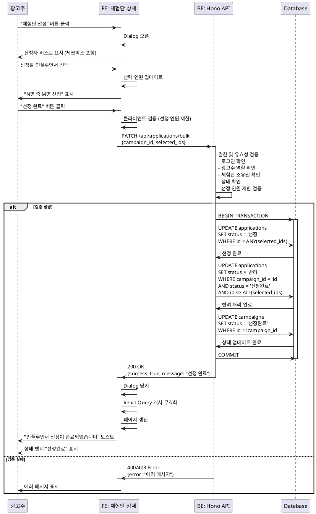

# 유스케이스: UC-008 인플루언서 선정

## 제목
광고주의 체험단 인플루언서 선정

---

## 1. 개요

### 1.1 목적
광고주가 체험단에 지원한 인플루언서들 중에서 적합한 후보를 선정하여 체험단을 운영하고, 선정되지 않은 지원자에게는 반려 결과를 제공합니다. 이를 통해 효율적인 체험단 매칭을 완료합니다.

### 1.2 범위
- 모집 종료된 체험단의 신청자 조회
- 선정 인원 제한 검증 (모집 인원 이내)
- 인플루언서 선정 및 반려 처리
- 체험단 상태를 '선정완료'로 변경
- 알림 발송 (P1, 추후 구현)

**제외 사항**:
- 선정 결과 알림 발송 (1차 범위 제외)
- 선정 취소 기능 (추후 고려)

### 1.3 액터
- **주요 액터**: 광고주 (Advertiser)
- **부 액터**:
  - 인플루언서 (선정/반려 결과 수신)
  - 시스템 (상태 변경 및 데이터 업데이트)

---

## 2. 선행 조건

사용자 관점에서의 선행 조건:
1. 광고주로 로그인되어 있어야 함
2. 광고주 정보가 등록되어 있어야 함
3. 해당 체험단의 소유자여야 함 (`campaigns.advertiser_id = current_user_id`)
4. 체험단 상태가 '모집종료'여야 함
5. 체험단에 최소 1명 이상의 신청자가 있어야 함

---

## 3. 참여 컴포넌트

- **Frontend (React)**:
  - `/dashboard/campaigns/:id` 페이지: 신청자 리스트 및 선정 Dialog 표시
  - React Query: 신청자 데이터 캐싱 및 상태 관리
  - shadcn-ui Dialog: 선정 프로세스 UI
  - shadcn-ui Checkbox: 복수 선택 UI

- **Backend (Hono API)**:
  - `PATCH /api/applications/bulk`: 일괄 선정/반려 처리
  - `PATCH /api/campaigns/:id/status`: 체험단 상태 업데이트

- **Database (Supabase PostgreSQL)**:
  - `applications` 테이블: 선정/반려 상태 업데이트
  - `campaigns` 테이블: 상태를 '선정완료'로 변경

- **External Services**:
  - Supabase Auth: 사용자 인증 및 권한 확인

---

## 4. 기본 플로우 (Basic Flow)

### 4.1 단계별 흐름

1. **광고주**: 체험단 상세 페이지(`/dashboard/campaigns/:id`)에서 "체험단 선정" 버튼 클릭
   - 입력: 체험단 ID
   - 처리: Dialog 오픈
   - 출력: 신청자 리스트 표시

2. **Frontend**: 신청자 리스트 표시 (Dialog)
   - 입력: `GET /api/campaigns/:id/applications` 응답 데이터
   - 처리:
     - 각 신청자 행에 체크박스 포함
     - 컬럼: 이름, SNS 채널명, 팔로워 수, 각오 한마디, 방문 예정일
     - 선택 인원 표시 (예: "5명 중 3명 선정")
   - 출력: 체크박스가 포함된 신청자 테이블

3. **광고주**: 선정할 인플루언서 체크박스 선택
   - 입력: 체크박스 클릭
   - 처리: 선택된 인원 수 업데이트
   - 출력: 선택된 인원 표시 업데이트

4. **광고주**: "선정 완료" 버튼 클릭
   - 입력: 선택된 신청자 ID 배열
   - 처리: 선정 인원 검증 (클라이언트)
   - 출력: API 요청 전송

5. **Backend**: 권한 및 유효성 검증
   - 입력: `PATCH /api/applications/bulk` 요청
     - `campaign_id`: 체험단 ID
     - `selected_ids`: 선정된 신청자 ID 배열
   - 처리:
     - 로그인 확인 (Supabase Auth)
     - 광고주 역할 확인 (`advertisers` 테이블 조회)
     - 체험단 소유권 확인 (`campaigns.advertiser_id = current_user_id`)
     - 체험단 상태 확인 (`status = '모집종료'`)
     - 선정 인원 제한 검증 (`selected_ids.length <= campaigns.recruitment_count`)
     - Zod 스키마 검증
   - 출력: 검증 통과 또는 에러 응답

6. **Backend**: 선정/반려 처리 (트랜잭션)
   - 입력: 검증된 요청 데이터
   - 처리:
     ```sql
     -- 선정된 인플루언서
     UPDATE applications
     SET status = '선정'
     WHERE id = ANY(selected_ids);

     -- 미선정 인플루언서
     UPDATE applications
     SET status = '반려'
     WHERE campaign_id = :campaign_id
       AND status = '신청완료'
       AND id <> ALL(selected_ids);

     -- 체험단 상태 업데이트
     UPDATE campaigns
     SET status = '선정완료'
     WHERE id = :campaign_id;
     ```
   - 출력: 영향받은 행 수 및 성공 응답

7. **Frontend**: 성공 처리
   - 입력: 성공 응답
   - 처리:
     - "인플루언서 선정이 완료되었습니다" 토스트 메시지 표시
     - Dialog 닫기
     - React Query 캐시 무효화 (체험단 상세, 신청자 리스트)
     - 페이지 자동 갱신
   - 출력:
     - 상태 뱃지 "선정완료"로 변경
     - "체험단 선정" 버튼 숨김
     - 신청자 리스트에 선정/반려 뱃지 표시

### 4.2 시퀀스 다이어그램



---

## 5. 대안 플로우 (Alternative Flows)

### 5.1 대안 플로우 1: 모집 인원보다 적게 선정

**시작 조건**: 기본 플로우 4단계 (선정 완료 버튼 클릭 전)

**단계**:
1. 광고주가 모집 인원보다 적은 수의 인플루언서를 선택
   - 예: 모집 인원 5명, 선택 3명
2. "선정 완료" 버튼 클릭
3. 시스템이 선정 인원 제한을 확인 (3 <= 5, 통과)
4. 정상적으로 선정 프로세스 진행

**결과**: 선정된 3명은 '선정', 나머지는 '반려' 처리

### 5.2 대안 플로우 2: 전체 신청자 선정

**시작 조건**: 기본 플로우 4단계

**단계**:
1. 광고주가 모든 신청자를 선택
2. "선정 완료" 버튼 클릭
3. 시스템이 선정 인원 제한을 확인 (전체 신청자 수 <= 모집 인원, 통과)
4. 정상적으로 선정 프로세스 진행

**결과**: 모든 신청자가 '선정' 상태로 변경, 반려된 지원자 없음

---

## 6. 예외 플로우 (Exception Flows)

### 6.1 예외 상황 1: 선정 인원 초과

**발생 조건**: 선택한 인플루언서 수가 모집 인원을 초과하는 경우

**처리 방법**:
1. 클라이언트 검증:
   - 모집 인원 초과 시 추가 체크박스 비활성화
   - 또는 에러 메시지 표시: "최대 N명까지 선정할 수 있습니다"
2. 서버 검증:
   - `selected_ids.length > recruitment_count` 검증 실패
   - 400 Bad Request 응답
3. 프론트엔드:
   - 에러 메시지 표시: "최대 N명까지 선정할 수 있습니다"
   - Dialog 유지 (재시도 가능)

**에러 코드**: `SELECTION_COUNT_EXCEEDED` (HTTP 400)

**사용자 메시지**: "최대 {recruitment_count}명까지 선정할 수 있습니다"

### 6.2 예외 상황 2: 0명 선택

**발생 조건**: 아무도 선택하지 않고 "선정 완료" 버튼 클릭

**처리 방법**:
1. 클라이언트 검증:
   - "선정 완료" 버튼 비활성화 (0명 선택 시)
   - 또는 에러 메시지 표시: "최소 1명 이상 선정해주세요"
2. 서버 검증:
   - `selected_ids.length === 0` 검증 실패
   - 400 Bad Request 응답
3. 프론트엔드:
   - 에러 메시지 표시: "최소 1명 이상 선정해주세요"
   - Dialog 유지

**에러 코드**: `NO_SELECTION` (HTTP 400)

**사용자 메시지**: "최소 1명 이상 선정해주세요"

### 6.3 예외 상황 3: 권한 없음

**발생 조건**: 다른 광고주의 체험단에 대해 선정 시도

**처리 방법**:
1. 서버에서 체험단 소유권 확인:
   - `campaigns.advertiser_id !== current_user_id`
2. 403 Forbidden 응답
3. 프론트엔드:
   - "접근 권한이 없습니다" 에러 메시지 표시
   - `/dashboard`로 리다이렉트

**에러 코드**: `FORBIDDEN` (HTTP 403)

**사용자 메시지**: "접근 권한이 없습니다"

### 6.4 예외 상황 4: 이미 선정완료된 체험단

**발생 조건**: 체험단 상태가 이미 '선정완료'인 경우

**처리 방법**:
1. 서버에서 체험단 상태 확인:
   - `campaigns.status !== '모집종료'`
2. 400 Bad Request 응답
3. 프론트엔드:
   - "이미 선정이 완료된 체험단입니다" 에러 메시지 표시
   - 페이지 자동 갱신

**에러 코드**: `ALREADY_COMPLETED` (HTTP 400)

**사용자 메시지**: "이미 선정이 완료된 체험단입니다"

### 6.5 예외 상황 5: 신청자 없음

**발생 조건**: 체험단에 신청자가 한 명도 없는 상태에서 선정 시도

**처리 방법**:
1. 프론트엔드:
   - "체험단 선정" 버튼 비활성화
   - "아직 지원한 인플루언서가 없습니다" 빈 상태 메시지 표시
2. 서버 검증:
   - 신청자 수 확인 (`applications` 테이블 카운트)
   - 400 Bad Request 응답
3. 프론트엔드:
   - "지원자가 없어 선정할 수 없습니다" 에러 메시지 표시

**에러 코드**: `NO_APPLICANTS` (HTTP 400)

**사용자 메시지**: "지원자가 없어 선정할 수 없습니다"

### 6.6 예외 상황 6: 네트워크 오류

**발생 조건**: API 요청 중 네트워크 연결 끊김

**처리 방법**:
1. React Query의 retry 로직 활용 (최대 3회)
2. 3회 실패 시:
   - "일시적인 오류가 발생했습니다. 다시 시도해주세요" 에러 메시지 표시
   - "재시도" 버튼 표시
3. 트랜잭션 롤백으로 데이터 일관성 보장

**에러 코드**: `NETWORK_ERROR` (HTTP 500)

**사용자 메시지**: "일시적인 오류가 발생했습니다. 다시 시도해주세요"

---

## 7. 후행 조건 (Post-conditions)

### 7.1 성공 시

- **데이터베이스 변경**:
  - `applications` 테이블:
    - 선정된 신청자의 `status` → '선정'
    - 미선정 신청자의 `status` → '반려'
    - `updated_at` 자동 업데이트 (트리거)
  - `campaigns` 테이블:
    - `status` → '선정완료'
    - `updated_at` 자동 업데이트 (트리거)

- **시스템 상태**:
  - 체험단이 '선정완료' 상태로 전환
  - "체험단 선정" 버튼 숨김
  - 신청자 리스트에 선정/반려 뱃지 표시
  - React Query 캐시 무효화 (체험단 상세, 신청자 리스트, 대시보드)

- **외부 시스템**:
  - (추후 구현) 선정/반려 알림 발송

### 7.2 실패 시

- **데이터 롤백**:
  - 트랜잭션 롤백으로 모든 데이터베이스 변경 취소
  - 체험단 상태는 '모집종료' 유지
  - 신청자 상태는 '신청완료' 유지

- **시스템 상태**:
  - Dialog 유지 (재시도 가능)
  - 에러 메시지 표시
  - "체험단 선정" 버튼 계속 표시

---

## 8. 비기능 요구사항

### 8.1 성능
- API 응답 시간: 500ms 이내 (일괄 업데이트 포함)
- 트랜잭션 처리 시간: 1초 이내
- 신청자 수 제한: 최대 1,000명까지 처리 가능 (페이지네이션 권장)

### 8.2 보안
- **인증**: Supabase Auth 기반 세션 검증
- **권한**: 체험단 소유자만 선정 가능 (서버 사이드 검증)
- **입력 검증**: Zod 스키마로 요청 데이터 검증
- **SQL Injection 방지**: Supabase Parameterized Query 사용
- **트랜잭션**: ACID 속성 보장으로 데이터 일관성 유지

### 8.3 가용성
- **트랜잭션 롤백**: 실패 시 자동 롤백으로 데이터 무결성 보장
- **재시도 메커니즘**: 클라이언트에서 재시도 가능
- **에러 로깅**: 서버 에러 발생 시 로그 기록

---

## 9. UI/UX 요구사항

### 9.1 화면 구성

**체험단 상세 페이지 (`/dashboard/campaigns/:id`)**:
- 체험단 정보 표시 (읽기 전용)
- 신청자 리스트 테이블:
  - 컬럼: 이름, SNS 채널명, 팔로워 수, 각오 한마디, 방문 예정일, 지원일
  - 정렬: 지원일 최신순 (기본값)
- 상태별 액션 버튼:
  - **모집중**: "모집 조기 종료" 버튼
  - **모집종료**: "체험단 선정" 버튼
  - **선정완료**: 버튼 숨김, "선정 완료" 뱃지

**선정 Dialog**:
- 제목: "인플루언서 선정"
- 신청자 리스트 (체크박스 포함):
  - 각 행에 체크박스
  - 컬럼: 이름, SNS 채널명, 팔로워 수, 각오 한마디, 방문 예정일
- 선정 인원 표시: "5명 중 3명 선정"
- 버튼:
  - "선정 완료" (Primary)
  - "취소" (Secondary)

### 9.2 사용자 경험
- **명확한 선정 인원 표시**: 실시간으로 "N명 중 M명 선정" 업데이트
- **체크박스 선택 피드백**: 선택 시 행 강조 (배경색 변경)
- **비활성화 상태**: 모집 인원 초과 시 추가 체크박스 비활성화
- **로딩 인디케이터**: 선정 처리 중 로딩 스피너 표시
- **성공 피드백**: 토스트 메시지 + 페이지 자동 갱신
- **에러 피드백**: 명확한 에러 메시지 + 재시도 옵션
- **확인 모달**: "선정 완료" 클릭 시 확인 모달 표시 (선택사항)
  - "N명의 인플루언서를 선정하시겠습니까? 선정 후에는 취소할 수 없습니다."

---

## 10. 비즈니스 규칙 (Business Rules)

### BR-001: 선정 인원 제한
- **규칙**: 선정된 인플루언서 수는 모집 인원 이하여야 함
- **검증 시점**: 클라이언트 + 서버 양쪽
- **예외 처리**: 초과 시 에러 메시지 표시

### BR-002: 최소 선정 인원
- **규칙**: 최소 1명 이상 선정해야 함
- **검증 시점**: 클라이언트 + 서버 양쪽
- **예외 처리**: 0명 선택 시 버튼 비활성화 또는 에러 메시지

### BR-003: 상태 전환 조건
- **규칙**: 체험단 상태가 '모집종료'일 때만 선정 가능
- **검증 시점**: 서버
- **예외 처리**: 상태 불일치 시 400 에러

### BR-004: 소유권 확인
- **규칙**: 체험단을 등록한 광고주만 선정 가능
- **검증 시점**: 서버
- **예외 처리**: 권한 없음 시 403 에러

### BR-005: 중복 선정 방지
- **규칙**: 동일 체험단에 대해 선정은 1회만 가능
- **검증 시점**: 서버 (체험단 상태 확인)
- **예외 처리**: 이미 선정완료된 경우 400 에러

### BR-006: 자동 반려 처리
- **규칙**: 선정되지 않은 모든 신청자는 자동으로 '반려' 상태로 변경
- **적용 시점**: 선정 프로세스 완료 시 (트랜잭션 내)

### BR-007: 트랜잭션 보장
- **규칙**: 선정/반려/상태 변경은 단일 트랜잭션으로 처리
- **적용 시점**: 서버 (데이터베이스 업데이트)
- **예외 처리**: 일부 실패 시 전체 롤백

---

## 11. 테스트 시나리오

### 11.1 성공 케이스

| 테스트 케이스 ID | 입력값 | 기대 결과 |
|----------------|--------|----------|
| TC-008-01 | 모집 인원 5명, 선택 3명 | 3명 선정, 나머지 반려, 상태 '선정완료' |
| TC-008-02 | 모집 인원 5명, 선택 5명 | 5명 모두 선정, 상태 '선정완료' |
| TC-008-03 | 모집 인원 10명, 선택 1명 | 1명 선정, 나머지 반려, 상태 '선정완료' |

### 11.2 실패 케이스

| 테스트 케이스 ID | 입력값 | 기대 결과 |
|----------------|--------|----------|
| TC-008-04 | 모집 인원 5명, 선택 6명 | 400 에러, "최대 5명까지 선정할 수 있습니다" |
| TC-008-05 | 모집 인원 5명, 선택 0명 | 400 에러, "최소 1명 이상 선정해주세요" |
| TC-008-06 | 다른 광고주의 체험단 | 403 에러, "접근 권한이 없습니다" |
| TC-008-07 | 상태 '모집중'인 체험단 | 400 에러, "모집이 종료된 후에 선정할 수 있습니다" |
| TC-008-08 | 상태 '선정완료'인 체험단 | 400 에러, "이미 선정이 완료된 체험단입니다" |
| TC-008-09 | 신청자 없음 | 400 에러, "지원자가 없어 선정할 수 없습니다" |
| TC-008-10 | 비로그인 사용자 | 401 에러, 로그인 페이지로 리다이렉트 |
| TC-008-11 | 인플루언서 계정 | 403 에러, "광고주 전용 기능입니다" |

### 11.3 엣지 케이스

| 테스트 케이스 ID | 입력값 | 기대 결과 |
|----------------|--------|----------|
| TC-008-12 | 선정 중 네트워크 끊김 | 트랜잭션 롤백, 재시도 옵션 제공 |
| TC-008-13 | 동시에 2명의 광고주가 선정 시도 (동일 체험단) | 먼저 처리된 요청 성공, 나중 요청 400 에러 |
| TC-008-14 | 선정 중 Dialog 닫기 시도 | "처리 중입니다. 잠시만 기다려주세요" 메시지 표시 |
| TC-008-15 | 선정 완료 후 브라우저 뒤로가기 | 상태 유지, "체험단 선정" 버튼 숨김 |

---

## 12. 관련 유스케이스

- **선행 유스케이스**:
  - UC-007: 모집 조기 종료 (체험단 상태를 '모집종료'로 변경)
  - UC-006: 신청자 리스트 조회 (선정할 인플루언서 확인)
  - UC-004: 체험단 등록 (체험단 생성)

- **후행 유스케이스**:
  - (추후 구현) UC-009: 선정 결과 알림 발송
  - (추후 구현) UC-010: 리뷰 제출 관리

- **연관 유스케이스**:
  - UC-005: 체험단 지원 (인플루언서가 지원서 제출)
  - UC-011: 내 지원 목록 조회 (인플루언서가 선정/반려 결과 확인)

---

## 13. 변경 이력

| 버전 | 날짜 | 작성자 | 변경 내용 |
|------|------|--------|-----------|
| 1.0  | 2025-11-14 | Claude | 초기 작성 |

---

## 부록

### A. 용어 정의

- **체험단**: 광고주가 등록한 제품/서비스 체험 모집 캠페인
- **인플루언서**: 블로그, 유튜브 등 SNS 채널을 운영하는 콘텐츠 크리에이터
- **선정**: 광고주가 체험단에 지원한 인플루언서를 선택하는 행위
- **반려**: 선정되지 않은 지원자의 상태
- **모집 인원**: 체험단에서 선정할 최대 인원 수
- **트랜잭션**: 데이터베이스의 여러 작업을 단일 단위로 처리하는 기법

### B. 참고 자료

- `/docs/requirement.md` - 기본 요구사항 (섹션: "광고주는 모집이 종료된 체험단에 대해, 인플루언서를 선정할 수 있다")
- `/docs/prd.md` - PRD 문서 (섹션 3.3.3: 광고주용 체험단 상세)
- `/docs/userflow.md` - 유저 플로우 (섹션 2.3.2: 체험단 선정 프로세스)
- `/docs/database.md` - 데이터베이스 설계 (섹션 4.4: applications 테이블)
- [Supabase Transactions](https://supabase.com/docs/guides/database/transactions)
- [PostgreSQL BEGIN/COMMIT](https://www.postgresql.org/docs/current/sql-begin.html)

### C. API 명세 (개요)

**PATCH /api/applications/bulk**
- **설명**: 체험단 신청자 일괄 선정/반려 처리
- **권한**: 광고주 전용
- **요청 본문**:
  ```json
  {
    "campaign_id": 123,
    "selected_ids": [1, 3, 5]
  }
  ```
- **응답 (성공)**:
  ```json
  {
    "success": true,
    "message": "인플루언서 선정이 완료되었습니다",
    "data": {
      "selected_count": 3,
      "rejected_count": 7
    }
  }
  ```
- **응답 (실패)**:
  ```json
  {
    "success": false,
    "error": "SELECTION_COUNT_EXCEEDED",
    "message": "최대 5명까지 선정할 수 있습니다"
  }
  ```

### D. 데이터베이스 쿼리 예시

**선정/반려 일괄 처리 (트랜잭션)**:
```sql
BEGIN;

-- 선정된 인플루언서
UPDATE applications
SET status = '선정'
WHERE id = ANY(ARRAY[1, 3, 5]);

-- 미선정 인플루언서
UPDATE applications
SET status = '반려'
WHERE campaign_id = 123
  AND status = '신청완료'
  AND id <> ALL(ARRAY[1, 3, 5]);

-- 체험단 상태 업데이트
UPDATE campaigns
SET status = '선정완료'
WHERE id = 123;

COMMIT;
```

**선정 인원 제한 검증**:
```sql
SELECT
  c.recruitment_count,
  COUNT(a.id) FILTER (WHERE a.status = '신청완료') AS total_applicants
FROM campaigns c
LEFT JOIN applications a ON c.id = a.campaign_id
WHERE c.id = :campaign_id
GROUP BY c.id;
```
