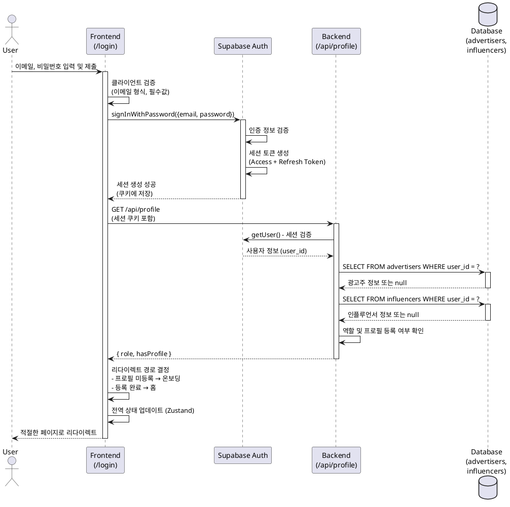
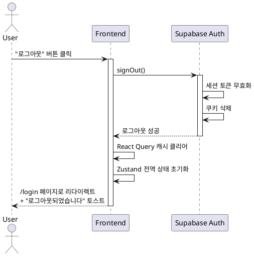
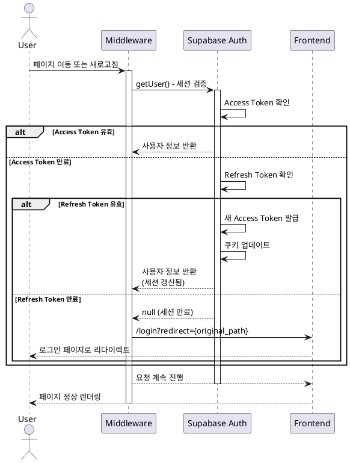
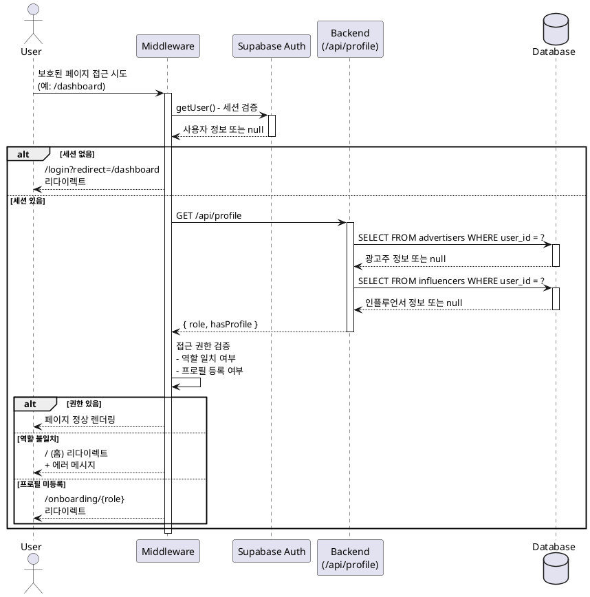

# 유스케이스: 로그인 및 인증

## 유스케이스 ID: UC-009

### 제목
사용자 인증 및 세션 관리 (로그인/로그아웃/세션 갱신/접근 제어)

---

## 1. 개요

### 1.1 목적
사용자가 이메일과 비밀번호를 통해 시스템에 로그인하고, 안전하게 세션을 유지하며, 역할 기반 접근 제어를 통해 인가된 리소스에만 접근할 수 있도록 한다.

### 1.2 범위
- 이메일/비밀번호 기반 로그인
- 로그아웃
- 세션 자동 갱신 (Refresh Token)
- 역할 기반 페이지 접근 제어 (인플루언서/광고주)
- 프로필 등록 여부에 따른 접근 제어
- **제외**: 비밀번호 찾기, 이메일 인증, 소셜 로그인

### 1.3 액터
- **주요 액터**: 미인증 사용자, 인증된 사용자 (인플루언서/광고주)
- **부 액터**: Supabase Auth 시스템, 미들웨어

---

## 2. 선행 조건

- 사용자는 이미 회원가입을 완료한 상태여야 한다 (UC-001 참조)
- 사용자의 이메일은 인증된 상태여야 한다 (1차 범위에서는 자동 인증으로 가정)

---

## 3. 참여 컴포넌트

### 3.1 프론트엔드
- **로그인 페이지** (`/login`): 이메일/비밀번호 입력 폼
- **헤더/네비게이션**: 로그아웃 버튼
- **미들웨어**: 세션 검증 및 보호된 경로 제어

### 3.2 백엔드
- **Supabase Auth**: 인증 처리 (`signInWithPassword`, `signOut`, `getUser`)
- **서버 컴포넌트**: 세션 확인 및 역할 조회
- **API 엔드포인트**: `/api/profile` (역할 및 프로필 등록 여부 확인)

### 3.3 데이터베이스
- **auth.users**: Supabase Auth 관리 테이블 (참조 전용)
- **advertisers**: 광고주 정보
- **influencers**: 인플루언서 정보

---

## 4. 기본 플로우 (Basic Flow)

### 4.1 UC-009-A: 로그인 프로세스

#### Primary Actor
미인증 사용자

#### Precondition
- 사용자는 이미 회원가입을 완료한 상태
- 사용자는 로그인 페이지 (`/login`)에 접근

#### Trigger
사용자가 로그인 페이지에서 이메일과 비밀번호를 입력하고 "로그인" 버튼을 클릭

#### Main Scenario

1. **사용자**: `/login` 페이지 접근
   - 입력: 이메일, 비밀번호

2. **프론트엔드**: 입력 데이터 클라이언트 검증
   - 이메일 형식 검증 (Zod 스키마)
   - 비밀번호 필수 입력 검증

3. **프론트엔드**: `supabase.auth.signInWithPassword()` 호출
   - 입력: `{ email, password }`

4. **Supabase Auth**: 인증 정보 검증
   - 이메일과 비밀번호 일치 여부 확인
   - 세션 토큰 생성 (Access Token + Refresh Token)
   - 쿠키에 세션 정보 저장

5. **프론트엔드**: 세션 생성 확인 후 역할 조회
   - `GET /api/profile` API 호출
   - 사용자 ID로 `advertisers` 또는 `influencers` 테이블 조회

6. **백엔드**: 사용자 역할 및 프로필 등록 여부 확인
   - `advertisers` 테이블 조회 → 광고주 정보 존재 여부
   - `influencers` 테이블 조회 → 인플루언서 정보 존재 여부
   - 프로필 등록 여부 플래그 반환

7. **프론트엔드**: 리다이렉트 경로 결정
   - 인플루언서 정보 미등록: `/onboarding/influencer`
   - 광고주 정보 미등록: `/onboarding/advertiser`
   - 정보 등록 완료: `/` (홈 페이지)
   - 로그인 전 접근 시도한 페이지가 있는 경우: 해당 페이지로 복귀

8. **시스템**: 전역 상태 업데이트 (Zustand)
   - 사용자 정보 저장
   - 인증 상태 변경

#### Edge Cases

- **이메일 또는 비밀번호 오류**:
  - Supabase Auth가 `AuthApiError` 반환
  - 프론트엔드: "이메일 또는 비밀번호가 올바르지 않습니다" 에러 메시지 표시

- **이메일 형식 오류**:
  - 클라이언트 검증 실패
  - 프론트엔드: "올바른 이메일 형식을 입력해주세요" 에러 메시지 표시

- **네트워크 오류**:
  - API 호출 실패
  - 프론트엔드: "일시적인 오류가 발생했습니다. 다시 시도해주세요" 에러 메시지 표시

- **이미 로그인된 상태에서 `/login` 접근**:
  - 미들웨어에서 세션 확인
  - 홈 페이지로 자동 리다이렉트

- **역할 및 프로필 정보 조회 실패**:
  - 로그인은 성공했으나 프로필 정보가 없는 경우
  - 역할 선택 페이지 또는 회원가입 플로우로 복귀

#### Business Rules

- BR-009-A-01: 로그인 시 이메일과 비밀번호가 모두 정확히 일치해야 한다
- BR-009-A-02: 로그인 성공 시 세션은 자동으로 쿠키에 저장되며, 브라우저 종료 시까지 유지된다
- BR-009-A-03: 역할 정보가 없는 사용자는 역할 선택 단계로 리다이렉트된다
- BR-009-A-04: 프로필 정보가 없는 사용자는 온보딩 페이지로 리다이렉트된다
- BR-009-A-05: 로그인 시도는 횟수 제한이 없다 (1차 범위에서는 계정 잠금 기능 제외)

#### Sequence Diagram

---

### 4.2 UC-009-B: 로그아웃 프로세스

#### Primary Actor
인증된 사용자

#### Precondition
- 사용자는 로그인된 상태

#### Trigger
사용자가 헤더/네비게이션에서 "로그아웃" 버튼을 클릭

#### Main Scenario

1. **사용자**: "로그아웃" 버튼 클릭

2. **프론트엔드**: `supabase.auth.signOut()` 호출

3. **Supabase Auth**: 세션 쿠키 삭제
   - Access Token 및 Refresh Token 무효화

4. **프론트엔드**: 클라이언트 상태 초기화
   - React Query 캐시 클리어
   - Zustand 전역 상태 초기화

5. **프론트엔드**: `/login` 페이지로 리다이렉트

6. **시스템**: "로그아웃되었습니다" 토스트 메시지 표시

#### Edge Cases

- **네트워크 오류**:
  - `signOut()` API 호출 실패
  - 프론트엔드: "일시적인 오류가 발생했습니다. 다시 시도해주세요" 에러 메시지 표시
  - 로컬 세션은 클리어되지만 서버 세션은 유지될 수 있음

- **이미 로그아웃된 상태에서 로그아웃 시도**:
  - `signOut()`은 idempotent하므로 정상 처리
  - 에러 없이 로그인 페이지로 리다이렉트

#### Business Rules

- BR-009-B-01: 로그아웃 시 모든 클라이언트 상태가 초기화되어야 한다
- BR-009-B-02: 로그아웃 후 보호된 페이지 접근 시 로그인 페이지로 리다이렉트된다
- BR-009-B-03: 로그아웃은 즉시 실행되며 확인 모달을 표시하지 않는다

#### Sequence Diagram

---

### 4.3 UC-009-C: 세션 갱신 및 유지

#### Primary Actor
시스템 (자동 프로세스)

#### Precondition
- 사용자는 로그인된 상태
- Access Token이 만료 임박 또는 만료됨

#### Trigger
- 사용자가 페이지를 이동하거나 새로고침
- Middleware가 요청을 가로채서 세션 확인

#### Main Scenario

1. **사용자**: 페이지 이동 또는 새로고침

2. **미들웨어**: `supabase.auth.getUser()` 호출
   - 쿠키에서 세션 정보 읽기

3. **Supabase Auth**: Access Token 검증
   - 유효한 경우: 사용자 정보 반환
   - 만료된 경우: Refresh Token으로 자동 갱신 시도

4. **Supabase Auth**: Refresh Token으로 새 Access Token 발급
   - 새 Access Token 생성
   - 쿠키 업데이트

5. **미들웨어**: 갱신된 세션으로 요청 계속 진행

6. **시스템**: 정상적으로 페이지 렌더링

#### Edge Cases

- **세션 만료 + Refresh Token 갱신 성공**:
  - 사용자는 로그인 상태 유지
  - 페이지 정상 표시

- **세션 만료 + Refresh Token 갱신 실패**:
  - 로그아웃 처리
  - `/login` 페이지로 리다이렉트
  - `?redirect={original_path}` 쿼리 파라미터 추가

- **여러 탭에서 동시 로그인**:
  - Supabase SSR이 세션 동기화 자동 처리
  - 한 탭에서 로그아웃하면 다른 탭도 자동 로그아웃

- **장시간 비활성 후 활동**:
  - Refresh Token도 만료된 경우: 로그인 페이지로 리다이렉트
  - Refresh Token이 유효한 경우: 자동 갱신 후 계속 진행

#### Business Rules

- BR-009-C-01: 세션은 자동으로 갱신되며 사용자 개입이 필요 없다
- BR-009-C-02: Access Token 만료 시 Refresh Token으로 자동 갱신을 시도한다
- BR-009-C-03: Refresh Token도 만료된 경우 사용자를 로그아웃 처리한다
- BR-009-C-04: 여러 탭의 세션은 자동으로 동기화된다

#### Sequence Diagram

---

### 4.4 UC-009-D: 보호된 페이지 접근 제어

#### Primary Actor
인증된 또는 미인증 사용자

#### Precondition
- 사용자가 보호된 페이지에 접근 시도
- 보호된 경로: `/onboarding/*`, `/dashboard`, `/dashboard/campaigns/*`, `/my/applications`, `/campaigns/:id/apply`

#### Trigger
사용자가 보호된 페이지 URL로 접근 시도

#### Main Scenario

1. **사용자**: 보호된 페이지 URL 접근 시도

2. **미들웨어**: 세션 확인
   - `supabase.auth.getUser()` 호출

3. **미들웨어**: 세션 존재 여부 확인
   - 비로그인: 로그인 페이지로 리다이렉트 (`/login?redirect={original_path}`)
   - 로그인: 역할 및 프로필 등록 여부 확인

4. **백엔드**: 역할 및 프로필 확인
   - `advertisers` 또는 `influencers` 테이블 조회

5. **미들웨어**: 접근 권한 검증
   - 인플루언서 전용 페이지에 광고주 접근: 홈으로 리다이렉트 + 에러 메시지
   - 광고주 전용 페이지에 인플루언서 접근: 홈으로 리다이렉트 + 에러 메시지
   - 프로필 미등록 상태에서 기능 페이지 접근: 온보딩 페이지로 리다이렉트
   - 권한 있음: 정상 페이지 렌더링

6. **시스템**: 접근 권한에 따른 페이지 표시 또는 리다이렉트

#### Edge Cases

- **비로그인 상태에서 보호된 페이지 접근**:
  - `/login?redirect={original_path}` 로 리다이렉트
  - 로그인 후 원래 페이지로 복귀

- **인플루언서가 광고주 전용 페이지 접근**:
  - 홈 페이지로 리다이렉트
  - "광고주 전용 페이지입니다" 에러 메시지 표시

- **광고주가 인플루언서 전용 페이지 접근**:
  - 홈 페이지로 리다이렉트
  - "인플루언서 전용 페이지입니다" 에러 메시지 표시

- **프로필 미등록 상태에서 기능 페이지 접근**:
  - 인플루언서: `/onboarding/influencer` 로 리다이렉트
  - 광고주: `/onboarding/advertiser` 로 리다이렉트

- **다른 광고주의 체험단 상세 페이지 접근**:
  - "접근 권한이 없습니다" 에러 메시지 표시
  - 대시보드로 리다이렉트

#### Business Rules

- BR-009-D-01: 모든 보호된 페이지는 로그인이 필요하다
- BR-009-D-02: 역할에 따라 접근 가능한 페이지가 다르다
- BR-009-D-03: 프로필 정보가 없는 사용자는 온보딩 페이지로 리다이렉트된다
- BR-009-D-04: 로그인 후 원래 접근하려던 페이지로 자동 복귀한다
- BR-009-D-05: 리소스 소유권 검증은 백엔드에서 수행한다

#### Sequence Diagram

---

## 5. 대안 플로우 (Alternative Flows)

### 5.1 로그인 전 페이지 접근 시도 후 로그인

**시작 조건**: 사용자가 비로그인 상태에서 보호된 페이지에 접근 시도

**단계**:
1. 미들웨어가 `/login?redirect=/campaigns/123/apply` 로 리다이렉트
2. 사용자가 로그인 폼에서 인증 정보 입력 및 제출
3. 로그인 성공 후 `redirect` 쿼리 파라미터 확인
4. 원래 접근하려던 페이지 (`/campaigns/123/apply`)로 리다이렉트

**결과**: 사용자는 로그인 후 원하는 페이지에 바로 접근

---

## 6. 예외 플로우 (Exception Flows)

### 6.1 예외 상황 1: 인증 정보 불일치

**발생 조건**: 사용자가 잘못된 이메일 또는 비밀번호를 입력

**처리 방법**:
1. Supabase Auth가 `AuthApiError` 반환
2. 프론트엔드에서 에러 타입 확인
3. 로그인 폼 하단에 에러 메시지 표시: "이메일 또는 비밀번호가 올바르지 않습니다"
4. 입력 필드 유지 (이메일은 유지, 비밀번호는 클리어)

**에러 코드**: `AUTH_INVALID_CREDENTIALS` (Supabase 내부 코드)

**사용자 메시지**: "이메일 또는 비밀번호가 올바르지 않습니다"

---

### 6.2 예외 상황 2: 네트워크 연결 실패

**발생 조건**: 로그인 시도 중 네트워크 연결 끊김

**처리 방법**:
1. API 호출 실패 (timeout 또는 network error)
2. 프론트엔드에서 에러 감지
3. 에러 메시지 표시: "일시적인 오류가 발생했습니다. 다시 시도해주세요"
4. React Query의 retry 로직 활용 (최대 3회 재시도)

**에러 코드**: `NETWORK_ERROR`

**사용자 메시지**: "일시적인 오류가 발생했습니다. 다시 시도해주세요"

---

### 6.3 예외 상황 3: 세션 만료 (Refresh Token 만료)

**발생 조건**: 장시간 비활성 후 Refresh Token이 만료된 상태에서 페이지 접근

**처리 방법**:
1. 미들웨어에서 `getUser()` 호출 시 null 반환
2. 세션 만료로 판단
3. 로그인 페이지로 리다이렉트: `/login?redirect={original_path}`
4. 로그인 페이지에 안내 메시지 표시: "세션이 만료되었습니다. 다시 로그인해주세요"

**에러 코드**: `SESSION_EXPIRED`

**사용자 메시지**: "세션이 만료되었습니다. 다시 로그인해주세요"

---

### 6.4 예외 상황 4: 권한 없는 페이지 접근

**발생 조건**: 인플루언서가 광고주 전용 페이지에 접근 시도

**처리 방법**:
1. 미들웨어에서 역할 확인
2. 역할 불일치 감지
3. 홈 페이지로 리다이렉트
4. 토스트 메시지 표시: "광고주 전용 페이지입니다" 또는 "인플루언서 전용 페이지입니다"

**에러 코드**: `FORBIDDEN` (HTTP 403)

**사용자 메시지**: "접근 권한이 없습니다"

---

## 7. 후행 조건 (Post-conditions)

### 7.1 로그인 성공 시

- **세션 상태**: 사용자 세션이 생성되고 쿠키에 저장됨
- **전역 상태**: Zustand에 사용자 정보 및 인증 상태 저장
- **시스템 상태**: 사용자는 역할에 맞는 페이지에 접근 가능
- **데이터베이스 변경**: 없음 (로그인은 인증만 수행)

### 7.2 로그아웃 성공 시

- **세션 상태**: 세션 쿠키 삭제됨
- **전역 상태**: 모든 클라이언트 상태 초기화 (React Query 캐시, Zustand)
- **시스템 상태**: 사용자는 비로그인 상태로 전환
- **보호된 페이지 접근**: 로그인 페이지로 리다이렉트

### 7.3 세션 갱신 성공 시

- **세션 상태**: 새로운 Access Token 발급 및 쿠키 업데이트
- **시스템 상태**: 사용자는 로그인 상태 유지
- **사용자 경험**: 끊김 없이 페이지 사용 계속

### 7.4 접근 제어 실패 시

- **시스템 상태**: 사용자는 권한이 없는 페이지에 접근할 수 없음
- **리다이렉션**: 적절한 페이지 (홈, 로그인, 온보딩)로 자동 이동
- **데이터 보안**: 권한 없는 사용자는 데이터를 조회/수정할 수 없음

---

## 8. 비기능 요구사항

### 8.1 성능
- 로그인 응답 시간: 1초 이내
- 세션 갱신: 사용자가 인지하지 못할 정도로 즉시 처리
- 미들웨어 검증: 50ms 이내

### 8.2 보안
- **HTTPS 필수**: 모든 인증 요청은 HTTPS를 통해 전송
- **쿠키 보안**: `httpOnly`, `secure`, `sameSite=lax` 속성 설정
- **세션 토큰 암호화**: Supabase Auth가 자동으로 처리
- **CSRF 방어**: Supabase SSR이 자동으로 처리
- **비밀번호 저장**: Supabase Auth가 bcrypt로 해싱

### 8.3 가용성
- Supabase Auth 서비스 SLA: 99.9%
- 세션 갱신 실패 시 재시도 로직 적용
- 네트워크 오류 시 사용자 친화적 에러 메시지 표시

---

## 9. UI/UX 요구사항

### 9.1 로그인 페이지 화면 구성

**레이아웃**:
- 중앙 정렬 카드 레이아웃
- 로고 또는 서비스명 (상단)
- 이메일 입력 필드
- 비밀번호 입력 필드 (마스킹)
- "로그인" 버튼 (Primary)
- "회원가입" 링크 (하단)

**인터랙션**:
- 입력 필드 포커스 시 테두리 색상 변경
- 로그인 버튼 클릭 시 로딩 스피너 표시
- 에러 발생 시 입력 필드 하단에 빨간색 에러 메시지 표시
- Enter 키로 폼 제출 가능

### 9.2 로그아웃 사용자 경험

- 헤더/네비게이션에 "로그아웃" 버튼 또는 메뉴 항목 표시
- 클릭 시 즉시 로그아웃 (확인 모달 없음)
- 로그아웃 후 "로그아웃되었습니다" 토스트 메시지 표시 (3초 후 자동 사라짐)

### 9.3 세션 만료 사용자 경험

- 세션 만료 시 로그인 페이지로 자동 이동
- 로그인 페이지 상단에 "세션이 만료되었습니다. 다시 로그인해주세요" 안내 메시지 표시
- 로그인 후 원래 페이지로 자동 복귀

### 9.4 접근 제어 에러 메시지

- 권한 없는 페이지 접근 시 토스트 메시지로 안내
- 메시지 예시:
  - "로그인이 필요한 페이지입니다"
  - "광고주 전용 페이지입니다"
  - "인플루언서 전용 페이지입니다"
  - "프로필 등록 후 이용 가능합니다"

---

## 10. 테스트 시나리오

### 10.1 로그인 성공 케이스

| 테스트 케이스 ID | 입력값 | 기대 결과 |
|----------------|--------|----------|
| TC-009-A-01 | 유효한 이메일 + 비밀번호 (인플루언서, 프로필 등록 완료) | 홈 페이지로 리다이렉트 |
| TC-009-A-02 | 유효한 이메일 + 비밀번호 (광고주, 프로필 등록 완료) | 대시보드로 리다이렉트 |
| TC-009-A-03 | 유효한 이메일 + 비밀번호 (인플루언서, 프로필 미등록) | `/onboarding/influencer` 로 리다이렉트 |
| TC-009-A-04 | 유효한 이메일 + 비밀번호 (광고주, 프로필 미등록) | `/onboarding/advertiser` 로 리다이렉트 |
| TC-009-A-05 | 유효한 이메일 + 비밀번호 + `?redirect=/campaigns/123` | 로그인 후 `/campaigns/123` 으로 리다이렉트 |

### 10.2 로그인 실패 케이스

| 테스트 케이스 ID | 입력값 | 기대 결과 |
|----------------|--------|----------|
| TC-009-A-11 | 잘못된 이메일 형식 (예: `test@`) | "올바른 이메일 형식을 입력해주세요" 클라이언트 에러 |
| TC-009-A-12 | 존재하지 않는 이메일 | "이메일 또는 비밀번호가 올바르지 않습니다" 에러 메시지 |
| TC-009-A-13 | 올바른 이메일 + 잘못된 비밀번호 | "이메일 또는 비밀번호가 올바르지 않습니다" 에러 메시지 |
| TC-009-A-14 | 빈 이메일 또는 빈 비밀번호 | "필수 입력 항목입니다" 클라이언트 에러 |
| TC-009-A-15 | 네트워크 연결 끊김 상태에서 로그인 시도 | "일시적인 오류가 발생했습니다" 에러 메시지 + 재시도 가능 |

### 10.3 로그아웃 케이스

| 테스트 케이스 ID | 입력값 | 기대 결과 |
|----------------|--------|----------|
| TC-009-B-01 | 로그인된 상태에서 "로그아웃" 버튼 클릭 | `/login` 으로 리다이렉트 + "로그아웃되었습니다" 토스트 |
| TC-009-B-02 | 로그아웃 후 보호된 페이지 접근 시도 | `/login` 으로 리다이렉트 |

### 10.4 세션 갱신 케이스

| 테스트 케이스 ID | 입력값 | 기대 결과 |
|----------------|--------|----------|
| TC-009-C-01 | Access Token 만료 + Refresh Token 유효 | 자동 세션 갱신 + 페이지 정상 렌더링 |
| TC-009-C-02 | Access Token 만료 + Refresh Token 만료 | `/login` 으로 리다이렉트 + "세션이 만료되었습니다" 메시지 |
| TC-009-C-03 | 여러 탭에서 동시 로그인 + 한 탭에서 로그아웃 | 모든 탭에서 자동 로그아웃 |

### 10.5 접근 제어 케이스

| 테스트 케이스 ID | 입력값 | 기대 결과 |
|----------------|--------|----------|
| TC-009-D-01 | 비로그인 상태에서 `/dashboard` 접근 | `/login?redirect=/dashboard` 로 리다이렉트 |
| TC-009-D-02 | 인플루언서가 `/dashboard` 접근 | 홈으로 리다이렉트 + "광고주 전용 페이지입니다" 에러 메시지 |
| TC-009-D-03 | 광고주가 `/my/applications` 접근 | 홈으로 리다이렉트 + "인플루언서 전용 페이지입니다" 에러 메시지 |
| TC-009-D-04 | 프로필 미등록 인플루언서가 `/campaigns/123/apply` 접근 | `/onboarding/influencer` 로 리다이렉트 |
| TC-009-D-05 | 광고주 A가 광고주 B의 체험단 상세 페이지 접근 | "접근 권한이 없습니다" 에러 메시지 + 대시보드로 리다이렉트 |

---

## 11. 관련 유스케이스

- **선행 유스케이스**:
  - UC-001: 회원가입 및 역할 선택
- **후행 유스케이스**:
  - UC-002: 인플루언서 정보 등록
  - UC-003: 광고주 정보 등록
  - UC-004: 체험단 탐색 및 조회
  - UC-005: 체험단 지원
  - UC-006: 체험단 등록 및 관리
- **연관 유스케이스**:
  - UC-010: 프로필 수정 (1차 범위 제외, 추후 구현)

---

## 12. 변경 이력

| 버전 | 날짜 | 작성자 | 변경 내용 |
|------|------|--------|-----------|
| 1.0  | 2025-11-14 | Claude | 초기 작성 |

---

## 부록

### A. 용어 정의

- **세션 (Session)**: 사용자의 로그인 상태를 유지하는 데이터로, Access Token과 Refresh Token으로 구성됨
- **Access Token**: 짧은 유효 기간(1시간)을 가진 인증 토큰
- **Refresh Token**: 긴 유효 기간(7일)을 가진 갱신 토큰으로, Access Token 재발급에 사용됨
- **미들웨어 (Middleware)**: 모든 요청을 가로채서 세션 검증 및 접근 제어를 수행하는 서버 사이드 로직
- **RLS (Row Level Security)**: 데이터베이스 행 단위 접근 제어 (본 프로젝트에서는 비활성화)

### B. 참고 자료

- [Supabase Auth SSR Guide](https://supabase.com/docs/guides/auth/server-side-rendering)
- [Next.js Middleware](https://nextjs.org/docs/app/building-your-application/routing/middleware)
- `/docs/external/supabase-auth.md` - Supabase Auth 가이드
- `/docs/userflow.md` - 전체 사용자 플로우 (섹션 3.1, 3.2, 3.3)
- `/docs/prd.md` - 제품 요구사항 문서 (섹션 6.1)
